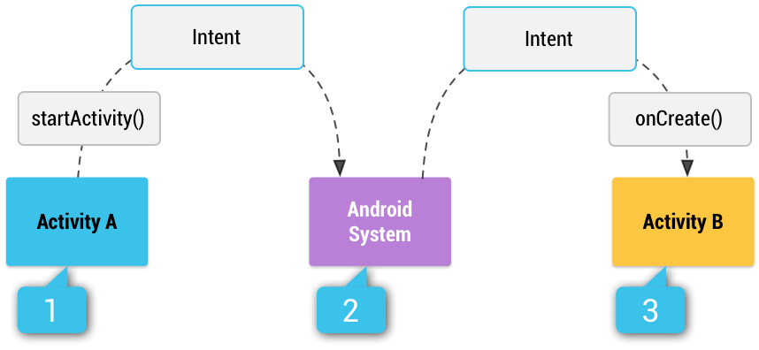

# Intent 和 Intent 过滤器
Intent 是一个消息传递对象，您可以使用它从其他应用组件请求操作。尽管 Intent 可以通过多种方式促进组件之间的通信，但其基本用例主要包括以下三个：
1. 启动 Activity：
    >Activity 表示应用中的一个屏幕。通过将 Intent 传递给 startActivity()，您可以启动新的 Activity 实例。Intent 描述了要启动的 Activity，并携带了任何必要的数据。  
    >
    >如果您希望在 Activity 完成后收到结果，请调用 startActivityForResult()。在 Activity 的 onActivityResult() 回调中，您的 Activity 将结果作为单独的 Intent 对象接收。
1. 启动服务：
    >Service 是一个不使用用户界面而在后台执行操作的组件。通过将 Intent 传递给 startService()，您可以启动服务执行一次性操作（例如，下载文件）。Intent 描述了要启动的服务，并携带了任何必要的数据。
    >
    >如果服务旨在使用客户端-服务器接口，则通过将 Intent 传递给 bindService()，您可以从其他组件绑定到此服务。
2. 传递广播：
    >广播是任何应用均可接收的消息。系统将针对系统事件（例如：系统启动或设备开始充电时）传递各种广播。通过将 Intent 传递给 sendBroadcast()、sendOrderedBroadcast() 或 sendStickyBroadcast()，您可以将广播传递给其他应用。

## 1. Intent 类型

Intent 分为两种类型：
1. 显式 Intent：
    >按名称（完全限定类名）指定要启动的组件。 通常，您会在自己的应用中使用显式 Intent 来启动组件，这是因为您知道要启动的 Activity 或服务的类名。例如，启动新 Activity 以响应用户操作，或者启动服务以在后台下载文件。
1. 隐式 Intent ：
    >不会指定特定的组件，而是声明要执行的常规操作，从而允许其他应用中的组件来处理它。 例如，如需在地图上向用户显示位置，则可以使用隐式 Intent，请求另一具有此功能的应用在地图上显示指定的位置。

创建显式 Intent 启动 Activity 或服务时，系统将立即启动 Intent 对象中指定的应用组件。

创建隐式 Intent 时，Android 系统通过将 Intent 的内容与在设备上其他应用的清单文件中声明的 Intent 过滤器进行比较，从而找到要启动的相应组件。 如果 Intent 与 Intent 过滤器匹配，则系统将启动该组件，并向其传递 Intent 对象。 如果多个 Intent 过滤器兼容，则系统会显示一个对话框，支持用户选取要使用的应用。

Intent 过滤器是应用清单文件中的一个表达式，它指定该组件要接收的 Intent 类型。 例如，通过为 Activity 声明 Intent 过滤器，您可以使其他应用能够直接使用某一特定类型的 Intent 启动 Activity。同样，如果您没有为 Activity 声明任何 Intent 过滤器，则 Activity 只能通过显式 Intent 启动。

注意：为了确保应用的安全性，启动 Service 时，请始终使用显式 Intent，且不要为服务声明 Intent 过滤器。使用隐式 Intent 启动服务存在安全隐患，因为您无法确定哪些服务将响应 Intent，且用户无法看到哪些服务已启动。从 Android 5.0（API 级别 21）开始，如果使用隐式 Intent 调用 bindService()，系统会引发异常。

隐式 Intent 如何通过系统传递以启动其他 Activity 的图解：[1] Activity A 创建包含操作描述的 Intent，并将其传递给 startActivity()。[2] Android 系统搜索所有应用中与 Intent 匹配的 Intent 过滤器。 找到匹配项之后，[3] 该系统通过调用匹配 Activity（Activity B）的 onCreate() 方法并将其传递给 Intent，以此启动匹配 Activity。

## 2. 构建 Intent
Intent 对象携带了 Android 系统用来确定要启动哪个组件的信息（例如，准确的组件名称或应当接收该 Intent 的组件类别），以及收件人组件为了正确执行操作而使用的信息（例如，要采取的操作以及要处理的数据）。

Intent 中包含的主要信息如下：
* 组件名称
    >要启动的组件名称。
    >
    >这是可选项，但也是构建显式 Intent 的一项重要信息，这意味着 Intent 应当仅传递给由组件名称定义的应用组件。 如果没有组件名称，则 Intent 是隐式的，且系统将根据其他 Intent 信息（例如，以下所述的操作、数据和类别）决定哪个组件应当接收 Intent。 因此，如需在应用中启动特定的组件，则应指定该组件的名称。
    >
    >注：启动 Service 时，您应始终指定组件名称。 否则，您无法确定哪项服务会响应 Intent，且用户无法看到哪项服务已启动。
    >
    >Intent 的这一字段是一个 ComponentName 对象，您可以使用目标组件的完全限定类名指定此对象，其中包括应用的软件包名称。 例如， com.example.ExampleActivity。您可以使用 setComponent()、setClass()、setClassName() 或 Intent 构造函数设置组件名称。

https://developer.android.com/guide/components/intents-filters.html#Building