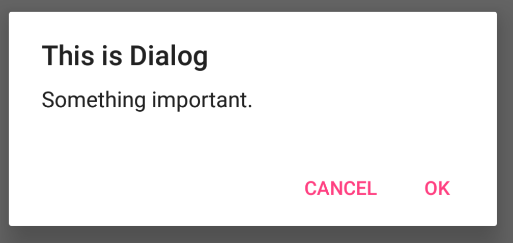

# AlertDialog
>time: 2018-01-04 17:42:52

AlertDialog 可以在当前界面弹出一个对话框，这个对话框是置顶于所有界面元素之上的，能够屏蔽掉其他控件的交互能力，因此 AlertDialog 一般都是用于提示一些非常重要的内容或者警告信息。

* setPositiveButton() 方法为对话框设置确定按钮的点击事件。  
* setNegativeButton() 方法设置取消按钮的点击事件。  
* show() 方法将对话框显示出来。

```java
@Override
    public void onClick(View view) {
        switch(view.getId()) {
            case R.id.button:
                AlertDialog.Builder dialog = new AlertDialog.Builder(MainActivity.this);
                dialog.setTitle("This is Dialog");
                dialog.setMessage("Something important.");
                dialog.setCancelable(false);
                dialog.setPositiveButton("OK", new DialogInterface.OnClickListener() {
                    @Override
                    public void onClick(DialogInterface dialogInterface, int which) {
                        Log.d(TAG, "onClick: OK - OnClick");
                    }
                });
                dialog.setNegativeButton("Cancel", new DialogInterface.OnClickListener() {
                    @Override
                    public void onClick(DialogInterface dialogInterface, int i) {
                        Log.d(TAG, "onClick: Cancel - OnClick");
                    }
                });
                dialog.show();
                break;
            default:
                break;
        }
    }
```

