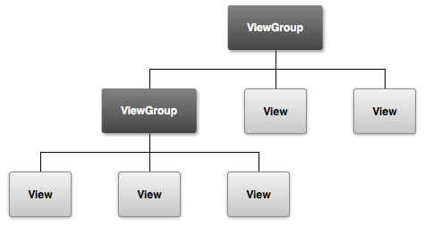

# 概览
>time: 2017-12-12 15:01:46  
>Android 应用中的所有用户界面元素都是使用 View 和 ViewGroup 对象构建而成。View 对象用于在屏幕上绘制可供用户交互的内容。ViewGroup 对象用于储存其他 View（和 ViewGroup）对象，以便定义界面的布局。
>
>Android 提供了一系列 View 和 ViewGroup 子类，可为您提供常用输入控件（如按钮和文本字段）和各种布局模式（如线性布局或相对布局）。

## 1. 用户界面布局
每个应用组件的用户界面都是使用 View 和 ViewGroup 对象的层次结构定义的。每个视图组都是一个用于组织子视图的不可见容器，而子视图可以是输入控件或其他可绘制某一 UI 部分的小部件。 此层次结构树可繁可简，随需而定（但是简单的结构可提供最佳性能）。

要声明布局，您可以实例化代码中的 View 对象并开始构建树，但是定义布局最简单且最有效的方法是使用 XML 文件。如同 HTML 一样，XML 也为布局提供了一种用户可读结构。

# 2. 用户界面组件
您无需使用 View 和 ViewGroup 对象构建所有 UI。Android 提供了几个带有标准 UI 布局的应用组件，您只需定义内容。 这些 UI 组件均拥有一组唯一的 API，具体描述可参阅相应的文档，如添加应用栏、对话框和状态通知。