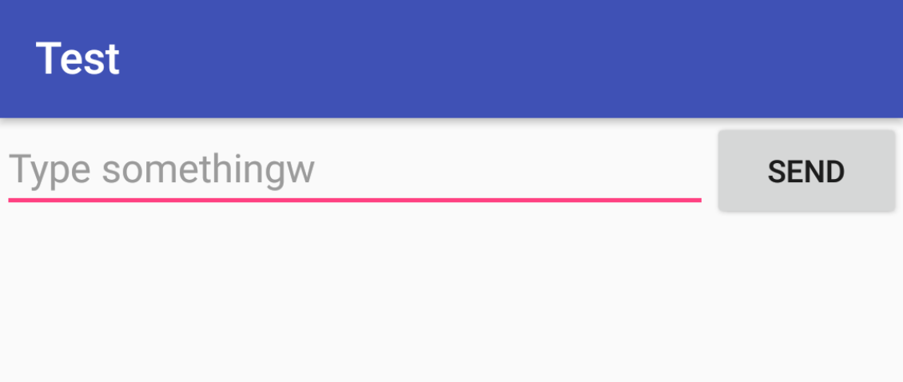

# android:layout_weight
>time: 2018-01-11 17:13:23

允许我们使用比例的方式来指定控件的大小，它在手机屏幕的适配性方面可以起到非常重要的作用。

```xml
<?xml version="1.0" encoding="utf-8"?>
<LinearLayout
    xmlns:android="http://schemas.android.com/apk/res/android"
    android:layout_width="match_parent"
    android:layout_height="match_parent"
    android:orientation="horizontal">

    <EditText
        android:id="@+id/input_message"
        android:layout_width="0dp"
        android:layout_height="wrap_content"
        android:layout_weight="1"
        android:hint="Type something"/>

    <Button
        android:id="@+id/send"
        android:layout_width="wrap_content"
        android:layout_height="wrap_content"
        android:text="Send"/>

</LinearLayout>
```

EditText 的 android:layout_weight 属性，并将 Button 的宽度改回 wrap_content。这表示 Button 的宽度仍然按照 wrap_content 来计算，而 EditText 则会占满屏幕所有的剩余空间。使用这种方式编写的界面，不仅在各种屏幕的适配方面会非常好，而且看起来也更加舒服。

