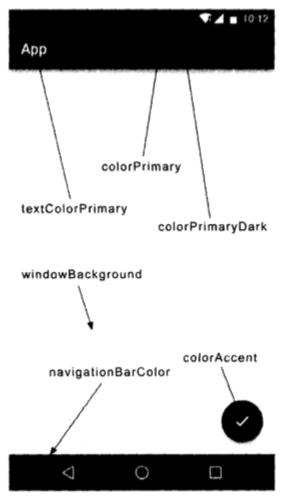

# ToolBar

ActionBar 由于设计原因，被限定只能位于活动的顶部，从而不能实现一些 Material Design 的效果，因此官方现在已经不再建议使用 ActionBar 了。

Toolbar 的强大之处在于，不仅继承了 ActionBar 的所有功能，而且灵活性很高，可以配合其他控件来完成一些 Material Design 的效果。

ToolBar 控件是由 appcompat-v7 库提供的。

## 1. 隐藏 ActionBar
### 1. 打开 AndroidManifest.xml
```xml
<?xml version="1.0" encoding="utf-8"?>
<manifest xmlns:android="http://schemas.android.com/apk/res/android"
          package="com.bpx.note">

    <application
        android:allowBackup="true"
        android:icon="@mipmap/ic_launcher"
        android:label="@string/app_name"
        android:roundIcon="@mipmap/ic_launcher_round"
        android:supportsRtl="true"
        android:theme="@style/BpxTheme">
        ...
</manifest>
```

### 2. 打开 `res/values/styles.xml` 文件

使用 Toolbar 替代 ActionBar，因此需要指定一个不带 ActionBar 的主题，通常有 `Theme.AppCompat.NoActionBar` 和 `Theme.AppCompat.Light.NoActionBar` 这两种主题可选。其中 `Theme.AppCompat.NoActionBar` 表示深色主题，它会将界面的主题颜色设成深色，陪衬颜色射成淡色。而 `Theme.AppCompat.Light.NoActionBar` 表示淡色主题，他会将页面的主题颜色设成淡色，陪衬颜色设成深色。


```xml
<style name="BpxTheme" parent="Theme.AppCompat.Light.NoActionBar">
    <item name="colorPrimary">@color/colorPrimary</item>
    <item name="colorPrimaryDark">@color/colorPrimary</item>
    <item name="colorAccent">@color/colorAccent</item>
</style>
```





## 2. ToolBar 属性

```java
@Override
protected void onCreate(Bundle savedInstanceState) {
    super.onCreate(savedInstanceState);
    setContentView(R.layout.activity_main);

    // 在活动上显示 Toolbar
    Toolbar toolbar = (Toolbar) findViewById(R.id.toolbar);
    setSupportActionBar(toolbar);
}
```

```xml
<android.support.v7.widget.Toolbar
    android:id="@+id/toolbar"
    android:layout_width="match_parent"
    android:layout_height="?attr/actionBarSize"
    android:background="?attr/colorPrimary"
    android:theme="@style/ThemeOverlay.AppCompat.Dark.ActionBar"
    app:popupTheme="@style/ThemeOverlay.AppCompat.Light"
    app:layout_constraintLeft_toLeftOf="parent"
    app:layout_constraintRight_toRightOf="parent"/>
```

`android:theme` 设置 ToolBar 的主题。  
`app:popupTheme` 设置弹出的菜单项主题。因为 popupTheme 属性是在 Android 5.0 系统中新增的，使用 app:popupTheme 就可以兼容 Android 5.0 以下的系统了。  

```xml
<?xml version="1.0" encoding="utf-8"?>
<manifest xmlns:android="http://schemas.android.com/apk/res/android"
          package="com.bpx.note">

    <application
        android:allowBackup="true"
        android:icon="@mipmap/ic_launcher"
        android:label="@string/app_name"
        android:roundIcon="@mipmap/ic_launcher_round"
        android:supportsRtl="true"
        android:theme="@style/BpxTheme">
        <activity android:name=".MainActivity"
            android:label="@string/main_toolbar_label">
            ...
        </activity>
    </application>

</manifest>
```

`android:label` 指定在 ToolBar 中显示的文字的内容，如果没有指定的话，会默认使用 application 中指定的 label 内容，也就是我们的应用名称。 

## 3. 添加按钮

`res/menu/main_toolbar.xml`
```xml
<menu xmlns:android="http://schemas.android.com/apk/res/android"
      xmlns:app="http://schemas.android.com/apk/res-auto">
    <item android:id="@+id/backup"
          android:icon="@mipmap/ic_launcher"
          android:title="Backup"
          app:showAsAction="always" />
    <item android:id="@+id/delete"
          android:icon="@mipmap/ic_launcher"
          android:title="Delete"
          app:showAsAction="ifRoom" />
    <item android:id="@+id/settings"
          android:icon="@mipmap/ic_launcher"
          android:title="Settings"
          app:showAsAction="never" />

</menu>
```

`<item>` 定义 action 按钮。  
`adnroid:id` 指定按钮的 id  
`android:icon` 用于指定按钮的图标  
`android:title` 用于指定按钮的文字。  
`app:showAsAction` 指定按钮的现实位置，使用 app 命名空间，可以兼容低版本的系统。
>`always`: 表示永远显示在 ToolBar中，如果屏幕空间不够则不显示。  
>`ifRoom`: 表示屏幕空间足够的情况下显示在 ToolBar 中，不够的话就显示在菜单当中。  
>`never`: 表示永远显示在菜单当中。

```java
@Override
public boolean onCreateOptionsMenu(Menu menu) {
    getMenuInflater().inflate(R.menu.main_toolbar, menu);
    return true;
}

@Override
public boolean onOptionsItemSelected(MenuItem item) {
    switch (item.getItemId()) {
        case R.id.backup:
            Toast.makeText(this, "You clicked Backup", Toast.LENGTH_SHORT)
                    .show();
            break;
        case R.id.delete:
            Toast.makeText(this, "You clicked Deleted", Toast.LENGTH_SHORT)
                    .show();
            break;
        case R.id.settings:
            Toast.makeText(this, "You clicked Settings", Toast.LENGTH_SHORT)
                    .show();
            break;
        default:
    }
    return true;
}
```