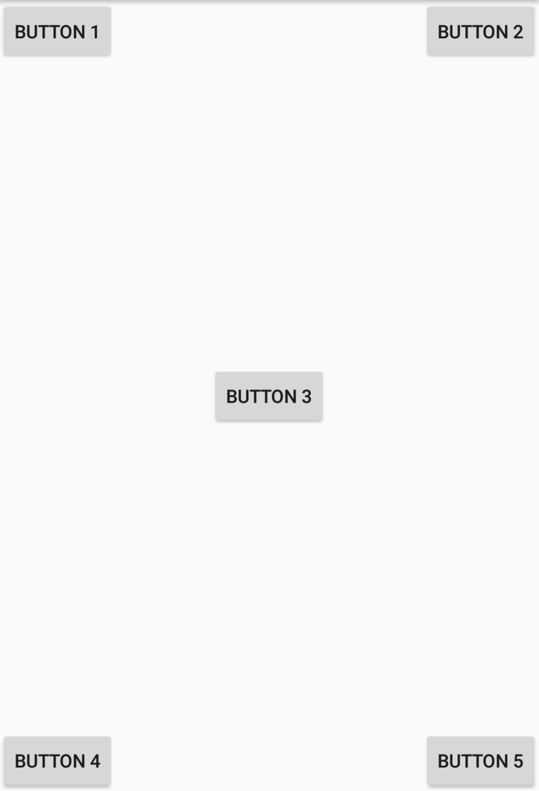

# 相对布局
>time: 2018-01-29 17:34:56  
>RelativeLayout 又称作相对布局，也是一种非常常用的布局。它可以通过相对定位的方式让控件出现布局的任何位置。

```xml
<?xml version="1.0" encoding="utf-8"?>
<RelativeLayout
    xmlns:android="http://schemas.android.com/apk/res/android"
    android:layout_width="match_parent"
    android:layout_height="match_parent">

    <Button
        android:id="@+id/button1"
        android:layout_width="wrap_content"
        android:layout_height="wrap_content"
        android:layout_alignParentLeft="true"
        android:layout_alignParentTop="true"
        android:text="Button 1"/>

    <Button
        android:id="@+id/button2"
        android:layout_width="wrap_content"
        android:layout_height="wrap_content"
        android:layout_alignParentRight="true"
        android:layout_alignParentTop="true"
        android:text="Button 2"/>

    <Button
        android:id="@+id/button3"
        android:layout_width="wrap_content"
        android:layout_height="wrap_content"
        android:layout_centerInParent="true"
        android:text="Button 3"/>

    <Button
        android:id="@+id/button4"
        android:layout_width="wrap_content"
        android:layout_height="wrap_content"
        android:layout_alignParentBottom="true"
        android:layout_alignParentLeft="true"
        android:text="Button 4"/>

    <Button
        android:id="@+id/button5"
        android:layout_width="wrap_content"
        android:layout_height="wrap_content"
        android:layout_alignParentBottom="true"
        android:layout_alignParentRight="true"
        android:text="Button 5"/>
</RelativeLayout>
```


```xml
<?xml version="1.0" encoding="utf-8"?>
<RelativeLayout
    xmlns:android="http://schemas.android.com/apk/res/android"
    android:layout_width="match_parent"
    android:layout_height="match_parent">

    <Button
        android:id="@+id/button3"
        android:layout_width="wrap_content"
        android:layout_height="wrap_content"
        android:layout_centerInParent="true"
        android:text="Button 3"/>
    <Button
        android:id="@+id/button1"
        android:layout_width="wrap_content"
        android:layout_height="wrap_content"
        android:layout_above="@+id/button3"
        android:layout_toLeftOf="@+id/button3"
        android:text="Button 1"/>

    <Button
        android:id="@+id/button2"
        android:layout_width="wrap_content"
        android:layout_height="wrap_content"
        android:layout_above="@+id/button3"
        android:layout_toRightOf="@+id/button3"
        android:text="Button 2"/>


    <Button
        android:id="@+id/button4"
        android:layout_width="wrap_content"
        android:layout_height="wrap_content"
        android:layout_below="@+id/button3"
        android:layout_toLeftOf="@+id/button3"
        android:text="Button 4"/>

    <Button
        android:id="@+id/button5"
        android:layout_width="wrap_content"
        android:layout_height="wrap_content"
        android:layout_below="@+id/button3"
        android:layout_toRightOf="@+id/button3"
        android:text="Button 5"/>
</RelativeLayout>
```
