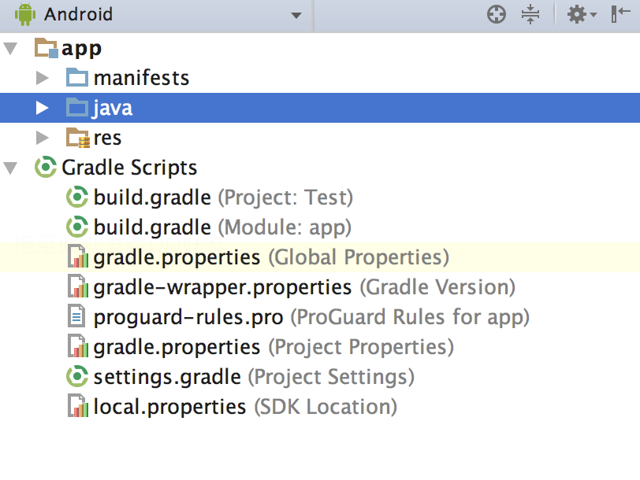
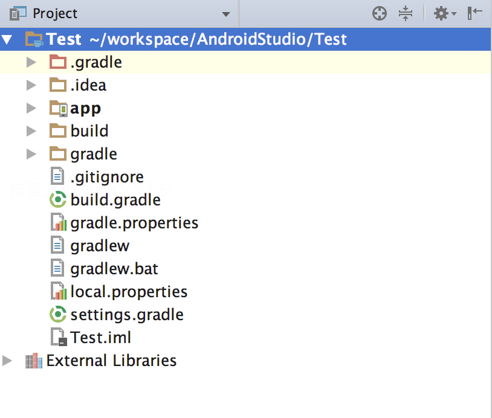

# 项目结构
>time: 2017-11-13 09:47:13
>key 项目结构   
android 目录结构

project 目录结构

## 1. .gradle 和 .idea
这两个目录下放置的都是 Android Studio 自动生成的一些文件，我们无须关心，也不要手动编辑

## 2. app
项目中的代码、资源等内容几乎都是放置在这个目录下的，我们后面的开发工作也基本都是在这个目录下进行的，待会儿还会对这个目录单独展开进行讲解。

## 3. build
这个目录下你也不需要过多关心，它主要包含了一些在编译时自动生成的文件。
