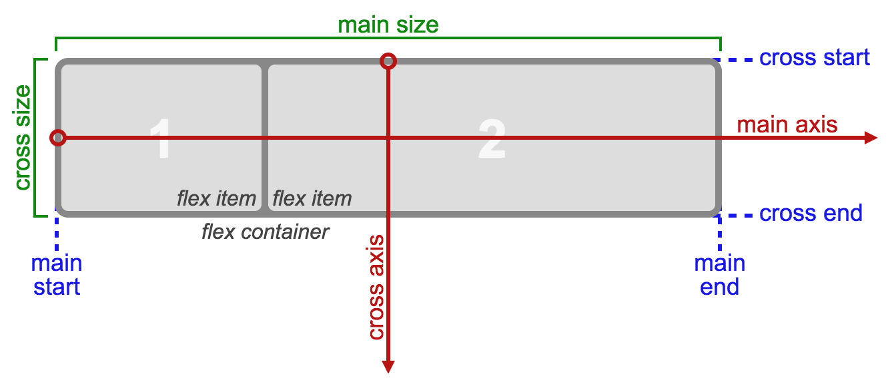

# 一、 Flex 布局

Flex 是 Flexible Box 的缩写，意为“弹性布局/弹性的盒子布局”，用来为盒状模型提供最大的灵活性。可以简单快速地完成各种伸缩性设计

任何一个容器都可以指定为 Flex 布局。

```css
.box{
    display: flex;
}
```

行内元素也可以使用 Flex 布局。
```css
.box {
    display: inline-flex;
}
```

**注意：** ，设置 Flex 布局以后，子元素的 `float`、`clear` 和 `vertical-align` 属性将失效。

# 二、基本概念

采用 Flex 布局的元素，称为 Flex 容器（flex container），简称“容器”。它的所有子元素自动成为容器成员，称为 Flex 项目（flex item），简称“项目”。


伸缩容器默认存在两根轴：
* 主轴（main axis）
* 交叉轴（cross axis）

主轴的开始位置叫做`main start`，结束位置叫`main end`。  
交叉轴的开始位置叫`cross start`，交叉轴的结束位置叫`cross end`。  
伸缩项目在主轴上占据的空间叫做`main size`，在交叉轴上占据的空间叫做`cross size`。根据设置情况的不同，主轴既可以是水平轴，也可以是垂直轴。不论那个轴作为主轴，默认情况下，伸缩项目总是沿着主轴，从主轴开始位置到主轴结束位置进行排列。flexbox 目前还处于草稿状态，所以在使用 flexbox 布局的时候，需要加上哥哥浏览器的私有前缀。
