# 一、 Flex 布局

Flex 是 Flexible Box 的缩写，意为“弹性布局/弹性的盒子布局”，用来为盒状模型提供最大的灵活性。可以简单快速地完成各种伸缩性设计

任何一个容器都可以指定为 Flex 布局。

```css
.box{
    display: flex;
}
```

行内元素也可以使用 Flex 布局。
```css
.box {
    display: inline-flex;
}
```

**注意：** ，设置 Flex 布局以后，子元素的 `float`、`clear` 和 `vertical-align` 属性将失效。

# 二、基本概念

采用 Flex 布局的元素，称为 Flex 容器（flex container），简称“容器”。它的所有子元素自动成为容器成员，称为 Flex 项目（flex item），简称“项目”。


伸缩容器默认存在两根轴：
* 主轴（main axis）
* 交叉轴（cross axis）

主轴的开始位置叫做`main start`，结束位置叫`main end`。  
交叉轴的开始位置叫`cross start`，交叉轴的结束位置叫`cross end`。  
伸缩项目在主轴上占据的空间叫做`main size`，在交叉轴上占据的空间叫做`cross size`。根据设置情况的不同，主轴既可以是水平轴，也可以是垂直轴。不论那个轴作为主轴，默认情况下，伸缩项目总是沿着主轴，从主轴开始位置到主轴结束位置进行排列。flexbox 目前还处于草稿状态，所以在使用 flexbox 布局的时候，需要加上哥哥浏览器的私有前缀。

## 2.1 伸缩容器属性

* display
* flex-direction
* flex-wrap
* flex-flow
* justify-content
* align-items
* align-content

### 2.1.1 display
该属性用来指定元素是否为伸缩容器，其语法为：  
`display: flex | inline-flex`

HTML 代码
```html
<span class="flex-container"></span>
```

#### flex:
>这个值用于产生块级伸缩容器  

```css
.flex-container {
    display: flex;
}
```
#### inline-flex
>这个值用于产生行内级伸缩容器

```css
.flex-container {
    display: inline-flex;
}
```

### 2.1.2 flex-direction
该属性用于指定主轴的方向  
`flex-direction: row | row-reverse | column | column-reverse`

HTML 代码
```html
<span class="flex-container">
    <span class="flex-item">1</span>
    <span class="flex-item">2</span>
    <span class="flex-item">3</span>
</span>
```

#### row（默认值）
> 伸缩容器若为水平方向轴，伸缩项目的排版方式为从左向右排列。

```css
.flex-container {
    display: flex;
    flex-direction: row;
}
```

[示例](../../Code/CSS/Flexbox/flex-direction_row.html)
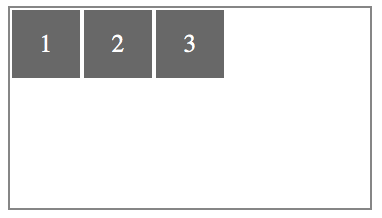

#### row-reverse
>伸缩容器若为水平方向轴，伸缩项目的排版方式为从右向左排列。
```css
.flex-container {
    display: flex;
    flex-direction: row-reverse;
}
```

[示例](../../Code/CSS/Flexbox/flex-direction_row-reverse.html)
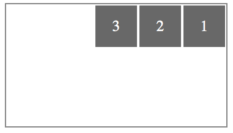

#### column
>伸缩容器若为垂直方向轴，伸缩项目的排版方式为从上向下排列。

```css
.flex-container {
    display: flex;
    flex-direction: column;
}
```

[示例](../../Code/CSS/Flexbox/flex-direction_column.html)
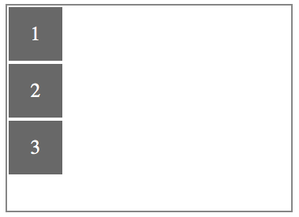

#### column-reverse
>伸缩容器若为垂直方向轴，伸缩项目的排版方式为从下向上排列。

```css
.flex-container {
    display: flex;
    flex-direction: column-reverse;
}
```
[示例](../../Code/CSS/Flexbox/flex-direction_column-reverse.html)
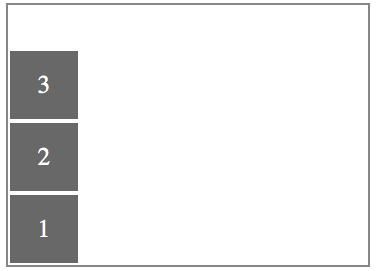

### 2.1.3 flex-wrap
该属性主要用来指定伸缩容器的主轴线方向空间不足的情况，是否换行以及该如何换行。
```
flex-wrap: nowrap | wrap | wrap-reverse
```
HTML 代码
```html
<span class="flex-container">
    <span class="flex-item">1</span>
    <span class="flex-item">2</span>
    <span class="flex-item">3</span>
    <span class="flex-item">4</span>
    <span class="flex-item">5</span>
</span>
```

#### nowrap（默认值）
>即使空间不足，伸缩容器也不允许换行

```css
.flex-container {
    display: flex;
    flex-direction: row;
    flex-wrap: nowrap;
    width: 360px;
    height: 260px;
}
.flex-item {
    width: 68px;
    height: 68px;
}
```
[示例](../../Code/CSS/Flexbox/flex-wrap_nowrap.html)
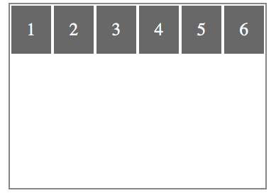

#### wrap
>伸缩容器在空间不足的情况下允许换行。若主轴为水平轴，则换行的方向为从上到下。

```css
.flex-container {
    display: flex;
    flex-direction: row;
    flex-wrap: wrap;
    width: 360px;
    height: 260px;
}
.flex-item {
    width: 68px;
    height: 68px;
}
```
[示例](../../Code/CSS/Flexbox/flex-wrap_wrap.html)
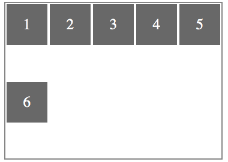

#### wrap-reverse
>伸缩容器在空间不足的情况下允许换行，若主轴为水平轴，则换行的方向为从下到上（和 wrap 相反）。

```css
.flex-container {
    display: flex;
    flex-direction: row;
    flex-wrap: wrap-reverse;
    width: 360px;
    height: 260px;
}
.flex-item {
    width: 68px;
    height: 68px;
}
```

[示例](../../Code/CSS/Flexbox/flex-wrap_wrap-reverse.html)
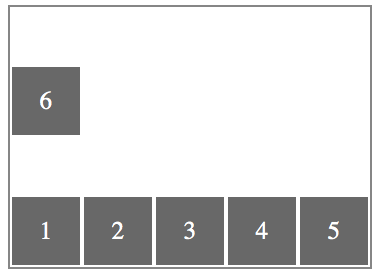

### 2.1.4 flex-flow
该属性是 `flex-direction` 和 `flex-wrap` 属性的缩写版本，它同时定义了伸缩容器的主轴和侧轴，其默认值为 `row nowrap`。

语法：
```
flex-flow: flex-direction flex-wrap
```

HTML 代码
```html
<span class="flex-container">
    <span class="flex-item">1</span>
    <span class="flex-item">2</span>
    <span class="flex-item">3</span>
    <span class="flex-item">4</span>
    <span class="flex-item">5</span>
</span>
```

```css
.flex-container {
    display: flex;
    flex-flow: row wrap-reverse;
    width: 360px;
    height: 260px;
}
.flex-item {
    width: 68px;
    height: 68px;
}
```

[示例](../../Code/CSS/Flexbox/flex-flow.html)
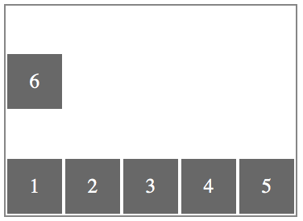

### 2.1.5 justify-content
该属性用来定义伸缩项目沿主轴线的对齐方式。
```
justify-content: flex-start | flex-end | center | space-between | space-around
```
HTML 代码
```html
<span class="flex-container">
    <span class="flex-item">1</span>
    <span class="flex-item">2</span>
    <span class="flex-item">3</span>
</span>
```

#### flex-start(default)
>伸缩项目向主轴线的起始位置靠齐。

```css
.flex-container {
    display: flex;
    flex-direction: row;
    justify-content: flex-start;
    width: 360px;
    height: 260px;
}
.flex-item {
    width: 68px;
    height: 68px;
}
```

[示例](../../Code/CSS/Flexbox/justify-content_flex-start.html)
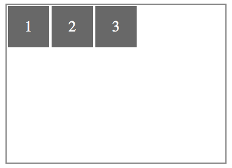

#### flex-end
>伸缩项目向主轴线的结束位置靠齐。

```css
.flex-container {
    display: flex;
    flex-direction: row;
    justify-content: flex-end;
    width: 360px;
    height: 260px;
}
.flex-item {
    width: 68px;
    height: 68px;
}
```

[示例](../../Code/CSS/Flexbox/justify-content_flex-end.html)
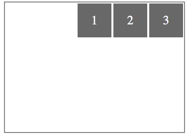

#### center
>伸缩项目向主轴线的中间位置靠齐。

```css
.flex-container {
    display: flex;
    flex-direction: row;
    justify-content: center;
    width: 360px;
    height: 260px;
}
.flex-item {
    width: 68px;
    height: 68px;
}
```

[示例](../../Code/CSS/Flexbox/justify-content_center.html)
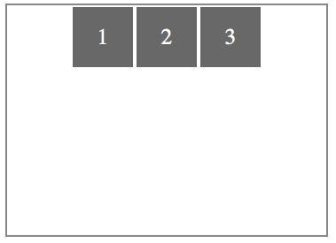

#### space-between
>伸缩项目会平均地分布在主轴线里。第一个伸缩项目在主轴线的开始位置，最后一个伸缩项目在主轴线的终点位置。

```css
.flex-container {
    display: flex;
    flex-direction: row;
    justify-content: space-between;
    width: 360px;
    height: 260px;
}
.flex-item {
    width: 68px;
    height: 68px;
}
```

[示例](../../Code/CSS/Flexbox/justify-content_space-between.html)
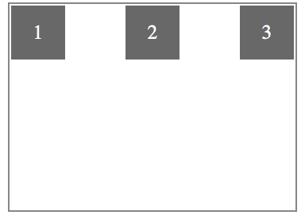

#### apsce-around
>伸缩项目会平均地分布在主轴线里，两端保留一半的空间

```css
.flex-container {
    display: flex;
    flex-direction: row;
    justify-content: space-around;
    width: 360px;
    height: 260px;
}
.flex-item {
    width: 68px;
    height: 68px;
}
```

[示例](../../Code/CSS/Flexbox/justify-content_space-around.html)
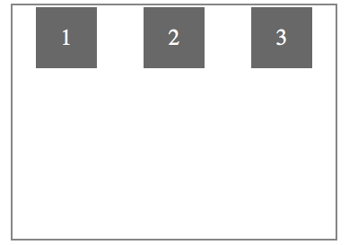


1
