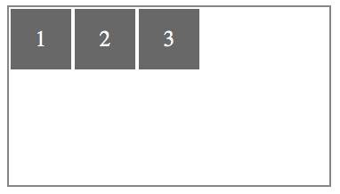
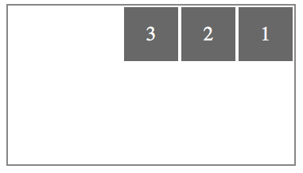
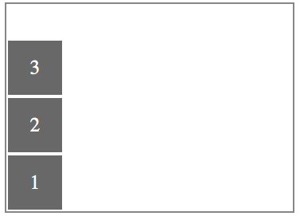
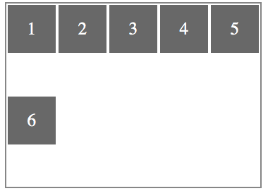
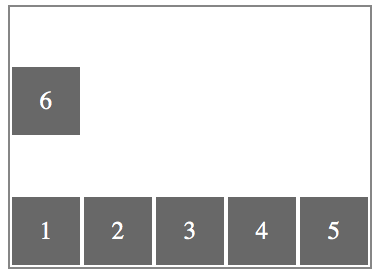
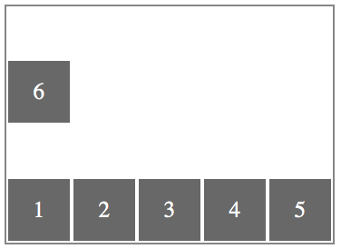
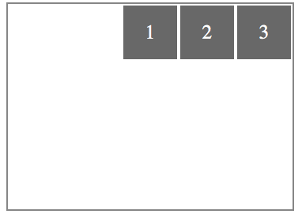
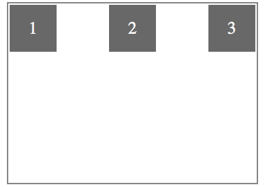

# 伸缩容器属性

* display
* flex-direction
* flex-wrap
* flex-flow
* justify-content
* align-items
* align-content

## 1. display
该属性用来指定元素是否为伸缩容器，其语法为：  
`display: flex | inline-flex`

HTML 代码
```html
<span class="flex-container"></span>
```

### 1.1 flex
>这个值用于产生块级伸缩容器  

```css
.flex-container {
    display: flex;
}
```
### 1.2 inline-flex
>这个值用于产生行内级伸缩容器

```css
.flex-container {
    display: inline-flex;
}
```

## 2. flex-direction
该属性用于指定主轴的方向  
`flex-direction: row | row-reverse | column | column-reverse`

HTML 代码
```html
<span class="flex-container">
    <span class="flex-item">1</span>
    <span class="flex-item">2</span>
    <span class="flex-item">3</span>
</span>
```

### 2.1 row(default)
>伸缩容器若为水平方向轴，伸缩项目的排版方式为从左向右排列。

```css
.flex-container {
    display: flex;
    flex-direction: row;
}
```

[示例](../../Code/CSS/Flexbox/flex-direction_row.html)


### 2.2 row-reverse
>伸缩容器若为水平方向轴，伸缩项目的排版方式为从右向左排列。
```css
.flex-container {
    display: flex;
    flex-direction: row-reverse;
}
```

[示例](../../Code/CSS/Flexbox/flex-direction_row-reverse.html)


### 2.3 column
>伸缩容器若为垂直方向轴，伸缩项目的排版方式为从上向下排列。

```css
.flex-container {
    display: flex;
    flex-direction: column;
}
```

[示例](../../Code/CSS/Flexbox/flex-direction_column.html)


### 2.4 column-reverse
>伸缩容器若为垂直方向轴，伸缩项目的排版方式为从下向上排列。

```css
.flex-container {
    display: flex;
    flex-direction: column-reverse;
}
```
[示例](../../Code/CSS/Flexbox/flex-direction_column-reverse.html)


## 3. flex-wrap
该属性主要用来指定伸缩容器的主轴线方向空间不足的情况，是否换行以及该如何换行。
```
flex-wrap: nowrap | wrap | wrap-reverse
```
HTML 代码
```html
<span class="flex-container">
    <span class="flex-item">1</span>
    <span class="flex-item">2</span>
    <span class="flex-item">3</span>
    <span class="flex-item">4</span>
    <span class="flex-item">5</span>
</span>
```

### 3.1 nowrap (default)
>即使空间不足，伸缩容器也不允许换行

```css
.flex-container {
    display: flex;
    flex-direction: row;
    flex-wrap: nowrap;
    width: 360px;
    height: 260px;
}
.flex-item {
    width: 68px;
    height: 68px;
}
```
[示例](../../Code/CSS/Flexbox/flex-wrap_nowrap.html)


### 3.2 wrap
>伸缩容器在空间不足的情况下允许换行。若主轴为水平轴，则换行的方向为从上到下。

```css
.flex-container {
    display: flex;
    flex-direction: row;
    flex-wrap: wrap;
    width: 360px;
    height: 260px;
}
.flex-item {
    width: 68px;
    height: 68px;
}
```
[示例](../../Code/CSS/Flexbox/flex-wrap_wrap.html)


### 3.3 wrap-reverse
>伸缩容器在空间不足的情况下允许换行，若主轴为水平轴，则换行的方向为从下到上（和 wrap 相反）。

```css
.flex-container {
    display: flex;
    flex-direction: row;
    flex-wrap: wrap-reverse;
    width: 360px;
    height: 260px;
}
.flex-item {
    width: 68px;
    height: 68px;
}
```

[示例](../../Code/CSS/Flexbox/flex-wrap_wrap-reverse.html)


## 4. flex-flow
该属性是 `flex-direction` 和 `flex-wrap` 属性的缩写版本，它同时定义了伸缩容器的主轴和侧轴，其默认值为 `row nowrap`。

语法：
```
flex-flow: flex-direction flex-wrap
```

HTML 代码
```html
<span class="flex-container">
    <span class="flex-item">1</span>
    <span class="flex-item">2</span>
    <span class="flex-item">3</span>
    <span class="flex-item">4</span>
    <span class="flex-item">5</span>
</span>
```

```css
.flex-container {
    display: flex;
    flex-flow: row wrap-reverse;
    width: 360px;
    height: 260px;
}
.flex-item {
    width: 68px;
    height: 68px;
}
```

[示例](../../Code/CSS/Flexbox/flex-flow.html)


## 5. justify-content
该属性用来定义伸缩项目沿主轴线的对齐方式。
```
justify-content: flex-start | flex-end | center | space-between | space-around
```
HTML 代码
```html
<span class="flex-container">
    <span class="flex-item">1</span>
    <span class="flex-item">2</span>
    <span class="flex-item">3</span>
</span>
```

### 5.1 flex-start (default)
>伸缩项目向主轴线的起始位置靠齐。

```css
.flex-container {
    display: flex;
    flex-direction: row;
    justify-content: flex-start;
    width: 360px;
    height: 260px;
}
.flex-item {
    width: 68px;
    height: 68px;
}
```

[示例](../../Code/CSS/Flexbox/justify-content_flex-start.html)


### 5.2 flex-end
>伸缩项目向主轴线的结束位置靠齐。

```css
.flex-container {
    display: flex;
    flex-direction: row;
    justify-content: flex-end;
    width: 360px;
    height: 260px;
}
.flex-item {
    width: 68px;
    height: 68px;
}
```

[示例](../../Code/CSS/Flexbox/justify-content_flex-end.html)


### 5.3 center
>伸缩项目向主轴线的中间位置靠齐。

```css
.flex-container {
    display: flex;
    flex-direction: row;
    justify-content: center;
    width: 360px;
    height: 260px;
}
.flex-item {
    width: 68px;
    height: 68px;
}
```

[示例](../../Code/CSS/Flexbox/justify-content_center.html)


### 5.4 space-between
>伸缩项目会平均地分布在主轴线里。第一个伸缩项目在主轴线的开始位置，最后一个伸缩项目在主轴线的终点位置。

```css
.flex-container {
    display: flex;
    flex-direction: row;
    justify-content: space-between;
    width: 360px;
    height: 260px;
}
.flex-item {
    width: 68px;
    height: 68px;
}
```

[示例](../../Code/CSS/Flexbox/justify-content_space-between.html)


### 5.5 space-around
>伸缩项目会平均地分布在主轴线里，两端保留一半的空间

```css
.flex-container {
    display: flex;
    flex-direction: row;
    justify-content: space-around;
    width: 360px;
    height: 260px;
}
.flex-item {
    width: 68px;
    height: 68px;
}
```

[示例](../../Code/CSS/Flexbox/justify-content_space-around.html)


## 6. align-items
定义伸缩项目在伸缩容器的交叉轴上的对齐方式。
```
align-items: flex-start | flex-end | center | baseline | stretch
```
HTML 代码
```html
<span class="flex-container">
    <span class="flex-item" id="item1">1</span>
    <span class="flex-item" id="item2">2</span>
    <span class="flex-item" id="item3">3</span>
</span>
```

### 6.1 flex-start (default)
>伸缩项目向交叉轴的起始位置靠齐。

```css
.flex-container {
    display: flex;
    flex-direction: row;
    align-items: flex-start;
    width: 360px;
    height: 260px;
}
.flex-item {
    width: 68px;
    height: 68px;
}
```

[示例](../../Code/CSS/Flexbox/align-items_flex-start.html)


### 6.2 flex-end
>伸缩项目向交叉轴的结束位置靠齐

```css
.flex-container {
    display: flex;
    flex-direction: row;
    align-items: flex-end;
    width: 360px;
    height: 260px;
}
.flex-item {
    width: 68px;
    height: 68px;
}
```

[示例](../../Code/CSS/Flexbox/align-items_flex-end.html)


### 6.3 center
>伸缩项目向交叉轴的中间位置靠齐

```css
.flex-container {
    display: flex;
    flex-direction: row;
    align-items: center;
    width: 360px;
    height: 260px;
}
.flex-item {
    width: 68px;
    height: 68px;
}
```

[示例](../../Code/CSS/Flexbox/align-items_center.html)


### 6.4 baseline
>伸缩项目根据它们的基线对齐

```css
.flex-container {
    display: flex;
    flex-direction: row;
    align-items: baseline;
    width: 360px;
    height: 260px;
}
.flex-item {
    width: 68px;
    height: 68px;
}
```

### 6.5 stretch
>伸缩项目在交叉轴方向拉伸填充整个伸缩容器

```css
.flex-container {
    display: flex;
    flex-direction: row;
    align-items: stretch;
    width: 360px;
    height: 260px;
}
.flex-item {
    width: 68px;
    height: 68px;
}
```

[示例](../../Code/CSS/Flexbox/align-items_stretch.html)

