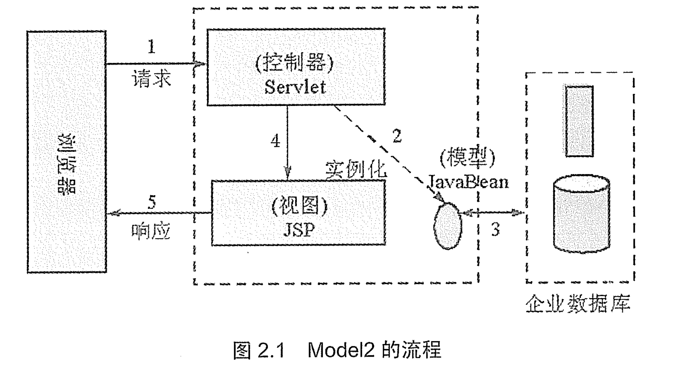
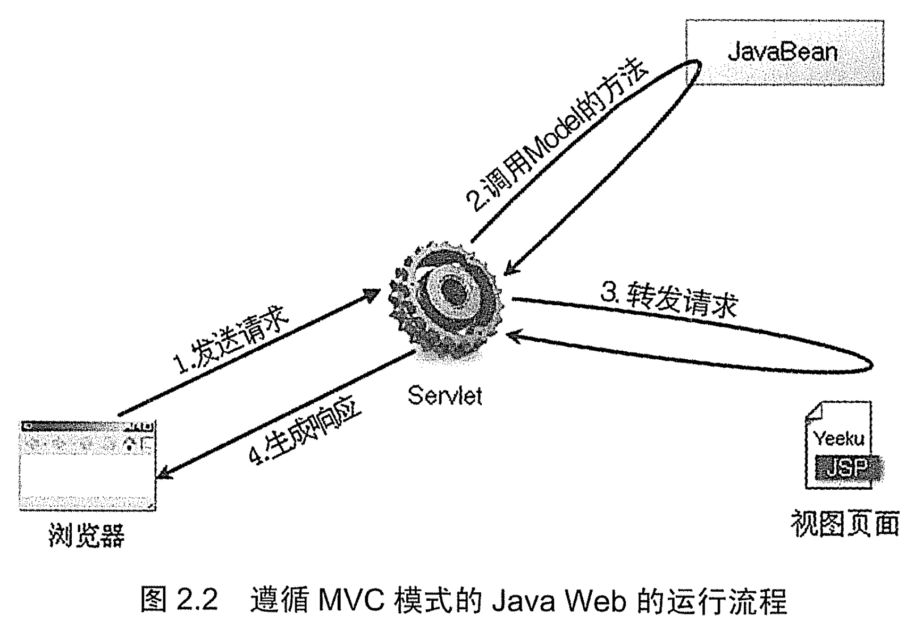

# MVC 思想概述
Java Web 应用的结构经历了 Model1 和 Model2 两个时代，从 Model 1 发展到 Model2 既是技术发展的必要，也是无数程序员的心血结晶。

在 Model1 模式下，整个 Web 应用几乎全部由 JSP 页面组成，JSP 页面接收处理客户端请求，对请求处理后直接作出响应。用少量的 JavaBean 来处理数据库链接、数据库访问等操作。

Model1 模式的实现比较简单，适用于快速开发小规模项目。但从工程化的角度看，它局限性非常明显；JSP 页面身兼 View 和 Controller 两种角色。将控制逻辑和表现逻辑混杂在一起，从而导致代码的重用性非常低，增加了应用的扩展和维护的难度。

早起由大量 JSP 页面所开发出来的 Web 应用，大都采用了 Model1 架构。实际上，早期绝大部分 ASP 应用也属于这种 Model1 架构。

Model 是基于 MVC 框架的设计模式。在 Model2 架构中，Servlet 作为前端控制器，负责接受客户端发送的请求。在 Servlet 中只包含控制逻辑和简单的前端处理；然后，调用后端 JavaBean 来完成实际的逻辑处理；最后，将其转发到相应的 JSP 页面来处理显示逻辑。

Model2 下的 JSP 不再承担控制器的责任，它仅仅是表现层角色，仅仅用于将结果呈现给用户。JSP 页面的请求与 Serlet（控制器）交互，而 Servlet 负责与后台的 JavaBean 通信。在 Model2 模式下，模型（Model）由 JavaBean 充当，试图（View）由 JSP 页面充当，而控制器（Controller）则由 Servlet 充当。

由于引入了 MVC 模式，使得 Model2 具有组件化的特点，从而更适用于大规模应用的开发，但也增加了应用开发的复杂度。原本需要一个简单的 JSP 页面就能实现的应用，在 Model2 中被分解成多个协同工作的部分，程序员需要花更多时间才能真正掌握其设计和实现过程。

Model2 是 MVC 设计思想下的架构。

从某种程度上讲，Model2 为了降低系统后期维护的复杂度，而导致前期开发的高复杂度。

### 1. MVC 思想及其优势

MVC 并不是 Java 语言所特有的设计思想，也并不是 Web 应用所特有的思想，它是所有面向对象程序设计语言都应该遵守的规范。

MVC 思想将一个应用分成三个部分：Model（模型）、View（试图）和Controller（控制器），这三个部分以最少的耦合协同工作，从而提高应用的可扩展性及可维护性。

在经典的 MVC 模式中，事件由控制器处理，控制器根据事件的类型改变模型或视图，反之亦然。具体地说，每个模型对应一系列的视图列表，这种对应关系通常采用注册来完成，即把多个试图注册到同一个模型，当模型发生改变时，模型向所有注册过的视图发送通知，接下来，视图从对应的模型中获得信息，然后完成视图显示的更新。

从设计模式的角度看，MVC 思想非常类似于观察者模式，但其与观察者模式存在少许差别：在观察者模式下，观察者和被观察者可以是两个相互对等的对象；但在 MVC 中，被观察者往往只是单纯的数据体，而观察者则是单纯的视图页面。

### 2. MVC 的特点
* 多个视图可以对应一个模型。按 MVC 设计模式，一个模型对应多个视图，可以减少代码的复制及代码的维护量，这样，一旦模型发生改变，也易于维护。
* 模型返回的数据与显示的逻辑分离。模型数据可以应用任何的显示技术，例如，使用 JSP 页面、Velocity 模版活着直接产生 Excel 文档等。
* 应用被分隔为三层，这降低了各层之间的耦合，提供了应用的可扩展性。
* 控制层的概念也很有效，由于它把不同的模型和不同的视图组合在一起，完成不同的请求。因此，控制层可以说包含了用户请求权限的概念。
* MVC 更符合软件工程化管理的精神。不同的层各司其职，每一层的组建具有相同的特征，这有利于通过工程化和工具化的方法产生管理程序代码。

相对与早起的 MVC 思想，Web 模式下的 MVC 思想则又存在一些变化。对于一个普通应用程序，可以将视图注册给模型，当模型数据发生改变时，即时通知视图页面发生改变；而对于 Web 应用，即使将多个 JSP 页面注册给一个模型，但当模型发生变化时，模型也无法主动给 JSP 页面发送消息（因为 Web 应用都是基于请求/响应模式的），只有当用户请求浏览该页面时，控制器才负责调用模型数据来更新 JSP 页面。

MVC 思想与观察者模式有一定的相似之处，但并不完全相同。经典的 MVC 思想与 Web 应用的 MVC 思想也存在一定的差别，引起差别的主要原因是因为 Web 应用是一种请求/响应模式下应用，对应请求/响应应用，如果用户不对应用发出请求，试图将无法主动更新自己。
