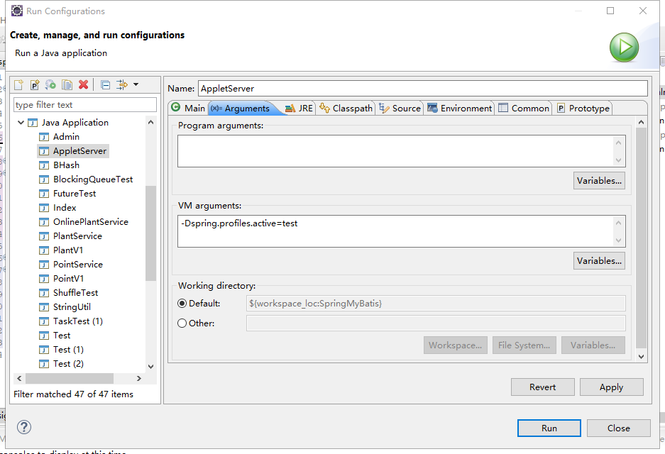

@Profile
>time: 2018-7-31 15:42:09

## 1. 注解配置

#### jdbc.properties
```
dev.driver=com.mysql.jdbc.Driver
dev.url=jdbc:mysql://127.0.0.1:3310/mybatis?useSSL=false&useUnicode=true&characterEncoding=utf8&rewriteBatchedStatements=true&serverTimezone=PRC
dev.username=root
dev.password=bhxz

test.driver=com.mysql.jdbc.Driver
test.url=jdbc:mysql://127.0.0.1:3310/mybatis?useSSL=false&useUnicode=true&characterEncoding=utf8&rewriteBatchedStatements=true&serverTimezone=PRC
test.username=root
test.password=bhxz
```

#### ProfileDataSource.java
```java
@Component
public class ProfileDataSource {
    
    @Value("${dev.driver}")
    private String devDriver = null;
    @Value("${dev.url}")
    private String devUrl = null;
    @Value("${dev.username}")
    private String devUsername = null;
    @Value("${dev.password}")
    private String devPassword = null;
    
    @Value("${test.driver}")
    private String testDriver = null;
    @Value("${test.url}")
    private String testUurl = null;
    @Value("${test.username}")
    private String testUsername = null;
    @Value("${test.password}")
    private String testPassword = null;
    
    @Bean(name = "devDataSource")
    @Profile("dev")
    public DataSource getDevDataSource() {
        
        
        Properties props = new Properties();
        props.setProperty("driver", this.devDriver);
        props.setProperty("url", this.devUrl);
        props.setProperty("username", this.devUsername);
        props.setProperty("password", this.devPassword);
        DataSource dataSource = null;
        try {
            dataSource = BasicDataSourceFactory.createDataSource(props);
        } catch(Exception e) {
            e.printStackTrace();
        }
        System.out.println("dev");
        return dataSource;
    }
    
    @Bean(name = "testDataSource")
    @Profile("test")
    public DataSource getTestDataSource() {
        Properties props = new Properties();
        props.setProperty("driver", this.testDriver);
        props.setProperty("url", this.testUurl);
        props.setProperty("username", this.testUsername);
        props.setProperty("password", this.testPassword);
        DataSource dataSource = null;
        try {
            dataSource = BasicDataSourceFactory.createDataSource(props);
        } catch(Exception e) {
            e.printStackTrace();
        }
        System.out.println("test");
        return dataSource;
    }
}
```

#### profileConfig.java
```java
@ComponentScan(basePackageClasses = {ProfileDataSource.class})
@PropertySource(value= {"classpath:jdbc.properties"}, ignoreResourceNotFound=true)
public class profileConfig {
    /**
     * 为了让 Spring 能够解析属性占位符
     * @return
     */
    @Bean
    public PropertySourcesPlaceholderConfigurer propertySourcesPlaceholderConfigurer() {
        return new PropertySourcesPlaceholderConfigurer();
    }
}
```

#### ProfileTest.java
```java
@RunWith(SpringJUnit4ClassRunner.class)
@ContextConfiguration(classes=profileConfig.class)
@ActiveProfiles("test")
public class ProfileTest {
    @Autowired
    private DataSource dataSource;
    
    @Test
    public void test() {
        dataSource.hashCode();
        System.out.println(dataSource);
    }
}
```

#### 输出：
```
test
org.apache.commons.dbcp.BasicDataSource@419c5f1a
```

## 2. XML 配置
```xml
<?xml version="1.0" encoding="UTF-8"?>
<beans xmlns="http://www.springframework.org/schema/beans"
    xmlns:xsi="http://www.w3.org/2001/XMLSchema-instance"
    xsi:schemaLocation="
        http://www.springframework.org/schema/beans
        http://www.springframework.org/schema/beans/spring-beans-4.3.xsd"
        profile="dev">
        
        
        <bean id="dataSource" class="org.apache.commons.dbcp.BasicDataSource">
            <property name="driverClassName" value="com.mysql.jdbc.Driver"></property>
            <property name="url" value="jdbc:mysql://127.0.0.1:3310/info"></property>
            <property name="username" value="root"></property>
            <property name="password" value="bhxz"></property>
        </bean>
</beans>
```
加了 Profile 属性会导致一个配置文件所有的 Bean 都放在 dev 的 Profile 下。

#### 在一个 XML 文件里配置多个 Profile
```xml
<?xml version="1.0" encoding="UTF-8"?>
<beans xmlns="http://www.springframework.org/schema/beans"
    xmlns:xsi="http://www.w3.org/2001/XMLSchema-instance"
    xsi:schemaLocation="
        http://www.springframework.org/schema/beans
        http://www.springframework.org/schema/beans/spring-beans-4.3.xsd">
        
        <beans profile="test">
            <bean id="dataSource" class="org.apache.commons.dbcp.BasicDataSource">
                <property name="driverClassName" value="com.mysql.jdbc.Driver"></property>
                <property name="url" value="jdbc:mysql://127.0.0.1:3310/info"></property>
                <property name="username" value="root"></property>
                <property name="password" value="bhxz"></property>
            </bean>
        </beans>
        <beans profile="dev">
            <bean id="dataSource" class="org.apache.commons.dbcp.BasicDataSource">
                <property name="driverClassName" value="com.mysql.jdbc.Driver"></property>
                <property name="url" value="jdbc:mysql://127.0.0.1:3310/info"></property>
                <property name="username" value="root"></property>
                <property name="password" value="bhxz"></property>
            </bean>
        </beans>
</beans>
```

在测试代码中可以加入 @ActiveProfiles 来指定加载哪个 Profile，这样程序就会自己去加载对应的 Profile 了。在服务器上运行，可以配置 Java 虚拟机的启动项，比如在 Tomcat 服务器上或者在 main 方法上，可以启用 Java 虚拟机的参数来试下它，关于定制 Profile 的参数存在两个
* spring.profiles.active: 启动的 Profile，如果配置了它，那么 spring.profiles.default 配置将失效。
* spring.profiles.default: 默认启动的 Profile，如果系统没有配置关于 Profile 参数的时候，那么它将启动。

配置 JVM 的参数启用对应的 Profile，比如启动 test：  
`JAVA_OPTS="-Dspring.profiles.active=test"`  
这时候 Spring 就知道你需要的时 Profile 为 test 的 Bean。

#### 在 Eclipse IDE 中给运行的类加入虚拟机参数



## 3. 在 Web.xml 配置 Profile

```xml
<!-- 使用 Web 环境参数 -->
<context-param>
    <param-name>spring.profiles.active</param-name>
    <param-value>test</param-value>
</context-param>
......
```

```xml
<!-- 使用 SpringMVC 的 DispatcherServlet 环境参数 -->
<servlet>
    <servlet-name>dispatcher</servlet-name>
    <servlet-class>org.springframework.web.servlet.DispatcherServlet</servlet-class>
    <load-on-startup>2</load-on-startup>
    <init-param>
        <param-name>spring.profile.active</param-name>
        <param-name>test</param-name>
    </init-param>
</servlet>
```
