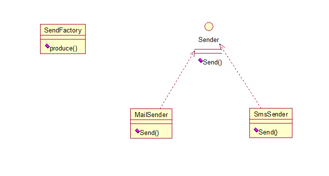
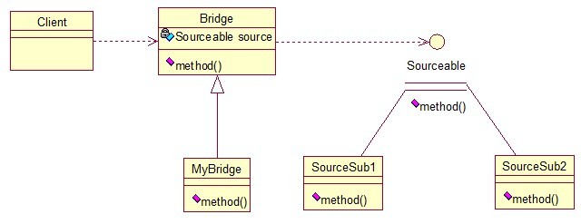

# 信息
>time: 2018-05-23 14:29:39

GoF 对于 23 种设计模式的分类已经深入人心，即中所周知的创建型模式、结构型模式与行为型模式。

## 1. 设计模式的分类
### 1.1 创建型
1. Factory Method（工厂方法）
2. Abstract Factory（抽象工厂）
3. Builder（建造者）
4. Prototype（原型）
5. Singleton（单例）

### 1.2 结构型

1. Adapter Class/Object（适配器）
7. Bridge（桥接）
8. Composite（组合）
9. Decorator（装饰）
10. Facade（外观）
11. Flyweight（享元）
12. Proxy（代理）

### 1.3 行为型

1. Interpreter（解释器）
14. Template Method（模板方法）
15. Chain of Responsibility（责任链）
16. Command（命令）
17. Iterator（迭代器）
18. Mediator（中介者）
19. Memento（备忘录）
20. Observer（观察者）
21. State（状态）
22. Strategy（策略）
23. Visitor（访问者）


## 2. 设计模式的六大原则
### 2.1 开闭原则（Open Close Principle）
开闭原则就是说对扩展开放，对修改关闭。在程序需要进行拓展的时候，不能去修改原有的代码，实现一个热插拔的效果。所以一句话概括就是：为了使程序的扩展性好，易于维护和升级。想要达到这样的效果，我们需要使用接口和抽象类。

### 2.2 里氏代换原则（Liskov Substitution Principle）
里氏代换原则(Liskov Substitution Principle LSP)面向对象设计的基本原则之一。 里氏代换原则中说，任何基类可以出现的地方，子类一定可以出现。 LSP是继承复用的基石，只有当衍生类可以替换掉基类，软件单位的功能不受到影响时，基类才能真正被复用，而衍生类也能够在基类的基础上增加新的行为。里氏代换原则是对“开-闭”原则的补充。实现“开-闭”原则的关键步骤就是抽象化。而基类与子类的继承关系就是抽象化的具体实现，所以里氏代换原则是对实现抽象化的具体步骤的规范。

### 2.3 依赖倒转原则（Dependence Inversion Principle）
这个是开闭原则的基础，具体内容：真对接口编程，依赖于抽象而不依赖于具体。

### 2.4 接口隔离原则（Interface Segregation Principle）
这个原则的意思是：使用多个隔离的接口，比使用单个接口要好。还是一个降低类之间的耦合度的意思，从这儿我们看出，其实设计模式就是一个软件的设计思想，从大型软件架构出发，为了升级和维护方便。所以上文中多次出现：降低依赖，降低耦合。

### 2.5 迪米特法则（最少知道原则）（Demeter Principle）
为什么叫最少知道原则，就是说：一个实体应当尽量少的与其他实体之间发生相互作用，使得系统功能模块相对独立。

### 2.6 合成复用原则（Composite Reuse Principle）
原则是尽量使用合成/聚合的方式，而不是使用继承。

## 3. Java的23中设计模式
### 3.1 工厂方法模式（Factory Method）
工厂方法模式分为三种：
#### 3.1.1 普通工厂模式
就是建立一个工厂类，对实现了同一接口的一些类进行实例的创建。


```java
public interface Sender {  
    public void Send();
}
```
```java
public class MailSender implements Sender {
    @Override
    public void Send() {
        System.out.println("this is mailsender!");
    }
}
```
```java
public class SmsSender implements Sender {
    @Override
    public void Send() {
        System.out.println("this is sms sender!");
    }
}
```

```java
public class SendFactory {  
    public Sender produce(String type) {
        if ("mail".equals(type)) {
            return new MailSender();
        } else if ("sms".equals(type)) {
            return new SmsSender();
        } else {
            System.out.println("请输入正确的类型!");
            return null;
        }
    }
}
```

```java
public class FactoryTest {
    public static void main(String[] args) {
        SendFactory factory = new SendFactory();
        Sender sender = factory.produce("sms");
        sender.Send();
    }
}
```

### 3.1.2 多个工厂方法模式
是对普通工厂方法模式的改进，在普通工厂方法模式中，如果传递的字符串出错，则不能正确创建对象，而多个工厂方法模式是提供多个工厂方法，分别创建对象。


```java
public class SendFactory {
   public Sender produceMail(){
        return new MailSender();
    }

    public Sender produceSms(){
        return new SmsSender();
    }
}
```

```java
public class FactoryTest {
    public static void main(String[] args) {
        SendFactory factory = new SendFactory();
        Sender sender = factory.produceMail();
        sender.Send();
    }
}
```

### 3.1.3 静态工厂方法模式
>将上面的多个工厂方法模式里的方法置为静态的，不需要创建实例，直接调用即可。

```java
public class SendFactory {
    public static Sender produceMail(){
        return new MailSender();
    }
    public static Sender produceSms(){
        return new SmsSender();
    }
}
```

```java
public class FactoryTest {
    public static void main(String[] args) {
        Sender sender = SendFactory.produceMail();
        sender.Send();
    }
}
```

工厂模式适合：凡是出现了大量的产品需要创建，并且具有共同的接口时，可以通过工厂方法模式进行创建。在以上的三种模式中，第一种如果传入的字符串有误，不能正确创建对象，第三种相对于第二种，不需要实例化工厂类，所以，大多数情况下，我们会选用第三种——静态工厂方法模式。

## 3.2 抽象工厂模式（Abstract Factory）
>工厂方法模式有一个问题就是，类的创建依赖工厂类，也就是说，如果想要拓展程序，必须对工厂类进行修改，这违背了闭包原则，所以，从设计角度考虑，有一定的问题，如何解决？就用到抽象工厂模式，创建多个工厂类，这样一旦需要增加新的功能，直接增加新的工厂类就可以了，不需要修改之前的代码。因为抽象工厂不太好理解，我们先看看图，然后就和代码，就比较容易理解。


```java
public interface Sender {
    public void Send();
}
```

```java
public class MailSender implements Sender {
    @Override
    public void Send() {
        System.out.println("this is mailsender!");
    }
}
```

```java
public class SmsSender implements Sender {
    @Override
    public void Send() {
        System.out.println("this is sms sender!");
    }
}
```

```java
public interface Provider {
    public Sender produce();
}
```

```java
public class SendMailFactory implements Provider {
    @Override
    public Sender produce(){
        return new MailSender();
    }
}
```

```java
public class SendSmsFactory implements Provider {
    @Override
    public Sender produce() {
        return new SmsSender();
    }
}
```

```java
public class Test {
    public static void main(String[] args) {
        Provider provider = new SendMailFactory();
        Sender sender = provider.produce();
        sender.Send();
    }
}
```

其实这个模式的好处就是，如果你现在想增加一个功能：发及时信息，则只需做一个实现类，实现Sender接口，同时做一个工厂类，实现Provider接口，就行了，无需去改动现成的代码。这样做，拓展性较好！

## 3.3 单例模式（Singleton）
单例对象（Singleton）是一种常用的设计模式。在 Java 应用中，单例对象能保证在一个 JVM 中，该对象只有一个实例存在。这样的模式有几个好处：
1. 某些类创建比较频繁，对于一些大型的对象，这是一笔很大的系统开销。
1. 省去了 new 操作符，降低了系统内存的使用频率，减轻GC压力。
1. 有些类如交易所的核心交易引擎，控制着交易流程，如果该类可以创建多个的话，系统完全乱了。（比如一个军队出现了多个司令员同时指挥，肯定会乱成一团），所以只有使用单例模式，才能保证核心交易服务器独立控制整个流程。

```java
public class Singleton {
    /* 持有私有静态实例，防止被引用，此处赋值为null，目的是实现延迟加载 */
    private static Singleton instance = null;

    /* 私有构造方法，防止被实例化 */
    private Singleton() {
    }
  
    /* 静态工程方法，创建实例 */
    public static Singleton getInstance() {
        if (instance == null) {
            instance = new Singleton();
        }
        return instance;
    }

    /* 如果该对象被用于序列化，可以保证对象在序列化前后保持一致 */  
    public Object readResolve() {
        return instance;
    }
}
```

这个类可以满足基本要求，但是，像这样毫无线程安全保护的类，如果我们把它放入多线程的环境下，肯定就会出现问题了，如何解决？我们首先会想到对 getInstance 方法加 synchronized 关键字，如下：
```java
public static synchronized Singleton getInstance() {
    if (instance == null) {
        instance = new Singleton();
    }
    return instance;
}
```

但是，synchronized 关键字锁住的是这个对象，这样的用法，在性能上会有所下降，因为每次调用 getInstance()，都要对对象上锁，事实上，只有在第一次创建对象的时候需要加锁，之后就不需要了，所以，这个地方需要改进。我们改成下面这个：
```java
public static Singleton getInstance() {
    if (instance == null) {
        synchronized (instance) {
            if (instance == null) {
                instance = new Singleton();
            }  
        }
    }
    return instance;
}
```

似乎解决了之前提到的问题，将synchronized关键字加在了内部，也就是说当调用的时候是不需要加锁的，只有在instance为null，并创建对象的时候才需要加锁，性能有一定的提升。但是，这样的情况，还是有可能有问题的，看下面的情况：在Java指令中创建对象和赋值操作是分开进行的，也就是说instance = new Singleton();语句是分两步执行的。但是JVM并不保证这两个操作的先后顺序，也就是说有可能JVM会为新的Singleton实例分配空间，然后直接赋值给instance成员，然后再去初始化这个Singleton实例。这样就可能出错了，我们以A、B两个线程为例：
1. A、B 线程同时进入了第一个if判断
1. A 首先进入 synchronized 块，由于 instance 为 null，所以它执行 `instance = new Singleton();`
1. 由于 JVM 内部的优化机制，JVM 先画出了一些分配给 Singleton 实例的空白内存，并赋值给 instance 成员（注意此时 JVM 没有开始初始化这个实例），然后 A 离开了 synchronized 块。
1. B 进入 synchronized 块，由于 instance 此时不是 null，因此它马上离开了 synchronized 块并将结果返回给调用该方法的程序。
1. 此时 B 线程打算使用 Singleton 实例，却发现它没有被初始化，于是错误发生了。

所以程序还是有可能发生错误，其实程序在运行过程是很复杂的，从这点我们就可以看出，尤其是在写多线程环境下的程序更有难度，有挑战性。我们对该程序做进一步优化：

```java
private static class SingletonFactory{
    private static Singleton instance = new Singleton();
}
public static Singleton getInstance(){
    return SingletonFactory.instance;
}
```

实际情况是，单例模式使用内部类来维护单例的实现，JVM内部的机制能够保证当一个类被加载的时候，这个类的加载过程是线程互斥的。这样当我们第一次调用getInstance的时候，JVM能够帮我们保证instance只被创建一次，并且会保证把赋值给instance的内存初始化完毕，这样我们就不用担心上面的问题。同时该方法也只会在第一次调用的时候使用互斥机制，这样就解决了低性能问题。这样我们暂时总结一个完美的单例模式：
```java
public class Singleton {

    /* 私有构造方法，防止被实例化 */
    private Singleton() {
    }

    /* 此处使用一个内部类来维护单例 */
    private static class SingletonFactory {
        private static Singleton instance = new Singleton();
    }

    /* 获取实例 */
    public static Singleton getInstance() {
        return SingletonFactory.instance;
    }

    /* 如果该对象被用于序列化，可以保证对象在序列化前后保持一致 */
    public Object readResolve() {
        return getInstance();
    }
}
```
其实说它完美，也不一定，如果在构造函数中抛出异常，实例将永远得不到创建，也会出错。所以说，十分完美的东西是没有的，我们只能根据实际情况，选择最适合自己应用场景的实现方法。也有人这样实现：因为我们只需要在创建类的时候进行同步，所以只要将创建和 getInstance() 分开，单独为创建加 synchronized 关键字，也是可以的：
```java
public class SingletonTest {

    private static SingletonTest instance = null;
  
    private SingletonTest() {
    }

    private static synchronized void syncInit() {
        if (instance == null) {
            instance = new SingletonTest();
        }
    }

    public static SingletonTest getInstance() {
        if (instance == null) {
            syncInit();
        }
        return instance;
    }
}
```
考虑性能的话，整个程序只需创建一次实例，所以性能也不会有什么影响。

**补充**：采用"影子实例"的办法为单例对象的属性同步更新
```java
public class SingletonTest {

    private static SingletonTest instance = null;
    private Vector properties = null;

    public Vector getProperties() {
        return properties;
    }

    private SingletonTest() {
    }

    private static synchronized void syncInit() {
        if (instance == null) {
            instance = new SingletonTest();
        }
    }

    public static SingletonTest getInstance() {
        if (instance == null) {
            syncInit();
        }
        return instance;
    }

    public void updateProperties() {
        SingletonTest shadow = new SingletonTest();
        properties = shadow.getProperties();
    }
}
```
通过单例模式的学习告诉我们：
1. 单例模式理解起来简单，但是具体实现起来还是有一定的难度。
1. synchronized关键字锁定的是对象，在用的时候，一定要在恰当的地方使用（注意需要使用锁的对象和过程，可能有的时候并不是整个对象及整个过程都需要锁）。

到这儿，单例模式基本已经讲完了，结尾处，笔者突然想到另一个问题，就是采用类的静态方法，实现单例模式的效果，也是可行的，此处二者有什么不同？

首先，静态类不能实现接口。（从类的角度说是可以的，但是那样就破坏了静态了。因为接口中不允许有static修饰的方法，所以即使实现了也是非静态的）

其次，单例可以被延迟初始化，静态类一般在第一次加载是初始化。之所以延迟加载，是因为有些类比较庞大，所以延迟加载有助于提升性能。

再次，单例类可以被继承，他的方法可以被覆写。但是静态类内部方法都是static，无法被覆写。

最后一点，单例类比较灵活，毕竟从实现上只是一个普通的Java类，只要满足单例的基本需求，你可以在里面随心所欲的实现一些其它功能，但是静态类不行。从上面这些概括中，基本可以看出二者的区别，但是，从另一方面讲，我们上面最后实现的那个单例模式，内部就是用一个静态类来实现的，所以，二者有很大的关联，只是我们考虑问题的层面不同罢了。两种思想的结合，才能造就出完美的解决方案，就像HashMap采用数组+链表来实现一样，其实生活中很多事情都是这样，单用不同的方法来处理问题，总是有优点也有缺点，最完美的方法是，结合各个方法的优点，才能最好的解决问题！

## 3.4 建造者模式（Builder）
工厂类模式提供的是创建单个类的模式，而建造者模式则是将各种产品集中起来进行管理，用来创建复合对象，所谓复合对象就是指某个类具有不同的属性，其实建造者模式就是前面抽象工厂模式和最后的Test结合起来得到的。我们看一下代码：

```java
public class Builder {  

    private List<Sender> list = new ArrayList<Sender>();

    public void produceMailSender(int count){
        for(int i=0; i<count; i++){
            list.add(new MailSender());
        }
    }

    public void produceSmsSender(int count){
        for(int i=0; i<count; i++){
            list.add(new SmsSender());
        }
    }
}
```

```java
public class Test {
    public static void main(String[] args) {
        Builder builder = new Builder();
        builder.produceMailSender(10);
    }
}
```

从这点看出，建造者模式将很多功能集成到一个类里，这个类可以创造出比较复杂的东西。所以与工厂模式的区别就是：工厂模式关注的是创建单个产品，而建造者模式则关注创建符合对象，多个部分。因此，是选择工厂模式还是建造者模式，依实际情况而定。

## 3.5 原型模式（Prototype）
原型模式虽然是创建型的模式，但是与工程模式没有关系，从名字即可看出，该模式的思想就是将一个对象作为原型，对其进行复制、克隆，产生一个和原对象类似的新对象。本小结会通过对象的复制，进行讲解。在Java中，复制对象是通过clone()实现的，先创建一个原型类：

```java
public class Prototype implements Cloneable {
    public Object clone() throws CloneNotSupportedException {  
        Prototype proto = (Prototype) super.clone();
        return proto;
    }
}
```
很简单，一个原型类，只需要实现Cloneable接口，覆写clone方法，此处clone方法可以改成任意的名称，因为Cloneable接口是个空接口，你可以任意定义实现类的方法名，如cloneA或者cloneB，因为此处的重点是super.clone()这句话，super.clone()调用的是Object的clone()方法，而在Object类中，clone()是native的。

浅复制：将一个对象复制后，基本数据类型的变量都会重新创建，而引用类型，指向的还是原对象所指向的。

深复制：将一个对象复制后，不论是基本数据类型还有引用类型，都是重新创建的。简单来说，就是深复制进行了完全彻底的复制，而浅复制不彻底。

#### 深浅复制的例子：
```java
public class Prototype implements Cloneable, Serializable {  
    private static final long serialVersionUID = 1L;
    private String string;

    private SerializableObject obj;
  
    /* 浅复制 */
    public Object clone() throws CloneNotSupportedException {  
        Prototype proto = (Prototype) super.clone();
        return proto;
    }

    /* 深复制 */
    public Object deepClone() throws IOException, ClassNotFoundException {

        /* 写入当前对象的二进制流 */
        ByteArrayOutputStream bos = new ByteArrayOutputStream();
        ObjectOutputStream oos = new ObjectOutputStream(bos);
        oos.writeObject(this);

        /* 读出二进制流产生的新对象 */
        ByteArrayInputStream bis = new ByteArrayInputStream(bos.toByteArray());
        ObjectInputStream ois = new ObjectInputStream(bis);  
        return ois.readObject();
    }

    public String getString() {
        return string;
    }

    public void setString(String string) {
        this.string = string;
    }

    public SerializableObject getObj() {
        return obj;
    }

    public void setObj(SerializableObject obj) {
        this.obj = obj;
    }

}

class SerializableObject implements Serializable {
    private static final long serialVersionUID = 1L;
}
```
要实现深复制，需要采用流的形式读入当前对象的二进制输入，再写出二进制数据对应的对象。

***
7种结构型模式：适配器模式、装饰模式、代理模式、外观模式、桥接模式、组合模式、享元模式。其中对象的适配器模式是各种模式的起源，我们看下面的图：


## 3.6 适配器模式（Adapter）
 适配器模式将某个类的接口转换成客户端期望的另一个接口表示，目的是消除由于接口不匹配所造成的类的兼容性问题。主要分为三类：
 1. 类的适配器模式
 2. 对象的适配器模式
 3. 接口的适配器模式。

 #### 3.6.1 类的适配器模式
 
核心思想就是：有一个 Source 类，拥有一个方法，待适配，目标接口时 Targetable，通过 Adapter 类，将 Source 的功能扩展到 Targetable 里，看代码：
```java
public class Source {  
    public void method1() {
        System.out.println("this is original method!");
    }
}
```

```java
public interface Targetable {  
    /* 与原类中的方法相同 */
    public void method1();

    /* 新类的方法 */
    public void method2();
}
```

```java
public class Adapter extends Source implements Targetable {

    @Override
    public void method2() {  
        System.out.println("this is the targetable method!");
    }
}
```

#### 测试类：
```java
public class AdapterTest {

    public static void main(String[] args) {
        Targetable target = new Adapter();
        target.method1();
        target.method2();
    }
}
```

#### 输出：
```java
this is original method!
this is the targetable method!
```
这样Targetable接口的实现类就具有了Source类的功能。

### 3.6.2 对象的适配器模式


```java
public class Source {  
    public void method1() {
        System.out.println("this is original method!");
    }
}
```

```java
public interface Targetable {  
    /* 与原类中的方法相同 */
    public void method1();

    /* 新类的方法 */
    public void method2();
}
```

```java
public class Wrapper implements Targetable {  

    private Source source;

    public Wrapper(Source source){
        super();
        this.source = source;
    }
    @Override
    public void method2() {
        System.out.println("this is the targetable method!");
    }

    @Override  
    public void method1() {
        source.method1();
    }
} 
```

#### 测试类：
```java
public class AdapterTest {

    public static void main(String[] args) {
        Source source = new Source();
        Targetable target = new Wrapper(source);
        target.method1();
        target.method2();
    }
}
```

### 3.6.3 接口的适配器模式

接口的适配器是这样的：有时我们写的一个接口中有多个抽象方法，当我们写该接口的实现类时，必须实现该接口的所有方法，这明显有时比较浪费，因为并不是所有的方法都是我们需要的，有时只需要某一些，此处为了解决这个问题，我们引入了接口的适配器模式，借助于一个抽象类，该抽象类实现了该接口，实现了所有的方法，而我们不和原始的接口打交道，只和该抽象类取得联系，所以我们写一个类，继承该抽象类，重写我们需要的方法就行。

这个很好理解，在实际开发中，我们也常会遇到这种接口中定义了太多的方法，以致于有时我们在一些实现类中并不是都需要。

```java
public interface Sourceable {

    public void method1();
    public void method2();
}
```

```java
public abstract class Wrapper2 implements Sourceable{

    public void method1(){}
    public void method2(){}
}
```

```java
public class SourceSub1 extends Wrapper2 {
    public void method1(){
        System.out.println("the sourceable interface's first Sub1!");
    }
}
```

```java
public class SourceSub2 extends Wrapper2 {
    public void method2(){
        System.out.println("the sourceable interface's second Sub2!");
    }
}
```

```java
public class WrapperTest {

    public static void main(String[] args) {
        Sourceable source1 = new SourceSub1();
        Sourceable source2 = new SourceSub2();

        source1.method1();
        source1.method2();
    }
}
```

#### 三种适配器模式的应用场景：
1. 类的适配器模式：当希望将一个类转换成满足另一个新接口的类时，可以使用类的适配器模式，创建一个新类，继承原有的类，实现新的接口即可。
2. 对象的适配器模式：当希望将一个对象转换成满足另一个新接口的对象时，可以创建一个Wrapper类，持有原类的一个实例，在Wrapper类的方法中，调用实例的方法就行。
3. 接口的适配器模式：当不希望实现一个接口中所有的方法时，可以创建一个抽象类Wrapper，实现所有方法，我们写别的类的时候，继承抽象类即可。

## 3.7 装饰模式（Decorator）
装饰模式就是给一个对象增加一些新的功能，而且是动态的，要求装饰对象和被装饰对象实现同一个接口，装饰对象持有被装饰对象的实例。


Source类是被装饰类，Decorator类是一个装饰类，可以为Source类动态的添加一些功能
```java
public interface Sourceable {
    public void method();
}
```

```java
public class Source implements Sourceable {

    @Override
    public void method() {
        System.out.println("the original method!");
    }
}
```

```java
public class Decorator implements Sourceable {

    private Sourceable source;

    public Decorator(Sourceable source){
        super();
        this.source = source;
    }
    @Override
    public void method() {
        System.out.println("before decorator!");
        source.method();
        System.out.println("after decorator!");
    }
}
```

#### 测试类：
```java
public class DecoratorTest { 

    public static void main(String[] args) {
        Sourceable source = new Source();
        Sourceable obj = new Decorator(source);
        obj.method();
    }
}
```

#### 输出：
```java
before decorator!
the original method!
after decorator!
```

#### 装饰器模式的应用场景：
1. 需要扩展一个类的功能。
2. 动态的为一个对象增加功能，而且还能动态撤销。（继承不能做到这一点，继承的功能是静态的，不能动态增删。）

**缺点**：产生过多相似的对象，不易排错！

## 3.8 代理模式（Proxy）
代理模式就是多一个代理类出来，替原对象进行一些操作。


```java
public interface Sourceable {
    public void method();
}
```

```java
public class Source implements Sourceable {

    @Override
    public void method() {
        System.out.println("the original method!");
    }
}
```

```java
public class Proxy implements Sourceable {

    private Source source;
    public Proxy(){
        super();
        this.source = new Source();
    }
    @Override
    public void method() {
        before();
        source.method();
        atfer();
    }
    private void atfer() {
        System.out.println("after proxy!");
    }
    private void before() {
        System.out.println("before proxy!");
    }
}
```

```java
public class ProxyTest {

    public static void main(String[] args) {
        Sourceable source = new Proxy();
        source.method();
    }

}
```

#### 输出：
```java
before proxy!
the original method!
after proxy!
```

#### 代理模式的应用场景：
如果已有的方法在使用的时候需要对原有的方法进行改进，此时有两种办法：
1. 修改原有的方法来适应。这样违反了“对扩展开放，对修改关闭”的原则。
2. 就是采用一个代理类调用原有的方法，且对产生的结果进行控制。这种方法就是代理模式。

使用代理模式，可以将功能划分的更加清晰，有助于后期维护！

## 3.9 外观模式（Facade）
外观模式是为了解决类与类之家的依赖关系的，像spring一样，可以将类和类之间的关系配置到配置文件中，而外观模式就是将他们的关系放在一个Facade类中，降低了类类之间的耦合度，该模式中没有涉及到接口。


```java
public class CPU {  

    public void startup(){
        System.out.println("cpu startup!");
    }

    public void shutdown(){
        System.out.println("cpu shutdown!");
    }
}
```

```java
public class CPU {

    public void startup(){
        System.out.println("cpu startup!");
    }

    public void shutdown(){
        System.out.println("cpu shutdown!");
    }
}
```

```java
public class CPU {

    public void startup(){
        System.out.println("cpu startup!");
    }

    public void shutdown(){
        System.out.println("cpu shutdown!");
    }
}
```

```java
public class Computer {
    private CPU cpu;
    private Memory memory;
    private Disk disk;

    public Computer(){
        cpu = new CPU();
        memory = new Memory();
        disk = new Disk();
    }

    public void startup(){  
        System.out.println("start the computer!");
        cpu.startup();
        memory.startup();
        disk.startup();
        System.out.println("start computer finished!");
    }

    public void shutdown(){
        System.out.println("begin to close the computer!");
        cpu.shutdown();
        memory.shutdown();
        disk.shutdown();
        System.out.println("computer closed!");
    }
}
```

```java
public class User {

    public static void main(String[] args) {
        Computer computer = new Computer();
        computer.startup();
        computer.shutdown();
    }
}
```

#### 输出：
```
start the computer!
cpu startup!
memory startup!
disk startup!
start computer finished!
begin to close the computer!
cpu shutdown!
memory shutdown!
disk shutdown!
computer closed!
```

如果我们没有 Computer 类，那么，CPU、Memory、Disk 他们之间将会相互持有实例，产生关系，这样会造成严重的依赖，修改一个类，可能会带来其他类的修改，这不是我们想要看到的，有了 Computer 类，他们之间的关系被放在了 Computer 类里，这样就起到了解耦的作用，这，就是外观模式！

## 3.10 桥接模式（Bridge）
桥接模式就是把事物和其具体实现分开，使他们可以各自独立的变化。桥接的用意是：将抽象化与实现化解耦，使得二者可以独立变化，像我们常用的JDBC桥DriverManager一样，JDBC进行连接数据库的时候，在各个数据库之间进行切换，基本不需要动太多的代码，甚至丝毫不用动，原因就是JDBC提供统一接口，每个数据库提供各自的实现，用一个叫做数据库驱动的程序来桥接就行了。我们来看看关系图：



https://blog.csdn.net/yinyuehepijiu/article/details/38663843