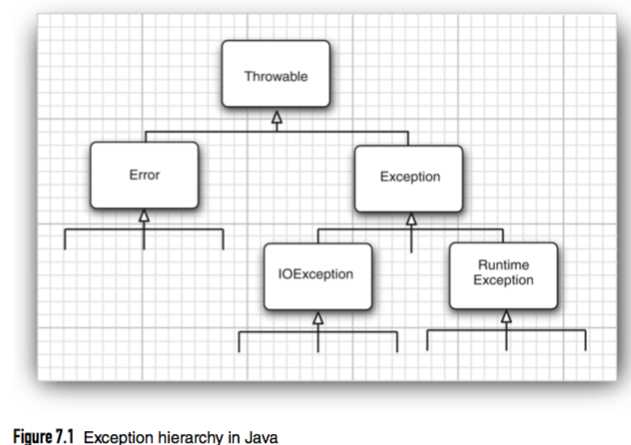

# 处理错误
>time: 2018-03-12 09:58:01

如果由于出现错误的对象引用而使得某些操作没有完成，程序应该：
* 返回到一种安全状态，并能够让用户执行一些其他的命令；或者
* 允许用户保存所有操作的状态，并以妥善的方式终止程序。

要做到这些并不是一件容易的事情。其原因是检测（或引发）错误条件的代码通常离那些能够让数据恢复到安全状态，或者能够保存用户操作，并正常地退出程序的代码很远。**异常处理的任务**就是将控制权从错误产生的地方转移给能够处理这种情况的错误处理器。为了能够在程序中处理异常情况，必须研究程序中可能会出现的错误和问题，以及哪类问题需要关注。
1. 用户输入错误
    >除了那些不可避免的键盘输入错误外，有些用户喜欢各行其是，不遵守程序的要求。例如，假设有一个用户请求连接一个 URL，而语法却不正确。在程序代码中应该对此进行检查，如果没有检查，网络层就会给出警告。
1. 设备错误
    >硬件并不总是让它做什么，它就做什么。打印机可能被关掉了。网页可能临时性地不能浏览。在一个任务的处理过程中，硬件经常出现问题。
1. 物理限制
    >磁盘满了，可用存储空间已被用完。
1. 代码错误
    >程序方法有可能无法正确执行。  

对于方法中的一个错误，传统的做法是返回一个特殊的错误码，有调用方法分析。例如，对于一个从文件中读取信息的方法来说，返回值通常不是标准字符，而是一个 -1，表示文件结束。这种处理方式对于很多异常情况都是可行的。还有一种表示错误状况的常用返回值是 null 引用。  

遗憾的是，并不是在任何情况下都能返回一个错误码。有可能无法明确地将有效数据与无效数据加以区分。一个返回整数的方法就不能简单地通过返回 -1 表示错误，因为 -1 很可能是一个完全合法的结果。

在 Java 中，如果某个方法不能够采用正常的途径完整它的任务，就可以通过另外一个路径退出方法。在这种情况下，方法并不会返回任何值，而是抛出（throw）一个封装了错误信息的对象。需要注意的是，这个方法将会立即退出，并不返回任何值。此外，调用这个方法的代码也将无法继续执行，取而代之的是，异常处理机制开始搜索能够处理这种异常的异常处理器（exception handler）。

异常具有自己的语法和特定的继承结构。

## 1. 异常分类

在 Java 程序设计语言中，异常对象都是派生于 Throwable 类的一个实例。如果 Java 中内置的异常类不能满足需求，用户可以创建自己的异常类。



需要注意的是，所有的异常处理都是有 Throwable 继承而来，但在下一层立即分解为两个分支: Error 和 Exception。

Error 类层次结构描述了 Java 运行时系统的内部错误和资源耗尽错误。应用程序不应该抛出这种类型的对象。如果出现了这样的内部错误，除了通告给用户，并尽力是程序安全地终止之外，再也无能为力了。这种情况很少出现。

在设计 Java 程序时，需要关注 Exception 层次结构。这个层次结构又分解为两个分支：一个分支派生于 RuntimeException；另一个分支包含其他异常。**划分两个分支的规则是**：由程序错误导致的异常属于 RuntimeException；而程序本身没有问题，但由于像 I/O 错误这类问题导致的异常属于其他异常。

派生于 RuntimeException 的异常包含下面几种情况：
* 错误的类型转换。
* 数组访问国界
* 访问 null 指针

不是派生于 RuntimeException 的异常包括：
* 试图在文件尾部后面读取数据。
* 试图打开一个不存在的文件。
* 试图根据给定的字符串查找 Class 对象，而这个字符串表示的类并不存在。

“**如果出现 RuntimeException 异常， 那么就一定是你的问题**” 是一条相当有道理的规则。应该通过检测数组下标是否越界来避免 ArraylndexOutOfBoundsException 异常；应该通过在使用变量之前检测是否为 null 来杜绝 NullPointerException 异常的发生。

Java 语言规范将派生于 Error 类或 RuntimeException 类的所有异常称为**非受查（unchecked）异常**，所有其他的异常称为**受查（checked) 异常**。这是两个很有用的术语，在后面还会用到。编译器将核查是否为所有的受査异常提供了异常处理器。

**注释**： RuntimeException 这个名字很容易让人混淆。实际上，现在讨论的所有错误都发生在运行时。

## 2. 声明受查异常
如果遇到了无法处理的情况，那么 Java 的方法可以抛出一个异常。这个道理很简单：一个方法不仅需要告诉编译器将要返回什么值，还要告诉编译器有可能发生什么错误。

方法应该在其首部声明所有可能抛出的异常。这样可以从首部反映出这个方法可能抛出哪类受査异常。  
`public FileInputStream(String name) throws FileNotFoundException`  
这个声明表7K这个构造器将根据给定的 String 参数产生一个 FilelnputStream 对象，但也有可能抛出一个 FileNotFoimdExcption 异常。如果发生了这种糟糕情况，构造器将不会初始化一个新的 Hlel叩utStream 对象， 而是抛出一个 FileNotFoundException 类对象。如果这个方法真的抛出了这样一个异常对象，运行时系统就会开始搜索异常处理器，以便知道如何处理 FileNotFoundException 对象。

在自己编写方法时，不必将所有可能抛出的异常都进行声明。至于什么时候需要在方法中用 throws 子句声明异常， 什么异常必须使用 throws子句声明，需要记住在遇到下面 4 种情况时应该抛出异常：
1. 调用一个抛出受查异常的方法。
1. 程序运行过程中发现错误，并且利用 throw 语句抛出一个受查异常。
1. 程序出现错误，例如，a[-1] 会抛出一个 ArrayIndexOutOfBoundsException 这样的非受查异常。
1. Java 虚拟机和运行时库出现的内部错误。

如果出现前两种情况之一，则必须告诉调用这个方法的程序员有可能抛出异常。为什么？因为任何一个抛出异常的方法都有可能是一个死亡陷阱。如果没有处理器捕获这个异常，当前执行线程就会结束。

对于那些可能被他人使用的 Java 方法，应该根据异常规范（exception specification），在方法的首部声明这个方法可能抛出的异常。
```java
class MyAnimation {
    ...
    public Image loadImage(String s) throws IOException {
        ...
    }
}
```

如果一个方法有可能抛出多个受查异常类型，那么就必须在方法的首部列出所有的异常类。每个异常类之间用逗号隔开。
```java
class MyAnimation {
    ...
    public Image loadImage(String s) throws FileNotFoundException, EOFException {
        ...
    }
}
```

但是，不需要声明 Java 的内部错误，即从 Error 继承的错误。任何程序代码都具有抛出那些错误的潜能，而我们对其没有任何控制能力。  
同样，也不应该声明从 RuntimeException 继承的那些非受查异常。
```java
class MyAnimation
{
    ...
    void drawImage(int i) throws ArrayIndexOutOfBandsException // bad style
    {
        ...
    }
}
```
这些运行时错误完全在我们的控制之下。如果特别关注数组下标引发的错误，就应该将更多的时间花费在修正程序中的错误上，而不是说明这些错误发生的可能性上。

总之，一个方法必须声明所有可能抛出的受查异常，而非受查异常要么不可控制（Error），要么就应该避免发生（RuntimeException）。 如果方法没有声明所有可能发生的受查异常，编译器就会发出一个错误消息。

**警告**：如果在子类中覆盖了超类的一个方法，子类方法中声明的受查异常不能比超类方法中声明的异常更通用（也就是说，子类方法中可以抛出更特定的异常，或者根本不抛出任何异常）。特别需要说明的是，如果超类方法没有抛出任何受查异常，子类也不能抛出任何受查异常。 

如果类中的一个方法声明将会抛出一个异常，而这个异常是某个特定类的实例时则这个方法就有可能抛出一个这个类的异常，或者这个类的任意一个子类的异常。例如，FilelnputStream 构造器声明将有可能抛出一个 IOExcetion 异常，然而并不知道具体是哪种 IOException 异常。 它既可能是 IOException 异常， 也可能是其子类的异常，例如，FileNotFoundException。

在 Java 中，没有 throws 说明符的方法将不能抛出任何受查异常。

## 3. 如何抛出异常

设在程序代码中发生了一些很糟糕的事情。一个名为 readData 的方法正在读取一个首部具有下列信息的文件：  
`Content-length: 1024`  
然而，读到 733 个字符之后文件就结束了。我们认为这是一种不正常的情况，希望抛出一个异常。

首先要决定应该抛出什么类型的异常。将上述异常归结为 IOException 是一种很好的选择。仔细阅读 Java API 文档之后会发现： EOFException 异常描述的是“在输入过程中，遇到了一个未预期的 EOF 后的信号”。这正是我们要抛出的异常。下面是抛出这个异常的语句：  
`throw new EOFException();`  
或者
`EOFException e = new EOFException(); throw e;`

```java
String readData(Scanner in) throw EOFException
{
    ...
    while(...) {
        if (!in.hashNext()) // EOF encountered
        {
            if (n < len)
                throw new EOFException();
        }
        ....
    }
    return s;
}
```

EOFException 类还有一个含有一个字符串类型参数的构造器。这个构造器可以更加细致的描述异常出现的情况。
```java
String gripe = "Content-length: " + len + ", Received: " + n;
throw new EOFException(gripe);
```

对于一个已经存在的异常类，将其抛出非常容易。在这种情况下：
1. 找到一个合适的异常类。
1. 创建这个类的一个对象。
1. 将对象抛出。
一旦方法抛出了异常，这个方法就不可能返回到调用者。也就是说，不必为返回的默认值或错误代码担忧。

在 Java 中只抛出 Throwable 子类的对象。

## 4. 创建异常类
