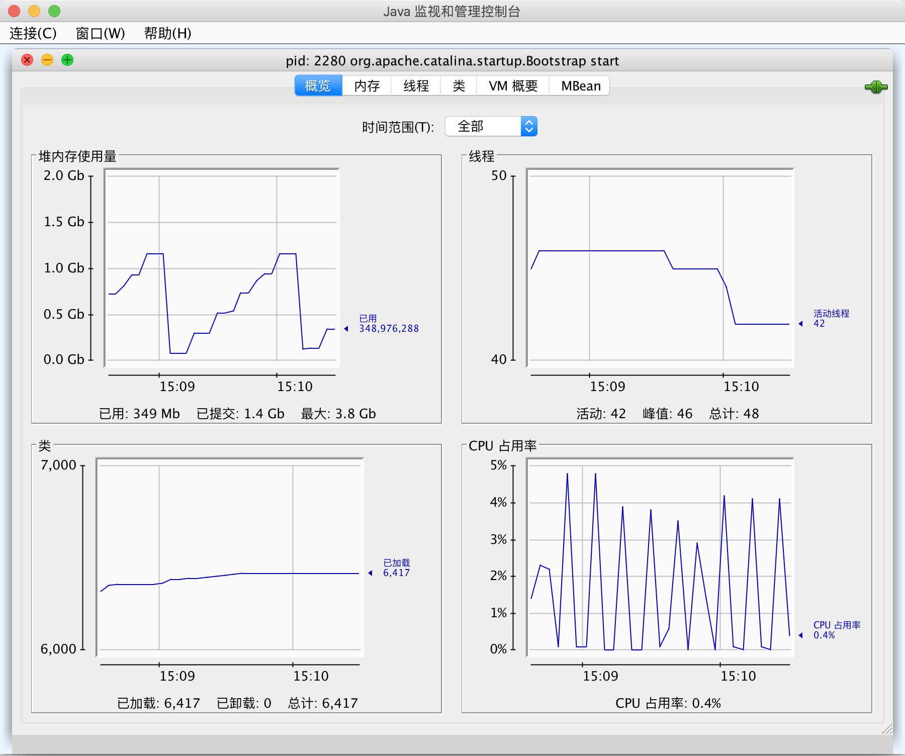

# 调试技巧
>time: 2018-04-28 10:59:47

1. 打印或记录任意变量的值
    >`System.out.println("x=" + x);`  
    >或  
    >`Logger.getGlobal().info("x=" + x);`

1. 一个不太为人所知但却非常有效的技巧是在每一个类中放置一个单独的 main 方法。这样就可以对每一个类进行单元测试。

1. 如果喜欢使用前面所讲述的技巧， 就应该到 `http://junit.org` 网站上査看一下 JUnit。JUnit 是一个非常常见的单元测试框架，利用它可以很容易地组织测试用例套件。只要修改类，就需要运行测试。在发现 bug 时，还要补充一些其他的测试用例。

1. 日志代理（logging proxy）是一个子类的对象，它可以截获方法调用，并进行日志记
录，然后调用超类中的方法。例如，如果在调用 Random 类的 nextDouble 方法时出现了问题，就可以按照下面的方式，以匿名子类实例的形式创建一个代理对象：
    ```java
    Random generator = new Random {
        public double nextDouble() {
            double result = super.nextDouble();
            Logger.getGlobal().info("nextDouble: " + result);
            return result;
        }
    }
    ```

    当调用 nextDouble 方法时，就会产生一个日志消息。要想知道谁调用了这个方法，就要生成一个堆栈轨迹。

1. 利用 Throwable 类提供的 printStackTmce 方法，可以从任何一个异常对象中获得堆栈情况。下面的代码将捕获任何异常，打印异常对象和堆栈轨迹，然后，重新拋出异，以便能够找到相应的处理器。
    ```java
    try {
        ...
    }catch(Throwable t) {
        t.printStackTrace();
        throw t;
    }
    ```
    不一定要通过捕获异常来生成堆栈轨迹。只要在代码的任何位置插入下面这条语句就可以获得堆栈轨迹：  
    `Thread.dumpStack();`

1. —般来说，堆栈轨迹显示在 System.err 上。也可以利用 `printStackTrace(PrintWriter s)` 方法将它发送到一个文件中。另外，如果想记录或显示堆栈轨迹，就可以采用下面的方式，将它捕获到一个字符串中：
    ```java
    StringWriter out = new StringWriter();
    new Throwable().printStackTrace(new PrintWriter(out));
    String description = out.toString();
    ```

1. 通常，将一个程序中的错误信息保存在一个文件中是非常有用的。然而，错误信息被发送到 System.err 中，而不是 System.out 中。因此，不能够通过运行下面的语句获取它们：  
`java MyProgram > error.txt`  
而是采用下面的方式捕获错误流：  
`java MyProgram 2> error.txt`  
要想在同一个文件中同时捕获 System.err 和 System.out，需要使用下面这条命令  
`java MyProgram 1> errors.txt 2>&1`  
这条命令将工作在 bash 和 Windows shell 中。

1. 让非捕获异常的堆栈轨迹出现在 System.err 中并不是一个很理想的方法。比较好的方式是将这些内容记录到一个文件中。可以调用静态的 `Thread.setDefaultUncaughtExceptionHandler` 方法改变非捕获异常的处理器：
    ```java
    Thread.setDefaultUncaughtExceptionHandler(new Thread.UncaughtExceptionHandler() {
        public void uncaughtException(Thread t, Throwable e) {
            // save infomation in log file
        }
    });
    ```

1. 要想观察类的加载过程，可以用 -verbose 标志启动 Java 虚拟机。这样就可以看到如下所示的输出结果：
    ```shell
    $ java -verbose Test
    [Opened /Library/Java/JavaVirtualMachines/jdk1.8.0_144.jdk/Contents/Home/jre/lib/rt.jar]
    [Loaded java.lang.Object from /Library/Java/JavaVirtualMachines/jdk1.8.0_144.jdk/Contents/Home/jre/lib/rt.jar]
    [Loaded java.io.Serializable from /Library/Java/JavaVirtualMachines/jdk1.8.0_144.jdk/Contents/Home/jre/lib/rt.jar]
    [Loaded java.lang.Comparable from /Library/Java/JavaVirtualMachines/jdk1.8.0_144.jdk/Contents/Home/jre/lib/rt.jar]
    [Loaded java.lang.CharSequence from /Library/Java/JavaVirtualMachines/jdk1.8.0_144.jdk/Contents/Home/jre/lib/rt.jar]
    [Loaded java.lang.String from /Library/Java/JavaVirtualMachines/jdk1.8.0_144.jdk/Contents/Home/jre/lib/rt.jar]
    [Loaded java.lang.reflect.AnnotatedElement from /Library/Java/JavaVirtualMachines/jdk1.8.0_144.jdk/Contents/Home/jre/lib/rt.jar]
    [Loaded java.lang.reflect.GenericDeclaration from /Library/Java/JavaVirtualMachines/jdk1.8.0_144.jdk/Contents/Home/jre/lib/rt.jar]
    [Loaded java.lang.reflect.Type from /Library/Java/JavaVirtualMachines/jdk1.8.0_144.jdk/Contents/Home/jre/lib/rt.jar]
    ...
    ```
    有时候， 这种方法有助于诊断由于类路径引发的问题。

1. -Xlint 选项告诉编译器对一些普遍容易出现的代码问题进行检査。例如，如果使用下面这条命令编译:  
`javac -Xlint:fallthrough`  
当 switch 语句中缺少 break 语句时， 编译器就会给出报告（术语“lint”最初用来描述一种定位 C 程序中潜在问题的工具， 现在通常用于描述查找可疑但不违背语法规则的代码问题的工具。)
    | - | - |
    |---|---|
    | -Xlint 或 -Xling:all | 执行所有检查 |
    | -Xlint:deprecation | 与 -deprecation 一样，检查废弃的方法 |
    | -Xlint:fallthrough | 检查 switch 语句中是否缺少 break 语句 |
    | -Xlint:finally | 警告 finally 子句不能正常的执行 |
    | -Xlint:none | 不执行任何检查 |
    | -Xlint:path | 检查类路径和源代码路径上的所有目录是否存在 |
    | -Xlint:serial | 警告没有 serialVersionUID 的串行话化类 |
    | -Xlint:unchecked | 对通用类型与原始类型之间的危险转换给予警告 |

1. ava虚拟机增加了对 Java应用程序进行监控（monitoring) 和管理 （management) 的支持。它允许利用虚拟机中的代理装置跟踪内存消耗、线程使用、类加载等情况。这个功能对于像应用程序服务器这样大型的、长时间运行的 Java 程序来说特别重要。下面是一个能够展示这种功能的例子：JDK 加载了一个称为 jconsole 的图形工具，可以用于显示虚拟机性能的统计结果。  
`jconsole processID`  
控制台给出了有关运行程序的大量信息。  


1. 可以使用 jmap 实用工具获得一个堆的转储，其中显示了堆中的每个对象。使用命令如下：  
    ```shell
    jmap -dump:format=b,file=dumpFileName processID
    jhat dumpFileName
    ```
    然后，通过浏览器进人localhOSt:7000，将会运行一个网络应用程序，借此探查转储对象时堆的内容。

1. 如果使用 -Xprof 标志运行 Java 虚拟机，就会运行一个基本的剖析器来跟踪那些代码中经常被调用的方法。剖析信息将发送给 System.out。输出结果中还会显示哪些方法是由即时编译器编译的。

***
**警告**：编译器的 -X 选项并没有正式支持， 而且在有些 JDK 版本中并不存在这个选项。可以运行命令 java -X 得到所有非标准选项的列表。
***