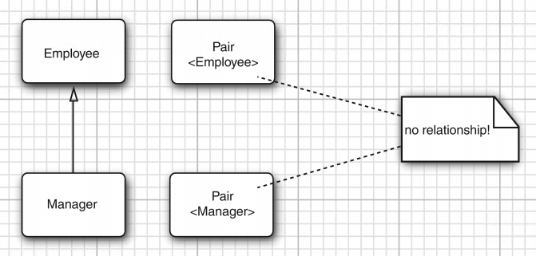
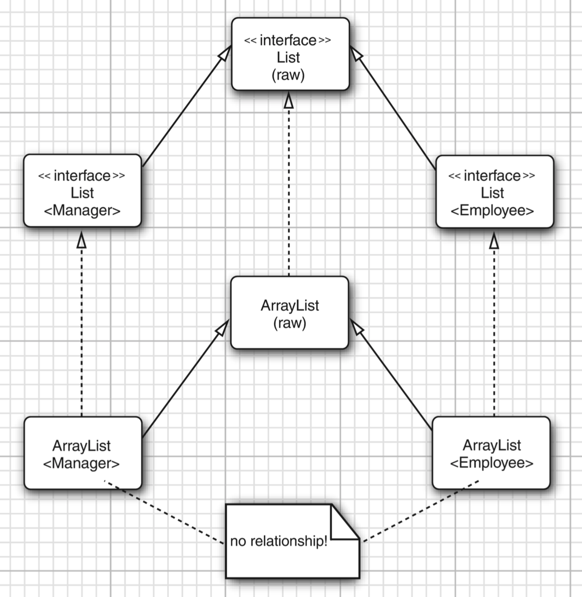

# 泛型类型的继承规则
>time: 2018-05-22 17:21:25

`Pair<Manager>` 不是 `Pair<Employee>` 的一个子类。
```java
Manager[] topHonchos = ...;
Pair<Employee> result = ArrayAlg.minmax(topHonchos); // Error
```

minmax 方法返回 `Pair<Manager>`，而不是 `Pair<Employee>`，并且这样的赋值是不合法的。  
无论 S 与 T 有什么联系（如图 8-1 所示），通常，`Pair<S>` 与 `Pair<T>` 没有什么联系。   
#### 图 8-1


这一限制看起来过于严格，但对于类型安全非常必要。假设允许将 `Pair<Manage>` 转换为 `Pair<Employee>`。
```java
Pair<Manager> managerBuddies = new Pair<>(ceo, cfo);
Pair<Employee> employeeBuddies = managerBuddies; // illegal, but suppose it wasn't
employeeBuddies.setFirst(lowlyEmployee);
```

显然，最后一句是合法的。但是 employeeBuddies 和 managerBuddies 引用了同样的对象。现在将 CFO 和一个普通员工组成一对，这对于 `Pair<Manager>` 来说应该是不可能的。

***
**注释**：必须注意泛型与 Java 数组之间的重要区别。可以将一个 `Manager[]` 数组赋给一个类型为 `Employee[]` 的变量：
```java
Manger[] managerBuddies = { ceo, cfo};
Employee[] employeeBuddies = managerBuddies; // OK
```
然而，数组带有特别的保护。如果试图将一个低级别的员工存储到 employeeBuddies[0]，虚拟机将会抛出 ArrayStoreException 异常。
***

永远可以将参数化类型转换为一个原始类型。例如，`Pai<Employee>` 是原始类型 Pair 的一个子类型。在与遗留代码衔接时，这个转换非常必要。

转换成原始类型之后会产生类型错误吗？很遗憾，会！看一看下面这个示例：
```java
Pair<Manger> managerBuddies = new Pair<>(ceo, cfo);
Pair rawBuddies = managerBuddies; // OK
rawBuddies.setFirst(new File("...")); // only a compile-time warning
```
听起来有点吓人。但是，请记住现在的状况不会再比旧版 Java 的情况糟糕。虚拟机的安全性还没有到生死攸关的程度。当使用 getFirst 获得外来对象并赋给 Manager 变量时，与通常一样，会抛出 ClassCastException 异常。这里失去的只是泛型程序设计提供的附加安全性。

最后，泛型类可以扩展或实现其他的泛型类。就这一点而言，与普通的类没有什么区别。例如，`ArrayList<T>` 类实现 `List<T>` 接口。这意味着，一个 `ArrayList<Manager>` 可以被转换为一个 `List<Manager>`。但是，如前面所见，一个 `ArrayList<Manager>` 不是一个
`ArrayList<Employee>` 或 `List<Employee>`。图 8-2 展7K了它们之间的联系。

#### 图 8-2 泛型列表类型中子类型间的联系
