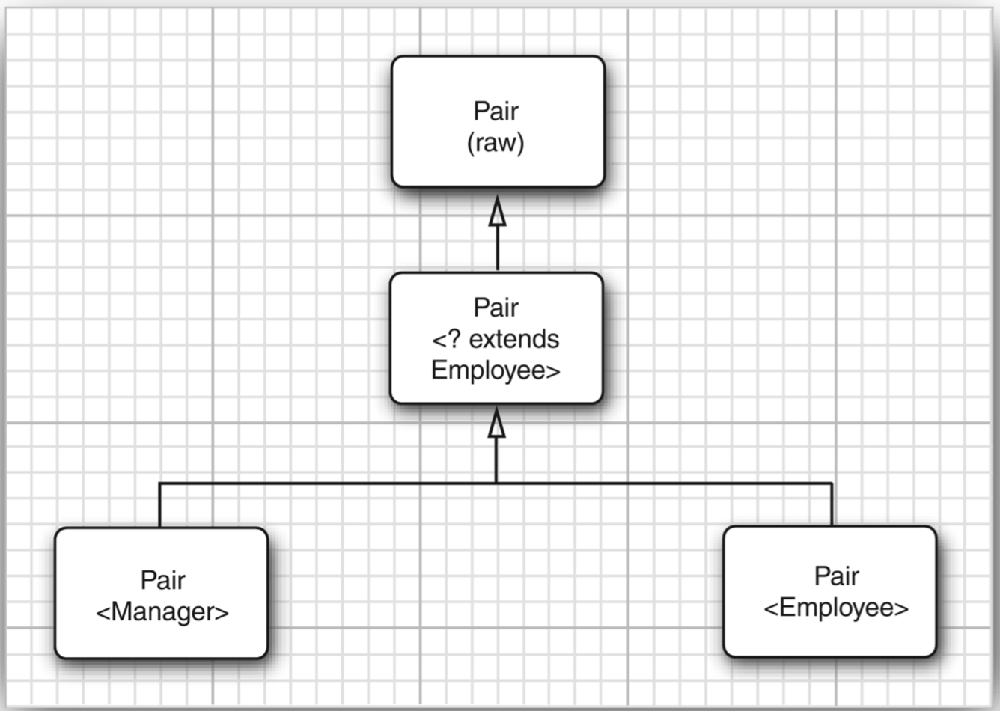
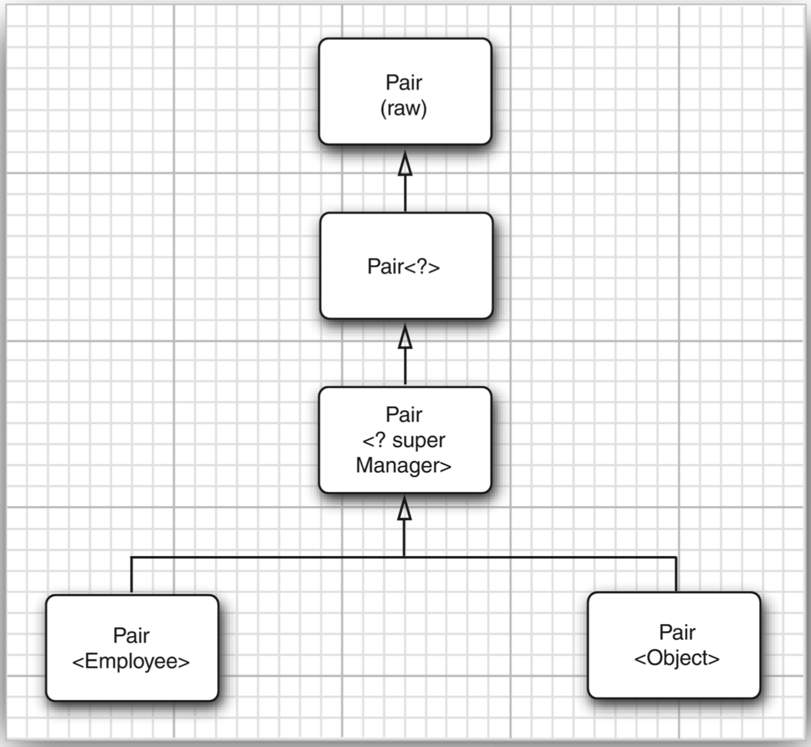

# 通配符类型
>time: 2018-06-08 09:46:11

## 1. 通配符概念
通配符类型中，允许类型参数变化。  
`Pair<? extends Employee>`  
表示任何泛型 Pair 类型，它的类型参数是 Employee 的子类，如 `Pair<Manager>`，但不是 `Pair<String>`。

假设要编写一个打印雇员对的方法，
```java
public static void printBuddies(Pair<Employee> p) {
    Employee first = p.getFirst();
    Employee second = p.getSecond();
    System.out.println(first.getName + " and " + second.getName() + " are buddies.");
}
```

正如前面讲到的，不能讲 `Pair<Manager>` 传递给这个方法，这一点受限制。解决的方法简单：使用通配符类型：  
`public static void printBuddies<Pair<? extends Employee> p)`  
类型 `Pair<Manager>` 是 `Pair<? extends Employee>` 的子类型（如图 8-3 所示）。


使用通配符会通过 `Pair<? extends Employee>` 的引用破坏 `Pair<Manager>` 吗？

```java
Pair<Manager> managerBuddies = new Pair<>( ceo, cfo );
Pair<? extends Employee> widcardBuddies = managerBuddier; // OK
wildcardBuddies.setFirst(lowlyEmployeee); // compile-time error
```
这可能不会引起破坏。对 setFirst 的调用有一个类型错误。要了解其中的缘由，请仔细看一看类型 `Pair<?extendsEmployee>`。其方法似乎是这样的：
```java
? extends Employee getFirst()
void setFirst(? extends Employee)
```
这样将不可能调用 setFirst 方法。编译器只知道需要某个 Employee的子类型，但不知道具体是什么类型。它拒绝传递任何特定的类型。毕竟？不能用来匹配。  
使用 getFirst 就不存在这个问题：将 getFirst 的返回值赋给一个 Employee 的引用完全合法。  
这就是引人有限定的通配符的关键之处。现在已经有办法区分安全的访问器方法和不安全的更改器方法了。

## 2. 通配符的超类型限定
通配符限定与类型变量限定十分类似，但是，还有一个附加的能力，即可以指定一个超类限定（supertype bound）  
`? super Manager`  
这个通配符限制为 Manager 的所有超类型。（已有的 super 关键字十分准确地描述了这种联系，这一点令人感到非常欣慰。）  
可以为方法提供参数，但不能使用返回值。例如，`Pair<? super Manager>` 有方法
```java
void setFirst(? super Manager)
? super Manager getFirst()
```
这不是正真的 Java 语法，但是可以看出编译器知道什么。编译器无法知道 setFirst 方法的具体类型，因此调用这个方法时不能接受类型为 Employee 或 Object 的参数。只能传递 Manager 类型的对象，或者某个子类型对象。另外，如果调用 getFirst，不能保证返回对象的类型。只能把它赋给一个 Object。

下面的方法将可以接受任何适当的 Pair：
```java
public static void minmaxBonus(Manager[] a, Pair<? super Manager> result) {
    if(a.length == 0) return;
    Manager min = a[0];
    Manager max = a[0];
    for(int i = 1; i < a.length; i++) {
        if (min.getBonus() > a[i].getBonus()) {
            min = a[i];
        }
        if (max.getBonus() > a[i].getBonus()) {
            max = a[i];
        }
    }
    result.setFirst(min);
    result.setSecond(max);
}
```
带有超类型限定的通配符可以向泛型对象写入，带有子类型限定的通配符可以从泛型对象读取。

下面是超类型限定的另一种应用。Comparable 接口本身就是一个泛型类型。声明如下：
```java
public interface Comparable<T>
{
    public int comparaTo(T other);
}
```
在此，类型变量指示了 other 参数的类型。例如，String 类实现 `Comparable<String>`，它的 compareTo 方法被声明为  
`public int compareTo(String)`  
显式的参数有一个正确的类型。接口是一个泛型接口之前，other 是一个 Object，并且这个方法的实现需要强制类型转换。  
由于 Comparable 是一个泛型类型，也许可以把 ArrayAlg 类的 min 方法可以这样声明：  
`public static <T extends Comparable<T>> T min(T[] a)`
#### 带有超类型限定的通配符

看起来，这样写比只使用 `T extends Ccomparable` 更彻底，并且对许多类来讲，工作得更好。例如，如果计算一个 String 数组的最小值，T 就是 String 类型的，而 String 是 `Comparable<String>` 的子类型。但是，处理一个 LocalDate 对象的数组时，会出现一个问题。LocalDate 实现了 ChronoLocalDate，而 ChronoLocalDate 扩展了 `Comparable<ChronoLocalDate>`。因此，LocalDate 实现的是 `Comparable<ChronoLocalDate>` 而不是 `Comparable<LocalDate>`。

在这种情况下，超类型可以用来进行救助：  
`public static <T extends Comparable<? super T>> t min(T[] a) ...`  
现在 compareTo 方法写成  
`int compareTo(? super T)`  
有可能被申明为使用类型 T 的对象，也有可能使用 T 的超类型（如当 T 是 LocalDate，T 的一个子类型）。无论如何，传递一个 T 类型的对象给 compareTo 方法都是安全的。  
对于初学者来说，`<T extends Compareable<? super T>>` 这样的声明看起来有点吓人。很遗憾，因为这一声明的意图在于帮助应用程序员排除调用参数上的不必要的限制。对泛型没有兴趣的应用程序员很可能很快就学会掩盖这些声明，想当然地认为库程序员做的都是正确的。如果是一名库程序员，一定要习惯于通配符，否则，就会受到用户的责备，还要在代码中随意地添加强制类型转换直代码可以编译。

***
**注释**： 子类型限定的另一个常见的用法是作为一个函数式接口的参数类型。例如，Collection 接口有一个方法：  
`default boolean removeIf(Predicate<? super E> filter)`  
这个方法会删除所有满足给定谓词条件的元素。例如，如果你不喜欢有奇怪散列码的员工，就可以如下将他们删除：
```java
ArrayList<Employee> staff = ...;
Predicate<Object> oddHashCode = obj -> obj.hashCode() % 2 != 0;
staff.removeIf(oddHashCode);
```
你希望传入一个 `Predicate<Object>`，而不只是 `Predicate<Employee>`。Super 通配符可以使这个愿望成真。
***

## 3. 无限定通配符
还可以使用无限定的通配符，例如，`Pair<?>`。初看起来，这好像与原始的 Pair 类型一样。实际上，有很大的不同。类型 Pair<?> 有以下方法：
```java
? getFirst()
void setFirst()
```
getFirst 的返回值只能赋给一个 Object。setFirst 方法不能被调用，甚至不能用 Object 调用。`Pair<?>` 和 Pair 本质的不同在于： 可以用任意 Object 对象调用原始 Pair 类的 setObject 方法。
***
**注释**： 可以调用 setFirst(null)。
***

为什么要使用这样脆弱的类型？它对于许多简单的操作非常有用。例如，下面这个方法将用来测试一个 pair 是否包含一个 null 引用，它不需要实际的类型。
```java
public static boolean hasNulls(Pair<?> p) 
{
    return p.getFirst() == null || p.getSecond == null;
}
```
通过将 hasNulls 转换成泛型方法，可以避免使用通配符类型：  
`public static <T> boolean hasNulls(Pair<T> p)`  
但是，带有通配符的版本可读性更强。

## 4. 通配符捕获
编写一个交换成对元素的方法：  
`public static void swap(Pair<?> p)`  
通配符不是类型变量，因此，不能在编写代码中使用 “?” 作为一种类型。也就是说，下述代码是非法的：  
```java
? t = p.getFirst(); // Error
p.setFirst(p.getSecond());
p.setSecond(t);
```

这是一个问题，因为在交换的时候必须临时保存第一个元素。幸运的是，这个问题有一个有趣的解决方案。我们可以写一个辅助方法 swapHelper，如下所示：   
```java
public static <T> void swapHelper(Pair<T> p)
{
    T t = p.getFirst();
    p.setFirst(p.getSecond());
    p.setSecond(t);
}
```
注意，swapHelper 是一个泛型方法，而 swap 不是，它具有固定的 `Pair<?>` 类型的参数。

现在可以由 swap 调用 swapHelper:  
`public static void swap(Pair<?> p) { swapHelper(p); }`  
在这种情况下，swapHelper 方法的参数 T 捕获通配符。它不知道是哪种类型的通配符， 但是，这是一个明确的类型，并且 `<T>swapHelper` 的定义只有在 T 指出类型时才有明确的含义。

当然，在这种情况下，并不是一定要使用通配符。我们已经直接实现了没有通配符的泛型方法 `<T> void swap(Pair<T> p)`。 然而，下面看一个通配符类型出现在计算中间的示例：
```java
public static void maxminBonus(Manager[] a, Pair<? super Manager> result) 
{
    minmaxBonus(a, result);
    PairAlg.swap(result); // OK--swapHelper captures wildcard type
}
```
在这里，通配符捕获机制是不可避免的。

通配符捕获只有在有许多限制的情况下才是合法的。编译器必须能够确信通配符表达的是单个、确定的类型。 例如，`ArrayList<Pair<T>>` 中的 T 永远不能捕获 `ArrayList<Pair<?>>` 
中的通配符。数组列表可以保存两个 `Pair<?>`，分别针对 ？的不同类型。

```java
public class Employee {
    private String name;
    private double salary;
    private LocalDate hireDay;
    
    public Employee(String name, double salary, int year, int month, int day) {
        this.name = name;
        this.salary = salary;
        hireDay = LocalDate.of(year, month, day);
    }

    public String getName() {
        return name;
    }

    public double getSalary() {
        return salary;
    }


    public LocalDate getHireDay() {
        return hireDay;
    }

    public void raiseSalary(double byPercent) {
        double raise = salary * byPercent / 100;
        salary += raise;
    }
}
```

```java
public class Manager extends Employee {
    
    private double bonus;
    
    /**
     * @param name the employee's name
     * @param salary the salary
     * @param year the hire year
     * @param month the hire month
     * @param day the hire dayß
     */
    public Manager(String name, double salary, int year, int month, int day) {
        super(name, salary, year, month, day);
        bonus = 0;
    }
    
    public double getSalary() {
        double baseSalary = super.getSalary();
        return baseSalary + bonus;
    }
    
    public void setBonus(double b) {
        bonus = b;
    }

    public double getBonus() {
        return bonus;
    }
}
```

```java
public class Pair<T> {

    private T first;
    private T second;
    
    public Pair() { first = null; second = null; }
    public Pair(T first, T second) {
        this.first = first;
        this.second = second;
    }
    
    public T getFirst() {
        return first;
    }
    public T getSecond() {
        return second;
    }
    
    public void setFirst(T newValue) {
        first = newValue;
    }
    public void setSecond(T newValue) {
        second = newValue;
    }
}
```

```java
/**
 * @version 1.01 2018-06-13
 * @author bpx
 */
public class Test {
    public static void main(String[] args) {
        
    }
    
    public static void printBuddies(Pair<? extends Employee> p) {
        Employee first = p.getFirst();
        Employee second = p.getSecond();
        System.out.println(first.getName() + " and " + second.getName() + 
                " are buddies.");
    }
    
    public static void minmaxBonus(Manager[] a, Pair<? super Manager> result) {
        if(a.length == 0) return;
        Manager min = a[0];
        Manager max = a[0];
        
        for (int i = 1; i < a.length; i++) {
            if (min.getBonus() > a[i].getBonus()) {
                min = a[i];
            }
            if (max.getBonus() < a[i].getBonus()) {
                max = a[i];
            }
        }
        
        result.setFirst(min);
        result.setSecond(max);
    }
    
    public static void maxminBonus(Manager[] a, Pair<? super Manager> result) {
        minmaxBonus(a, result);
        PairAlg.swapHelper(result);
    }
}
class PairAlg
{
    public static boolean hasNulls(Pair<?> p) {
        return p.getFirst() == null || p.getSecond() == null;
    }
    
    public static void swap(Pair<?> p) {
        swapHelper(p);
    }
    
    public static <T> void swapHelper(Pair<T> p) {
        T t = p.getFirst();
        p.setFirst(p.getSecond());
        p.setSecond(p.getFirst());
    }
}
```