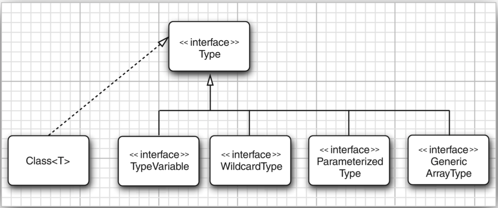

# 反射和泛型
>time: 2018-06-14 16:02:01

反射允许你在运行时分析任意的对象。如果对象是泛型类的实例，关于泛型类型参数则得不到太多信息，因为它们会被擦除。

## 1. 泛型 Class 类
现在，Class 类是泛型的。例如，String.class 实际上是一个 `Class<String>` 类的对象（实际上，是唯一的对象）。

类型参数十分有用，这是因为它允许 `Class<T>` 方法的返回类型更加具有针对性。下面 `Class<T>` 中的方法就使用了类型的参数：
```
T newInstance()
T cast(Object obj)
T[] getEnumConstants()
Class<? super T> getSuperclass()
Constructor<T> getConstructor(Class... parameterTypes)
Constructor<T> getDeclaredConstructor(Class... parameterTypes)
```

newlnstance 方法返回一个实例，这个实例所属的类由默认的构造器获得。它的返回类型
目前被声明为 T，其类型与 `Class<T>` 描述的类相同，这样就免除了类型转换。  

如果给定的类型确实是 T 的一个子类型，cast 方法就会返回一个现在声明为类型 T 的对
象，否则，抛出一个 BadCastException 异常。

如果这个类不是 enum 类或类型 T 的枚举值的数组，getEnumConstants 方法将返回 null。

最后，getConstructor 与 getdeclaredConstructor 方法返回一个 `Constructor<T>` 对象。Constructor 类也已经变成泛型，以便 newlnstance 方法有一个正确的返回类型。

#### `java.lang.Class<T>` 1.0
* T newInstance()  
    返回无参数构造器构造的的一个新实例。
* T cast(Object obj)  
    如果 obj 为 null 或有可能转换成类型 T，则返回 obj；否则抛出 BadCastException 异常。
* T[] getEnumConstants() 5.0  
    如果 T 是枚举类型，则返回所有值组成的数组，否则返回 null。
* Class<? super T> getSuperclass()  
    返回这个类的超类。如果 T 不是一个类或 Object 类，则返回 null。
* `Constructor<T> getConstructor(Class... parameterTypes)` 1.1
* `Constructor<T> getDeclaredConstructor(Class... parameterTypes)` 1.1  
    获得公有的构造器，或带有给定参数类型的构造器。
#### `java.lang.reflect.Constructor<T>` 1.1
* `T newInstance(Object... parameters)`  
    返回用指定参数构造的新实例。

## 2. 使用 `Class<T>` 参数进行类型匹配
有时，匹配泛型方法中的 `Class<T>` 参数的类型变量很有实用价值。下面是一个标准的示例：
```java
public static <T> Pair<T> makePair(Class<T> c) throws InstantiationException,
        IllegalAccessException
{
    return new Pair<>(c.newInstance(), c.newInstance());
}
```
如果调用  
`makePair(Employee.class)`  
Employee.class 是类型 `Class<Employee>` 的一个对象。makePair 方法的类型参数 T 同 Employee 匹配，并且编译器可以推断出这个方法将返回一个 `Pair<Employee>`。

## 3. 虚拟机中的泛型类型信息
Java 泛型的卓越特性之一是在虚拟机中泛型类型的擦除。令人感到奇怪的是，擦除的类仍然保留一些泛型祖先的微弱记忆。例如，原始的 Pair 类知道源于泛型类 `Pair<T>`，即使一个 Pair 类型的对象无法区分是由 `Pair<String>` 构造的还是由 `Pair<Employee>` 构造的。

类似地，看一下方法  
`public static Comparable min(Comparable[] a)`  
这是一个泛型方法的擦除  
`public static <T extends Comparable<? super T>> T min(T[] a)`  
可以使用反射 API 来确定：
* 这个泛型方法有一个叫做 T 的类型参数。
* 这个类型参数有一个子类型限定，其自身又是一个泛型类型。
* 这个限定类型有一个通配符参数。
* 这个通配符参数有一个超类型限定。
* 这个泛型方法有一个泛型数组参数。
换句话说，需要重新构造实现者声明的泛型类以及方法中的所有内容。但是，不会知道对于特定的对象或方法调用，如何解释类型参数。

为了表达泛型类型声明，使用 java.lang.reflect 包中提供的接口 Type。这个接口包含下列子类型：
* Class 类，描述具体类型。
* TypeVariable 接口，描述类型变量（如 `T extends  Comparable<? super T>`)。
* WildcardType 接口， 描述通配符 （如 ？super T)。
* ParameterizedType 接口， 描述泛型类或接口类型（如 `Comparable<? super T>`)。
* GenericArrayType 接口， 描述泛型数组（如 T[])。

## Type 类和它的后代

最后 4 个子类型的接口，虚拟机将实例化实现这些接口的适当的类。
```java
public class Pair<T> {

    private T first;
    private T second;
    
    public Pair() { first = null; second = null; }
    public Pair(T first, T second) {
        this.first = first;
        this.second = second;
    }
    
    public T getFirst() {
        return first;
    }
    public T getSecond() {
        return second;
    }
    
    public void setFirst(T newValue) {
        first = newValue;
    }
    public void setSecond(T newValue) {
        second = newValue;
    }
}
```

```java

import java.lang.reflect.GenericArrayType;
import java.lang.reflect.Method;
import java.lang.reflect.Modifier;
import java.lang.reflect.ParameterizedType;
import java.lang.reflect.Type;
import java.lang.reflect.TypeVariable;
import java.lang.reflect.WildcardType;
import java.util.Arrays;
import java.util.Scanner;

public class GenericReflectionTest {

    public static void main(String[] args) {
        String name;
        if (args.length > 0) {
            name = args[0];
        } else {
            try (Scanner in = new Scanner(System.in)) {
                System.out.println("Enter class name (e.g. java.util.Collections): ");
                name = in.next();
            }
        }
        
        try {
            Class<?> cl = Class.forName(name);
            printClass(cl);
            for (Method m : cl.getDeclaredMethods()) {
                printMethod(m);
            }
        } catch (ClassNotFoundException e) {
            e.printStackTrace();
        }
    }
    
    public static void printClass(Class<?> cl) {
        System.out.print(cl);
        printTypes(cl.getTypeParameters(), "<", ", ", ">", true);
        Type sc = cl.getGenericSuperclass();
        if (sc != null) {
            System.out.print(" extends ");
            printType(sc, false);
        }
        printTypes(cl.getGenericInterfaces(), " implements ", ", ", "", false);
        System.out.println();
    }
    
    public static void printMethod(Method m) {
        String name = m.getName();
        System.out.print(Modifier.toString(m.getModifiers()));
        System.out.print(" ");
        printTypes(m.getTypeParameters(), "<", ", ", ">", true);
        
        printType(m.getGenericReturnType(), false);
        System.out.print(" ");
        System.out.print(name);
        System.out.print("(");
        printTypes(m.getGenericParameterTypes(), "", ", ", "", false);
        System.out.println(")");
    }
    
    public static void printTypes(Type[] types, String pre, String sep, String suf, 
            boolean isDefinition) {
        if(pre.equals(" extends ") && Arrays.equals(types, new Type[] { Object.class } )) {
            return;
        }
        if(types.length > 0) {
            System.out.print(pre);
        }
        for(int i = 0; i < types.length; i++) {
            if (i > 0) {
                System.out.print(sep);
            }
            printType(types[i], isDefinition);
        }
        if (types.length > 0) {
            System.out.print(suf);
        }
    }
    public static void printType(Type type, boolean isDefinition) {
        if(type instanceof Class) {
            Class<?> t = (Class<?>) type;
            System.out.print(t.getName());
        }else if(type instanceof TypeVariable) {
            TypeVariable<?> t = (TypeVariable<?>) type;
            System.out.print(t.getName());
            if (isDefinition) {
                printTypes(t.getBounds(), " extends ", " & ", "", false);
            }
        }else if(type instanceof WildcardType) {
            WildcardType t = (WildcardType) type;
            System.out.println("?");
            printTypes(t.getUpperBounds(), " extends ", " & ", "", false);
            printTypes(t.getLowerBounds(), " super ", " & ", "", false);
        }else if(type instanceof ParameterizedType) {
            ParameterizedType t = (ParameterizedType) type;
            Type owner = t.getOwnerType();
            if (owner != null) {
                printType(owner, false);
                System.out.print(".");
            }
            printType(t.getRawType(), false);
            printTypes(t.getActualTypeArguments(), "<", ", ", ">", false);
        }else if(type instanceof GenericArrayType) {
            GenericArrayType t = (GenericArrayType) type;
            System.out.print("");
            printType(t.getGenericComponentType(), isDefinition);
            System.out.print("[]");
        }
    }
}
```
用 Pair 类运行，输出
```
class Pair<T> extends java.lang.Object
public T getFirst()
public void setFirst(T)
public void setSecond(T)
public T getSecond()
```

#### `java.lang.Class<T> 1.0`
* TypeVariable[] getTypeParameters() 5.0  
    如果这个类型被声明为泛型类型，则获得泛型类型变量，否则获得一个长度为 0 的数组。
* Type getGenericSuperclass() 5.0  
    获得被声明为这一类型的超类的泛型类型；如果这个类型是 Object 或不是一个类类型（class type），则返回 null。
* Type[] getGenericInerfaces() 5.0  
    获得被声明为这个类型的接口的泛型类型（以声明的次序)，否则，如果这个类型没有实现接口，返回长度为 0 的数组。
#### java.lang.reflect.Method 1.1
* TypeVariable[] getTypeParameters() 5.0  
    如果这个方法被声明为泛型方法，则获得泛型类型变量，否则返回长度为 0 的数组。
* Type getGenericReturnType() 5.0  
    获得这个方法被声明的泛型返回类型。
* Type[] getGenericParameterTypes() 5.0  
    获得这个方法被声明的泛型参数类型。如果这个方法没有参数，返回长度为 0 的数组。
#### java.lang.reflect.TypeVariable 5.0
* String getName()  
    获得类型变量的名字。
* Type[] getBounds()  
    获得类型变量的子类限定，否则，如果该变量无限定，则返回长度为 0 的数组。
#### java.lang.reflect.WildcardType 5.0  
* Type[] getUpperBounds  
    获得这个类型变量的子类 (extends) 限定，否则，如果没有子类限定，则返回长度为 0 的数组。
* Type[] getLowerBounds()  
    获得这个类型变量的超类（super) 限定，否则，如果没有超类限定，则返回长度为 0 的数组。
#### java.lang.reflect.ParameterizedType 5.0  
* Type getRawType()  
    获得这个参数化类型的原始类型。
* Type[] getActualTypeArguments()  
    获得这个参数化类型声明时所使用的类型参数。
* Type getOwnerType()  
    如果是内部类型，则返回其外部类型，如果是一个顶级类型，则返回 null。
#### java.lang.reflect.GenericArrayType 5.0
* Type getGenericComponentType()  
    获得声明该数组类型的泛型组件类型。