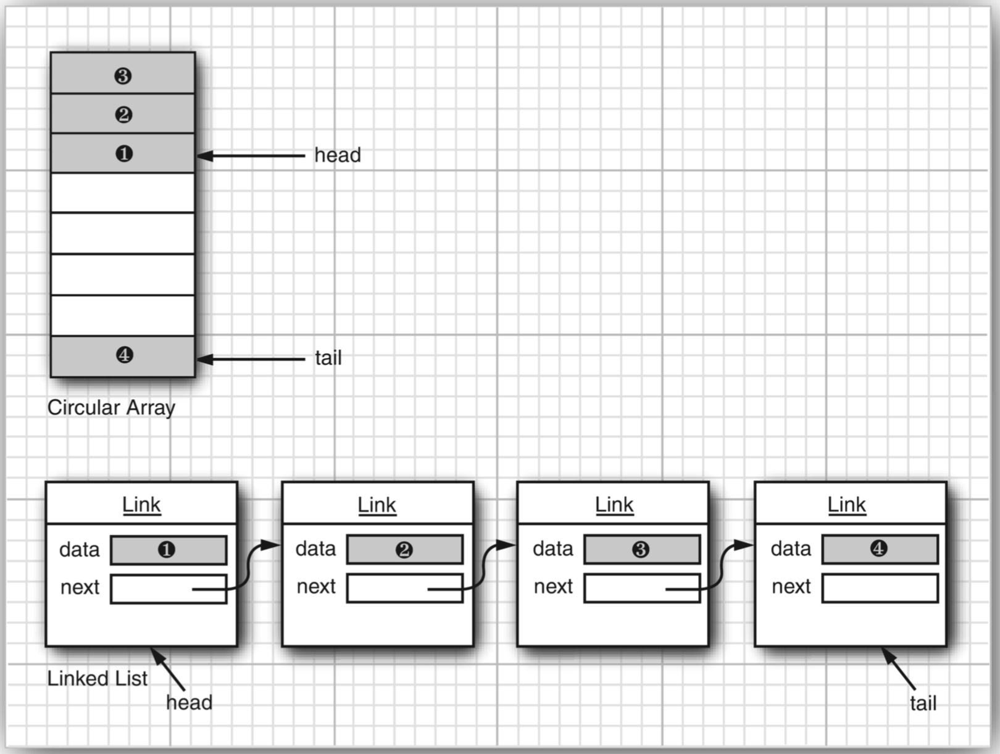
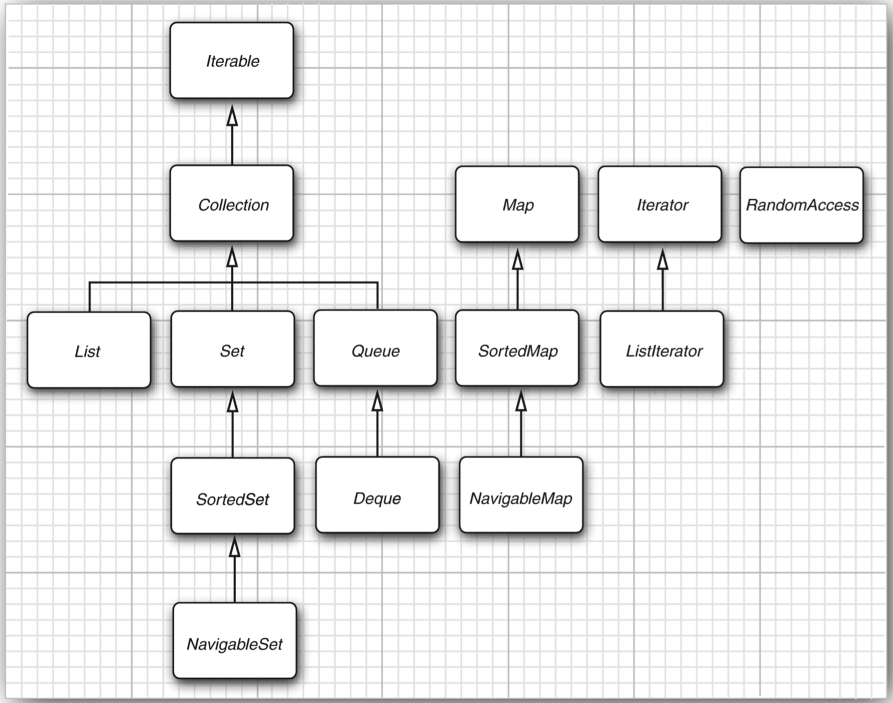

# Java 集合框架
>time: 2018-06-15 15:45:00  

## 1. 将集合的接口与实现分离
Java 集合类库也将接口（interface）与实现（implementation）分离。

**队列接口**指出可以在队列的尾部添加元素，在队列的头部删除元素，并且可以查找队列中元素的个数。当需要收集对象，并按照“先进先出”的规则检索对象时就应该使用队列。  
队列接口的最简形式可能类似下面这样：
```java
public interface Queue<E> // a simplified form of the interface in the standard library
{
    void add (E element);
    E remove();
    int size();
}
```

这个接口并没有说明队列是如何实现的。队列通常有两种实现方式：
1. 使用循环数组
2. 使用链表


每一个实现都可以通过一个实现了 Queue 接口的类表示。
```java
public class CircularArrayQueue<E> implements Queue<E> // not an actual library class
{
    private int head;
    private int tail;

    CircularArrayQueue(int capacity) { ... }
    public void add(E element) { ... }
    public E remove() { .... }
    public int size() { ... }
    public E[] elements;
}

public class LinkedListQueue<E> implements Queue<E> // not an actual library class
{
    private Link head;
    private Link tail;

    LinkedListQueue() { ... }
    public void add(E element) { ... }
    public E remove() { ... }
    public int size() { ... }
}
```

***
**注释**： 实际上，Java 类库没有名为 CircularArrayQueue 和 LinkedListQueue 的类。这里，只是以这些类作为示例，解释一下集合接口与实现在概念上的不同。如果需要一个循环数组队列，就可以使用 ArrayDeque 类。如果需要一个链表队列，就直接使用 LinkedList 类，这个类实现了 Queue 接口。
***

当在程序中使用队列时，一旦构建了结合就不需要知道使用了哪种实现。因此，只有在构建集合对象时，使用具体的类才有意义。可以使用接口类型存放集合的引用。
```java
Queue<Customer> expressLane = new CircularArrayQueue<>(100);
expressLane.add(new Customer("Harry"));
```
利用这种方式，一旦改变了想法，可以轻松地使用另外一种不同的实现。只需要对程序的一个地方做出修改，即调用构造器的地方。如果觉得 LinkedListQueue 是个更好的选择，就将代码修改为：
```java
Queue<Customer> expressLane = new LinkedListQueue<>();
expressLane.add(new Customer("Harry"));
```

循环数组要比链表更高效。 循环数组是一个有界集合，即容量有限。如果程序中要收集的对象数量没有上限，就最好使用链表来实现。

在研究 API 文档时，会发现另外一组名字以 Abstract 开头的类，例如，AbstractQueue。这些类是为类库实现者而设计的。如果想要实现自己的队列类，会发现扩展 AbstractQueue 类要比实现 Queue 接口中的所有方法轻松得多。

## 2. Collection 接口
在 Java 类库中，集合类的基本接口是 Collection 接口。这个接口有两个基本方法：
```java
public interface Collection<E>
{
    boolean add(E element);
    Iterator<E> iterator();
    ...
}
```
集合中不允许有重复的对象。  
interator 方法用于返回一个实现 Iterator 接口的对象。可以使用这个迭代器对象以此方法结合中的元素。

## 3. 迭代器
Iterator 接口包含 4 个方法：
```java
public interface Iterator<E> {
    E next();
    boolean hasNext();
    void remove();
    default void forEachRemaining(Consumer<? super E> action);
}
```

通过反复调用 next 方法，可以逐个访问集合中的每个元素。但是，如果到达了集合的末尾，next 方法将抛出一个 NoSuchElementException。因此，需要在调用 next 之前调用 hasNext 方法。如果迭代器对象还有多个供访问的元素，这个方法就返回 true。
```java
Collection<String> c = ...;
Iterator<String> iter = c.iterator();
while (iter.hasNext())
{
    String element = iter.next();
    // do somethime with element
}
```
用 “for each” 操作：
```java
for (String element : c)
{
    // do something with element
}
```
编译器简单地将 “for each” 循环翻译成带有迭代器的循环。  
“for each” 循环可以与任何实现了 Iterator 接口的对象一起工作，这个接口只包含一个抽象方法：
```java
public interface Iterator<E>
{
    Iterator<E> iterator();
    ...
}
```
Collection 接口扩展了 Iterator 接口。因此，对于标准类库中的任何集合都可以使用 “for each” 循环。

在 Java SE 8 中，甚至不用写循环。可以调用 forEachRemaining 方法并提供一个lambda 表达式。将对迭代器的每一个元素调用这个 lambda 表达式，直到再没有元素为止。  
`iterator.forEachRemaining(element -> do something with element);`  
元素被访问的顺序取决于集合类型。如果对 ArrayList 进行迭代，迭代器将从索引 0 开始，每迭代一次，索引值加 1.然而，如果访问 HashSet 中的元素，每个元素将会按照某种随机的次序出现。虽然可以确定在迭代过程中能够遍历到集合中的所有元素，但却无法预知元素被访问的次序。这对于计算总和和或统计符合某个条件的元素个数这类与顺序无关的操作来说，并不是什么问题。

***
**注释**：Iterator 接口的 next 和 hasNext 方法与 Enumeration 接口的 nextElement 和 hasMoreElement 方法的作用一样。Java 集合类库的设计者可以选择使用 Enumeration 接口。但是，它们不喜欢这个接口累赘的方法名，于是引入了具有 较短方法名的新接口。
***

Java 集合类库中的迭代器与其他类库中的迭代器在概念上有着重要的区别。在传统的集合类库中，迭代器是根据数组索引建模的。如果给定这样一个迭代器，就可以查看指定位置上的元素，就像知道数组索引 i 就可以査看数组元素 a[i] —样。不需要查找元素，就可以将迭代器向前移动一个位置。这与不需要执行査找操作就可以通过 i++ 将数组索引向前移动一样。但是，Java 迭代器并不是这样操作的。查找操作与位置变更是紧密相连的。查找一个元素的唯一方法是调用 next，而在执行查找操作的同时，迭代器的位置随之向前移动。  
因此，应该将 Java 迭代器认为是位于两个元素之间。当调用 next 时，迭代器就越过下一个元素，并返回刚刚越过的那个元素的引用。

***
**注释**： Iterator 接口的 remove 方法将会删除上次调用 next 方法时返回的元素。在大多数情况下，在决定删除某个元素之前应该先看一下这个元素是很具有实际意义的。然而，如果想要删除指定位置上的元素，任然需要越过这个元素。例如，下面是如何删除字符串集合中第一个元素的方法：
```java
Interator<String> it = c.iterator();
it.next(); // skip over the first element
it.remove(); // now remove it
```
***

更重要的是，对 next 方法和 remove 方法的调用具有互相依赖性。如果调用 remove 之前没有调用 next 将是不合法的。如果这样做，将会抛出一个 IllegalStateException 异常。
```java
it.remove();
it.remove(); // Error!
```
相反地，必须先调用 next 越过将要删除的元素。
```java
it.remove();
it.next();
it.remove(); // OK
```

## 4. 泛型实用方法
由于 Collection 与 Iterator 都是泛型接口，可以编写操作任何集合类型的实用方法。例如，下面是一个检测任意结合是否包含指定元素的泛型方法：
```java
public static <E> boolean contains(Collection<E> c, Object obj)
{
    for (E element : c) {
        if (element.equals(obj)) 
            return true;
    }
    return false;
}
```
Java 类库的设计者认为： 这些实用方法中的某些方法非常有用，应该将它们提供给用户实用。这样，类库的实用者就不必自己重新构建这些方法了。contains 就是这样一个实用方法。

如果实现 Collection 接口的每一个类都要提供如此多的例行方法将是一件很烦人的事情。为了能够让实现者更容易地实现这个接口，Java 类库提供了一个类 AbstractCollection，它将基础方法 size 和 iterator 抽象化了，但是在此提供了例行方法。
```java
public abstract class AbstractCollection<E> implements Collection<E>
{
    ...
    public abstract Iterator<E> iterator();

    public boolean contains(Object obj)
    {
        for (E element : this) // calls iterator()
            if(elemnet.equals(obj))
                return true;
        return false;
    }
    ...
}
```

 一个具体的集合类可以扩展 AbstractCollection 类了。现在要由具体的集合类提供 
iterator 方法，而 contains 方法已由 AbstractCollection 超类提供了。然而，如果子类有更加有效的方式实现 contains 方法，也可以由子类提供，就这点而言，没有什么限制。  
对于 Java SE 8，这种方法有些过时了。如果这些方法是 Collection 接口的默认方法会更好。但实际上并不是这样。不过，确实已经增加了很多默认方法。其中大部分都与流的处理有关。例外，还有一个很有用的方法：  
`default boolean removeIf(Predicate<? super E> filter)`

#### `java.util.Collection<E>` 1.2
* Iterator<E> iterator()  
    >返回一个用于访问集合中每个元素的迭代器。
* int size()  
    >返回当前存储在集合中的元素个数。
* boolean isEmpty()
    >如果集合中没有元素，返回 true
* boolean contains(Object obj)
    >如果集合中包含了一个与 obj 相等的对象，返回 true
* boolean containsAll(Collection<?> other)
    >如果这个集合包含 other 集合中的所有元素，返回 true
* boolean add(Object element)
    >将一个元素添加到集合中。如果由于这个调用改变了集合，返回 true
* boolean addAll(Collection<? extends E> other)
    >将 other 结合中的所有元素添加到这个集合。如果由于这个调用改变了集合，返回 true
* boolean remove(Object obj)
    >从这个集合中删除等于 obj 的对象。如果有匹配的对象被删除，返回 true
* boolean removeAll(Collection<?> other)
    >从这个集合中删除 other 集合中存在的所有元素。如果由于这个调用改变了集合，返回 true
* default boolean removeIf(Predicate<? super E> filter) 8
    >从这个集合删除 filter 返回 true 的所有元素。如果由于这个调用改变了集合，则返回 true
* void clear()
    >从这个集合中删除所有的元素
* boolean retainAll(Collection<?> other)
    >从这个集合中删除所有与 other 集合中的元素不同的元素。如果由于这个调用改变了集合，返回 true。
* Object[] toArray()
    >返回这个集合的对象数组
* `<T> T[] toArray(T[] arrayToFill)`
    >返回这个集合的对象数组。如果 arrayToFill 足够大，就将集合中的元素填入这个数组中。剩余空间填补 null; 否则，分配一个新数组，其成员类型与 arrayToFill 的成员类型相同，其长度等于集合的大小，并填充集合元素。
#### `java.util.Iterator<E> 1.2`
* boolean hasNect()
    >如果存在可方法的元素，返回 true
* E next()
    >返回将要访问的下一个对象。如果已经到达了集合的尾部，将抛出一个 NoSuchElementException
* void remove()
    >删除上次访问的对象。这个方法必须紧跟在访问一个元素之后执行。如果上次访问之后，集合已经发生了变化，这个方法将抛出一个 IllegalStateException

## 5. 集合框架中的接口
Java 集合框架为不同类型的集合定义了大量接口。

集合有两个基本接口： Collection 和 Map。  
List 是一个有序集合（ ordered collection ）。元素会增加到容器中的特定位置。可以采用两种方式访问元素：使用迭代器访问，或者使用一个整数索引来访问。后一种方法称为随机访问（ random access )，因为这样可以按任意顺序访问元素。与之不同，使用迭代器访问时，必须顺序地访问元素。  
List  接口定义了多个用于随机访问的方法：
```java
void add(int index, E element)
void remove(int index)
E get(int index)
E set(int index, E element)
```

Listlterator 接口是 Iterator 的一个子接口。它定义了一个方法用于在迭代器位置前面增加一个元素：  
`void add(E element)`  
坦率地讲，集合框架的这个方面设计得很不好。实际中有两种有序集合，其性能开销有很大差异。由数组支持的有序集合可以快速地随机访问，因此适合使用 List 方法并提供一个整数索引来访问。与之不同，链表尽管也是有序的，但是随机访问很慢，所以最好使用迭代器来遍历。如果原先提供两个接口就会容易一些了。

***
**注释**：为了避免对链表完成随机访问操作，Java SE 1.4 引入了一个标机接口 RandomAccess。这个接口不包含任何方法，不过可以用它来测试一个特定的集合是否支持高校的随机访问：
```java
if (c instanceof RandomAccess)
{
    // use random access algorithm
}
else
{
    // use sequential access algorithm
}
```
***

Set 接口等同于 Collection 接口，不过其方法的行为有更严谨的定义。集（set）的 add 方法不允许增加重复的元素。要适当地定义集的 equals 方法：只要两个集包含同样的元素就认为是相等的，而不要求这些元素有同样的顺序。hashCode方法的定义要保证包含相同元素的
两个集会得到相同的散列码。

既然方法签名是一样的，为什么还要建立一个单独的接口呢？从概念上讲，并不是所有集合都是集。建立一个 Set 接口可以让程序员编写只接受集的方法。

SortedSet 和 SortedMap 接口会提供用于排序的比较器对象，这两个接口定义了可以得到集合子集视图的方法。

最后，Java SE 6 引人了接口 NavigableSet 和 NavigableMap，其中包含一些用于搜索和遍历有序集和映射的方法。（理想情况下，这些方法本应当直接包含在 SortedSet 和 SortedMap 接口中）。TreeSet 和 TreeMap 类实现了这些接口。