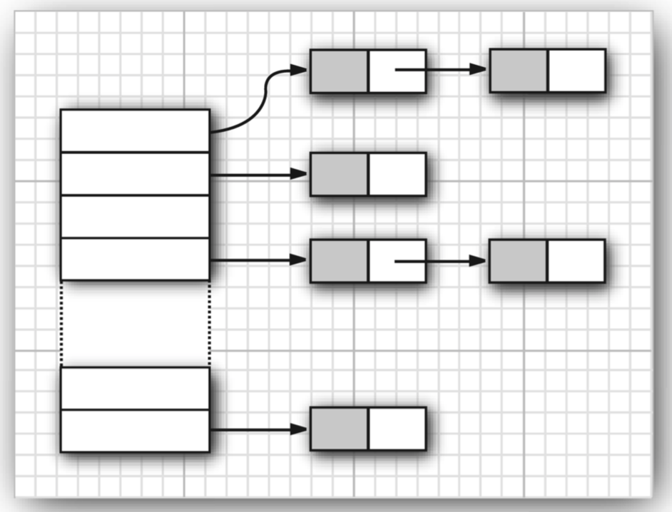

# 具体集合
>time: 2018-06-19 16:39:16

#### Java 库中的具体集合
| 集合类型 | 描述 |
|---|---|
| ArrayList | 一种可以动态增长和缩减的索引序列 |
| LinkedList | 一种可以在任何位置进行高效地插入和删除操作的有序序列 |
| ArrayDeque | 一种用循环数组实现的双端队列 |
| HashSet | 一种没有重复元素的无序结合 |
| TreeSet | 一种有序集 |
| EnumSet | 一种包含枚举型值得集 |
| LinkedHashSet | 一种可以记住元素插入次序的集 |
| PriorityQueue | 一种允许高效删除最小元素的集合 |
| HashMap | 一种存储键/值关联的数据结构 |
| TreeMap | —种键值有序排列的映射表 |
| EnumMap | 一种键值属于枚举类型的映射表 |
| LinkedHashMap | 一种可以记住键/值项添加次序的映射表 |
| WeakHashMap | 一种其值无用武之地后可以被垃圾回收器回收的映射表 |
| IdentityHashMap | 一种用=而不是用 equals 比较键值的映射表 |

#### 集合框架中的类


## 1. 链表
数组和数组列表都有一个重大的缺陷。这就是从数组的中间位置删除一个元素要付出很大的代价，其原因是数组中处于被删除元素之后的所有元素都要向数组的前端移动。在数组中间的位置上插入一个元素也是如此。

数组在连续的存储位置上存放对象引用。

链表（linked list）解决了从中间增删元素的低效问题。链表将每个对象存放在独立的节点中，每个节点还存放着序列中下一个节点的引用。在 Java 程序设计语言中，所有链表实际上都是双向连接的(double linked)——即每个结点还存放着指向前驱结点的引用（双向链表）。

#### 双向链表


从链表中间删除一个元素是一个很轻松的操作， 即需要更新被删除元素附近的链接。
#### 从链表中删除一个元素


#### 代码示例中， 先添加 3 个元素， 然后再将第 2 个元素删除：
```java
// LinkedList implements List
List<String> staff = new LinkedList<>();
staff.add("Amy");
staff.add("Bob");
staff.add("Carl");
Iterator iter = staff.iterator();
// visit first element
String first = iter.next();
// visit second element
String second = iter.next();
// remove last visited element
iter.remove();
```

链表与泛型集合之间有一个重要的区别。链表是一个有序集合（ordered collection），每个对象的位置十分重要。LinkedList.add 方法将对象添加到链表的尾部。但是，常常需要将元素添加到链表的中间。由于迭代器是描述集合中位置的，所以这种依赖于位置的 add 方法将由迭代器负责。只有对自然有序的集合使用迭代器添加元素才有实际意义。因此， 在 Iterator 接口中就没有 add 方法。相反地，集合类库提供了子接口 Listlterator，其中包含 add 方法：
```java
interface ListIterator<E> extends Iterator<E>
{
    void add(E element);
    ...
}
```

与 Collection.add 不同，这个方法不返回 boolean 类型的值，它假定添加操作总会改变链表。

Listlterator 接口有两个方法，可以用来反向遍历链表。
```java
E previous()
boolean hasPrevious()
```

与 next 方法一样，previous 方法返回越过的对象。  
LinkedList 类的 listlterator 方法返回一个实现了 Listlterator 接口的迭代器对象。  
`ListIterator<String> iter = staff.listIterator();`  
Add 方法在迭代器位置之前增加一个新对象。

#### 越过链表中的第一个元素， 并在第二个元素之前添加“ Juliet”
```java
List<String> staff = new LinkedList<>();
staff.add("Amy");
staff.add("Bob");
staff.add("Carl");
ListIterator<String> iter = staff.listIterator();
iter.next();// skip past first element
iter.add("Juliet");
```

#### 将一个元素添加到链表中


如果多次调用 add 方法，将按照提供的次序把元素添加到链表中。它们被依次添加到迭代器当前位置之前。

```java
List<String> staff = new LinkedList<>();
staff.add("Amy");
staff.add("Bob");
staff.add("Carl");
ListIterator<String> iter = staff.listIterator();
iter.next();// skip past first element
iter.add("Juliet 1");
iter.add("Juliet 2");
iter.add("Juliet 3");

System.out.println(staff.toString());
// [Amy, Juliet 1, Juliet 2, Juliet 3, Bob, Carl]
```

当用一个刚刚由 Iterator 方法返回，并且指向链表表头的迭代器调用 add 操作时，新添加的元素将变成列表的新表头。当迭代器越过链表的最后一个元素时（即 hasNext 返回 false)，添加的元素将变成列表的新表尾。如果链表有 n 个元素，有 n+1 个位置可以添加新元素。这些位置与迭代器的 n+1 个可能的位置相对应。例如，如果链表包含 3个元素， A、 B、 C， 就有 4 个位置（标有丨）可以插入新元素：
```
|ABC
A|BC
AB|C
ABC|
```

***
**注释**: 在用“光标”类比时要格外小心。remove 操作与 BACKSPACE 键的工作方式不太一样。在调用 next 之后，remove 方法确实与 BACKSPACE 键一样删除了迭代器左侧的元素。但是，如果调用 previous 就会将右侧的元素删掉，并且不能连续调用两次 remove。  
add 方法只依赖于迭代器的位置，而 remove 方法依赖于迭代器的状态。
***

最后需要说明，set 方法用一个新元素取代调用 next 或 previous方法返回的上一个元素。

如果在某个迭代器修改集合时，另一个迭代器对其进行遍历，一定会出现混乱的状况。例如，一个迭代器指向另一个迭代器刚刚删除的元素前面，现在这个迭代器就是无效的，并且不应该再使用。链表迭代器的设计使它能够检测到这种修改。如果迭代器发现它的集合被另一个迭代器修改了，或是被该集合自身的方法修改了，就会抛出一个 
ConcurrentModificationException 异常。例如，看一看下面这段代码：

```java
List<String> list = new LinkedList<>();
list.add("Amy");
list.add("Bob");
list.add("Carl");
ListIterator<String> iter1 = list.listIterator();
ListIterator<String> iter2 = list.listIterator();
iter1.next();
iter1.remove();
iter2.next(); // throws ConcurrentModificationException
```

由于 iter2检测出这个链表被从外部修改了，所以对 iter2.next 的调用抛出了一个 
ConcurrentModificationException 异常。  
为了避免发生并发修改的异常，请遵循下述简单规则：可以根据需要给容器附加许多的迭代器，但是这些迭代器只能读取列表。另外，再单独附加一个既能读又能写的迭代器。  
有一种傅单的方法可以检测到并发修改的问题。集合可以跟踪改写操作（诸如添加或删除元素）的次数。每个迭代器都维护一个独立的计数值。在每个迭代器方法的开始处检查自己改写操作的计数值是否与集合的改写操作计数值一致。如果不一致，抛出一个 ConcurrentModificationException 异常。

***
**注释**: 对于并发修改列表的检测有一个奇怪的例外。链表只负责跟踪对列表的机构性修改，例如，添加元素、删除元素。set 方法不被视为结构性修改。可以将多个迭代器附加给一个链表，所有的迭代器都调用 set 方法对现有节点的内容进行修改。
***

toString 方法调用了所有元素的 toString，并产生了一个很长的格式为 `[A, B, C]` 的字符串。这为调试工作提供了便利。可以使用 contains 方法检测某个元素是否出现在链表中。

在 Java 类库中，还提供了许多在理论上存在一定争议的方法。链表不支持快速地随机访问。如果要查看链表中第 n 个元素，就必须从头开始，越过个元素。没有捷径可走。鉴于这个原因，在程序需要采用整数索引访问元素时，程序员通常不选用链表。  
尽管如此， LinkedList 类还是提供了一个用来访问某个特定元素的 get 方法：
```
List<String> list = ...;
list.get(n);
```

当然，这个方法的效率并不太高。如果发现自己正在使用这个方法，说明有可能对于所要解决的问题使用了错误的数据结构。

绝对不应该使用这种让人误解的随机访问方法来遍历链表。下面这段代码的效率极低：
```
for (int i = 0; i < list.size(); i++)
    do something with list.get(i);
```

每次査找一个元素都要从列表的头部重新开始搜索。LinkedList 对象根本不做任何缓存位置信息的操作。
***
**注释**: get 方法做了微笑的优化：如果索引大于 `size() / 2` 就从列表尾端开始搜索元素。
***

列表迭代器接口还有一个方法，可以告之当前位置的索引。实际上，从概念上讲， 由于 Java 迭代器指向两个元素之间的位置，所以可以同时产生两个索引：nextlndex 方法返回下一次调用 next 方法时返回元素的整数索引；previouslndex 方法返回下一次调用 previous 方法时返回元素的整数索引。当然，这个索引只比 nextlndex 返回的索引值小 1。这两个方法的效率非常高，这是因为迭代器保持着当前位置的计数值。最后需要说一下，如果有一个整数索引 n，list.listlterator(n) 将返回一个迭代器，这个迭代器指向索引为 n 的元素前面的位置。也就是说，调用 next 与调用 `list.get(n)` 会产生同一个元素，只是获得这个迭代器的效率比较低。

如果链表中只有很少几个元素，就完全没有必要为 get 方法和 set 方法的开销而烦恼。但是，为什么要优先使用链表呢？使用链表的唯一理由是尽可能地减少在列表中间插人或删除元素所付出的代价。如果列表只有少数几个元素，就完全可以使用 ArrayList。

我们建议避免使用以整数索引表示链表中位置的所有方法。如果需要对集合进行随机访问，就使用数组或 ArrayList，而不要使用链表。

#### `java.util.List<E>` 1.2
* `ListIterator<E> listIterator()`
    >返回一个列表迭代器，以便用来访问列表中的元素。
* `ListIterator<E> listIterator(int index)`
    >返回一个列表迭代器，以便用来访问列表中的元素，这个元素第一次调用 next 返回的给定索引的元素。
* void add(int i, E element)
    >在给定位置添加一个元素。
* `void addAll(int i, Collection<? extends E> elements)`
    >将某个集合中的所有元素添加到给定位置。
* E remove(int i)
    >删除给定位置的元素并返回这个元素。
* E get(int i)
    >获取给定位置的元素。
* E set(int i, E element)
    >用新元素取代给定位置的元素，并返回原来那个元素。
* int indexOf(object element)
    >返回与指定元素相等的元素在列表中第一次出现的位置，如果没有这样的元素将返回 -1。
* int lastIndexOf(Object element)
    >返回与指定元素相等的元素在列表中最后一次出现的位置， 如果没有这样的元素将返回 -1。

#### `java.util.ListIterator<E> 1.2`
* void add(E newElement)
    >在当前位置前添加一个元素。
* void set(E newElement)
    >用新元素取代 next 或 previous 上次访问的元素。 如果在 next 或 previous 上次调用之后列表结构被修改了，将拋出一个 IllegalStateException 异常。
* boolean hasPrevious()
    >当反向迭代列表时，还有可供访问的元素，返回 true。
* E previous()
    >返回前对象。如果已经到达了列表的头部，就抛出一个 NoSuchElementException 异常。
* int nextIndex()
    >返回下一次调用 next 方法时将返回的元素索引。
* int previousIndex()
    >返回下一次调用 previous 方法时将返回的元素索引。

#### `java.util.LinkedList<E> 1.2`
* LinkedList()
    >构造一个空链表。
* `LinkedList(Collection<? extends E> elements)`
    >构造一个链表，并将集合中所有的元素添加到这个链表中。
* void addFirst(E element)
* void addLast(E element)
    >将某个元素添加到列表的头部或尾部。
* E getFirst()
* E getLast()
    >返回列表头部或尾部的元素。
* E removeFirst()
* E removeLast()
    >删除并返回列表头部或尾部的元素。

## 2 数组列表
List 接口用于描述一个有序集合，并且集合中每个元素的位置十分重要。有两种访问元素的协议：
1. 使用迭代器
2. 使用 get 和 set 方法随机地访问每个元素。

ArrayList 类实现了 List 接口。ArrayList 封装了一个动态分配的对象数组。

***
**注释**: 对于一个经验丰富的 Java 程序员来说，在需要动态数组时，可能会使用 Vector 类。为什么要用 ArrayList 取代 Vector 呢？原因很简单： Vector 类的所有方法都是同步的。可以由两个线程安全地访问一个 Vector 对象。但是，如果由一个线程访问 Vector，代码要在同步操作上耗费大量的时间。这种情况还是很是很常见的。而 ArrayList 方法不是同步的，因此，建议在不需要同步时使用 ArrayList，而不使用 Vector。
***

## 3 散列集
链表和数组可以按照人们的意愿排列元素的次序。但是，如果想要查看某个指定的元素，却又忘记了它的位置，就需要访问所有元素，直到找到为止。如果集合中包含的元素很多，将会消耗很多时间。如果不在意元素的顺序，可以有几种能够快速查找元素的数据结构。其缺点是无法控制元素出现的次序。它们将按照有利于其操作目的的原则组织数据。

散列表（hash table）为每一个对象计算一个整数，称为散列码（hash code）。散列码是由对象的实例域产生的一个整数。更准确地说，具有不同数据域的对象将产生不同的散列码。

如果自定义类，就要负责实现这个类的 hashCode 方法。自己实现的 hashCode 方法应该与 equals 方法兼容，即如果 a.equals(b) 为 true，a 与 b 必须具有相同的散列码。

最重要的问题是散列码要能快速地计算出来，并且这个计算只与散列的对象状态有关，与散列表中的其他对象无关。

在 Java 中，散列表用链表数组实现。每个列表被称为桶（bucket）。要查找表中对象的位置，就要先计算它的散列码，然后与桶的总数取余，所得到的结果就是保存这个元素的桶的索引。例如，如果某个对象的散列码为 76268，并且有 128 个桶，对象应该保存在第 108 号桶中（76268 除以 128 余 108 )。或许会很幸运，在这个桶中没有他元素，此时将元素直接插人到桶中就可以了。当然，有时候会遇到桶被占满的情况，这也是不可避免的。这种现象被称为散列冲突（hash collision)。这时，需要用新对象与桶中的所有对象进行比较，査看这个对象是否已经存在。如果散列码是合理且随机分布的，桶的数目也足够大，需要比较的次数就会很少。


***
**注释**: 在 Java SE 8 中，桶满时会从链表变为平衡二叉树。如果选择的散列函数不当，会产生很多冲突，或者如果有恶意代码试图在散列表中填充多个有相同散列码的值，这样就能提供性能。
***

如果想更多地控制散列表的运行性能，就要指定一个初始的桶数。桶数是指用于收集具有相同散列值的桶的数目。如果要插入到散列表中的元素太多，就会增加冲突的可能性，降低运行性能。

如果大致知道最终会有多少个元素要插人到散列表中，就可以设置桶数。通常，将桶数设置为预计元素个数的 75% ~ 150%。有些研究人员认为：尽管还没有确凿的证据，但最好将桶数设置为一个素数，以防键的集聚。标准类库使用的桶数是 2 的幂，默认值为 16 (为表大小提供的任何值都将被自动地转换为 2 的下一个幂)。

当然，并不是总能够知道需要存储多少个元素的，也有可能最初的估计过低。如果散列表太满，就需要再散列 (rehashed)。如果要对散列表再散列，就需要创建一个桶数更多的表，并将所有元素插入到这个新表中，然后丢弃原来的表。装填因子 ( load factor ) 决定何时对散列表进行再散列。例如，如果装填因子为 0.75 (默认值)，而表中超过 75% 的位置已经填人元素，这个表就会用双倍的桶数自动地进行再散列。对于大多数应用程序来说，装填因子为 0.75 是比较合理的。

散列表可以用于实现几个重要的数据结构。其中最简单的是 set 类型。set 是没有重复元素的元素集合。set 的 add 方法首先在集中查找要添加的对象，如果不存在，就将这个对象添加进去。

Java 集合类库提供了一个 HashSet 类，它实现了基于散列表的集。可以用 add 方法添加元素。contains 方法已经被重新定义。用来快速地查看是否某个元素已经出现在集合中。它只在某个桶中查找元素，而不必查看集合中的所有元素。

散列集迭代器将依次访问所有的桶。由于散列将元素分散在表的各个位置上，所以访问它们的顺序几乎是随机的。只有不关心集合中元素的顺序时才应该使用 HashSet。

```java
public class SetTest {
    public static void main(String[] args) {
        // HashSet implements Set
        Set<String> words = new HashSet<>();
        long totalTime = 0;
        
        try (Scanner in = new Scanner(System.in)) {
            while(in.hasNext()) {
                String word = in.next();
                long callTime = System.currentTimeMillis();
                words.add(word);
                callTime = System.currentTimeMillis() - callTime;
                totalTime += callTime;
            }
        }
        
        Iterator<String> iter = words.iterator();
        for (int i = 1; i <= 20 && iter.hasNext(); i++) {
            System.out.println(iter.next());
        }
        
        System.out.println("...");
        System.out.println(words.size() + " distinct words. " + totalTime + " milliseconds");
    }
}
```

#### `java.util.HashSet<E> 1.2`
* HashSet()
    >构造一个空散列表
* HashSet(Collecton<? extends E> elements)
    >构造一个散列集，并将集合中的所有元素添加到这个散列集中。
* HashSet(int initialCapacity)
    >构造一个空的具有指定容量(桶数)的散列集。
* HashSet(int initialCapacity, float loadFactor)
    >构造一个具有指定容量和装填因子(一个 0.0 ~ 1.0 之间的数值，确定散列表填充的百分比，当大于这个百分比时，散列表进行再散列)的空散列集。

#### `java.lang.Object 1.0`
* `int hashCode()`
    >返回这个对象的散列码。散列码可以是任何整数，包括整数或负数。equals 和 hashCode 的定义必须兼容，即如果 x.equals(y) 为 true，x.hashCode() 必须等于 y.hashCode()。

## 4. 树集
TreeSet 类与散列集十分类似，比散列集有所改进，是一个有序集合( sorted collection )。可以以任意顺序插入元素，遍历时，每个元素将自动地按照顺序呈现。
```java
// TreeSet implements SortedSet
SortedSet<String> sorter = new TreeSet<>();
sorter.add("Bob");
sorter.add("Amy");
sorter.add("Carl");

System.out.println(sorter);
```
#### 输出
`[Amy, Bob, Carl]`

排序是使用树结构完成的 (当前实现使用的是红黑树 (red-black tree) )，每次将一个元素添加到树中时，都被放置在正确的排序位置上。

将一个元素添加到树中要比添加到散列表中慢，但是，与检查数组或链表中的重复元素相比还是快很多。如果树中包含 n 个元素，查找新元素的正确位置平均需要 log<sub>2</sub>n 次比较。

#### 将元素添加到散列集和树集
| 文档 | 单词总数 | 不同的单词个数 | HashSet | TreeSet |
|---|---|---|---|---|
| Alice in Wonderland | 28195 | 5909 | 5 秒 | 7 秒 |
| The Count of Monte Cristo | 466300 | 37545 |75 秒 | 98 秒 |

***
**注释**: 要使用树集，必须能够比较元素。这些元素必须实现 Comparable 接口，或者构造集时必须提供一个 Comparator。
***

是否总是应该用树集取代散列集。毕竟，添加一个元素所花费的时间看上去并不很长，而且元素是自动排序的。到底应该怎样做将取决于所要收集的数据。如果不需要对数据进行排序，就没有必要付出排序的开销。更重要的是，对于某些数据来说，对其排序要比散列函数更加困难。散列函数只是将对象适当地打乱存放，而比较却要精确地判别每个对象。

要想具体地了解它们之间的差异，还需要研究一个收集矩形集的任务。如果使用 TreeSet，就需要提供 `Comparator<Rectangle>`。如何比较两个矩形呢？比较面积吗？这行不通。可能会有两个不同的矩形，它们的坐标不同，但面积却相同。树的排序必须是全序。也就是说，任意两个元素必须是可比的，并且只有在两个元素相等时结果才为 0。确实，有一种矩形的排序（按照坐标的词典顺序排列）方式，但它的计算很牵强且很繁琐。相反地，Rectangle 类已经定义了散列函数，它直接对坐标进行散列。

***
**注释**: 从 Java SE 6 起，TreeSet 类实现了 NavigableSet 接口。这个接口增加了几个便于定位元素以及反向遍历的方法。
***

```java

/**
 * An item with a description and a part number
 */
public class Item implements Comparable<Item>{
    private String description;
    private int partNum;
    
    /**
     * Constructs an item.
     * @param aDescription
     *      the item's description
     * @param aPartNum
     *      the item's part number
     */
    public Item(String aDescription, int aPartNum) {
        description = aDescription;
        partNum = aPartNum;
    }
    
    /**
     * Gets the description of this item
     * 
     * @return the description
     */
    public String getDescription() {
        return description;
    }
    
    public String toString() {
        return "[description=" + description + ", partNumber=" + partNum + "]";
    }
    
    public boolean equals(Object otherObject) {
        if (this == otherObject) return true;
        if (otherObject == null) return false;
        if (getClass() != otherObject.getClass()) return false;
        Item other = (Item)otherObject;
        return Objects.equals(description, other.description) && partNum == other.partNum;
    }
    
    public int hashCode() {
        return Objects.hash(description, partNum);
    }
    
    public int compareTo(Item other) {
        int diff = Integer.compare(partNum, other.partNum);
        return diff != 0 ? diff : description.compareTo(other.description);
    }
}
```

```java
public class TreeTest {

    public static void main(String[] args) {
        SortedSet<Item> parts = new TreeSet<>();
        parts.add(new Item("Toaster", 1234));
        parts.add(new Item("Widget", 456));
        parts.add(new Item("Modem", 9912));
        
        System.out.println(parts);
        
        NavigableSet<Item> sortByDescription = new TreeSet<>(
                Comparator.comparing(Item::getDescription));

        sortByDescription.addAll(parts);
        System.out.println(sortByDescription);
    }

}
```
#### 输出：
```
[[description=Widget, partNumber=456], [description=Toaster, partNumber=1234], [description=Modem, partNumber=9912]]
[[description=Modem, partNumber=9912], [description=Toaster, partNumber=1234], [description=Widget, partNumber=456]]
```