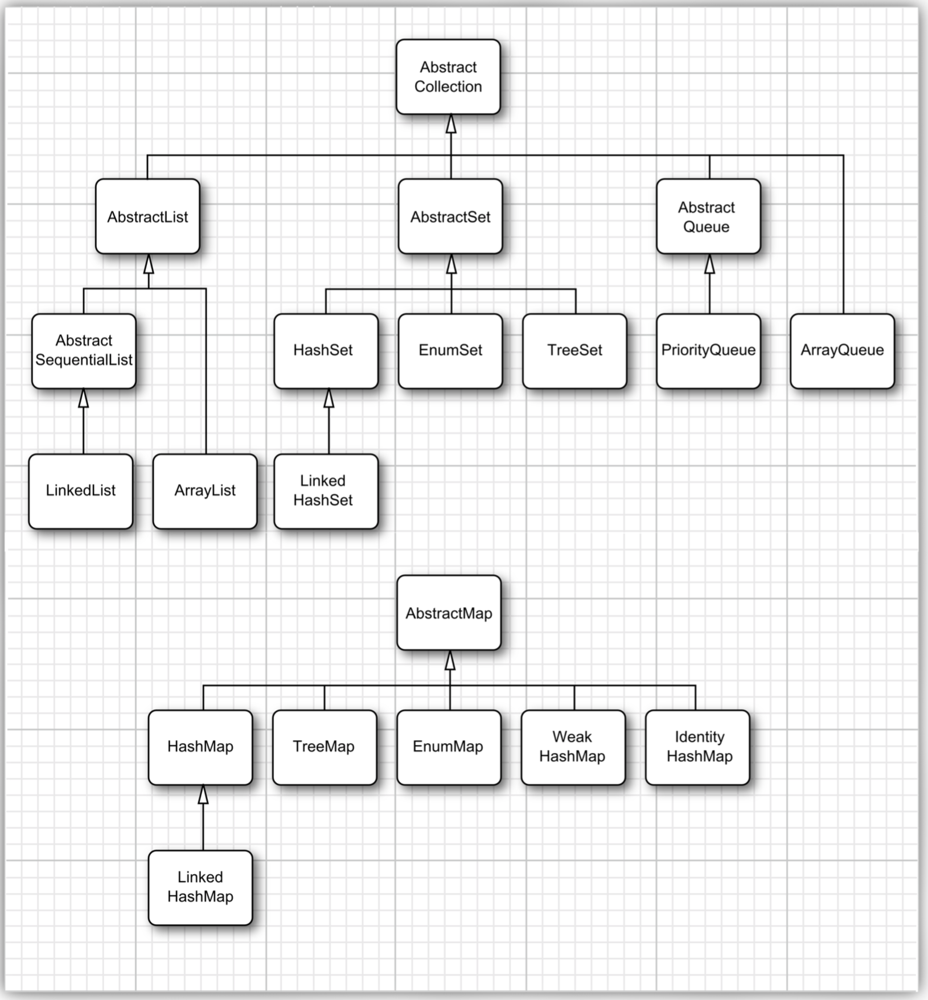

# 具体集合
>time: 2018-06-19 16:39:16

#### Java 库中的具体集合
| 集合类型 | 描述 |
|---|---|
| ArrayList | 一种可以动态增长和缩减的索引序列 |
| LinkedList | 一种可以在任何位置进行高效地插入和删除操作的有序序列 |
| ArrayDeque | 一种用循环数组实现的双端队列 |
| HashSet | 一种没有重复元素的无序结合 |
| TreeSet | 一种有序集 |
| EnumSet | 一种包含枚举型值得集 |
| LinkedHashSet | 一种可以记住元素插入次序的集 |
| PriorityQueue | 一种允许高效删除最小元素的集合 |
| HashMap | 一种存储键/值关联的数据结构 |
| TreeMap | —种键值有序排列的映射表 |
| EnumMap | 一种键值属于枚举类型的映射表 |
| LinkedHashMap | 一种可以记住键/值项添加次序的映射表 |
| WeakHashMap | 一种其值无用武之地后可以被垃圾回收器回收的映射表 |
| IdentityHashMap | 一种用=而不是用 equals 比较键值的映射表 |

#### 集合框架中的类


## 1. 链表
数组和数组列表都有一个重大的缺陷。这就是从数组的中间位置删除一个元素要付出很大的代价，其原因是数组中处于被删除元素之后的所有元素都要向数组的前端移动。在数组中间的位置上插入一个元素也是如此。

数组在连续的存储位置上存放对象引用。

链表（linked list）解决了从中间增删元素的低效问题。链表将每个对象存放在独立的节点中，每个节点还存放着序列中下一个节点的引用。在 Java 程序设计语言中，所有链表实际上都是双向连接的(double linked)——即每个结点还存放着指向前驱结点的引用（双向链表）。

#### 双向链表


从链表中间删除一个元素是一个很轻松的操作， 即需要更新被删除元素附近的链接。
#### 从链表中删除一个元素


#### 代码示例中， 先添加 3 个元素， 然后再将第 2 个元素删除：
```java
// LinkedList implements List
List<String> staff = new LinkedList<>();
staff.add("Amy");
staff.add("Bob");
staff.add("Carl");
Iterator iter = staff.iterator();
// visit first element
String first = iter.next();
// visit second element
String second = iter.next();
// remove last visited element
iter.remove();
```

链表与泛型集合之间有一个重要的区别。链表是一个有序集合（ordered collection），每个对象的位置十分重要。LinkedList.add 方法将对象添加到链表的尾部。但是，常常需要将元素添加到链表的中间。由于迭代器是描述集合中位置的，所以这种依赖于位置的 add 方法将由迭代器负责。只有对自然有序的集合使用迭代器添加元素才有实际意义。因此， 在 Iterator 接口中就没有 add 方法。相反地，集合类库提供了子接口 Listlterator，其中包含 add 方法：
```java
interface ListIterator<E> extends Iterator<E>
{
    void add(E element);
    ...
}
```

与 Collection.add 不同，这个方法不返回 boolean 类型的值，它假定添加操作总会改变链表。

Listlterator 接口有两个方法，可以用来反向遍历链表。
```java
E previous()
boolean hasPrevious()
```

与 next 方法一样，previous 方法返回越过的对象。  
LinkedList 类的 listlterator 方法返回一个实现了 Listlterator 接口的迭代器对象。  
`ListIterator<String> iter = staff.listIterator();`  
Add 方法在迭代器位置之前增加一个新对象。

#### 越过链表中的第一个元素， 并在第二个元素之前添加“ Juliet”
```java
List<String> staff = new LinkedList<>();
staff.add("Amy");
staff.add("Bob");
staff.add("Carl");
ListIterator<String> iter = staff.listIterator();
iter.next();// skip past first element
iter.add("Juliet");
```

#### 将一个元素添加到链表中
