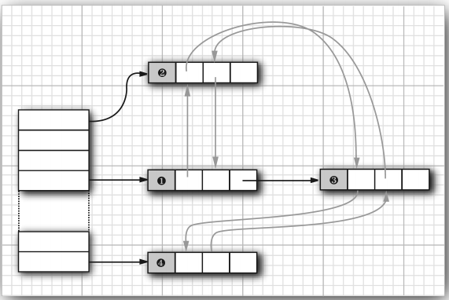

# 映射
>time: 2018-06-28 16:04:56

集是一个集合，它可以快速地查找现有的元素。但是，要查看一个元素，需要有要查找元素的精确副本。这不是一种非常通用的査找方式。通常，我们知道某些键的信息，并想要查找与之对应的元素。

映射（map）数据结构就是为此设计的。映射用来存放键 / 值对。如果提供了键，就能够查找到值。

## 1. 基本映射操作
Java 类库为映射提供了两个通用的实现：HashMap 和 TreeMap。这两个类都实现了 Map 接口。

散列映射对键进行散列，树映射用键的整体顺序对元素进行排序，并将其组织成搜索树。散列或比较函数只能作用域键。与键关联的值不能进行散列或比较。

散列稍快一些，如果不需要按照排列顺序访问键，就最好选择散列。

每当往映射中添加对象时，必须同时提供一个键。  
要想检索一个对象，必须使用一个键。  
如果在映射中没有与给定键对应的信息，get 将返回 null。  
null 返回值可能并不方便。有时可以有一个好的默认值，用作为映射中不存在的键。然后使用 getOrDefault 方法。
```java
Map<String, Integer> scores = ...;
// Gets 0 if the id is not present
int score = scores.getOrDefault(id, 0);
```
键必须是唯一的。不能对同一个键存放两个值。如果对同一个键两次调用 put 方法，第二个值就会取代第一个值。实际上，put 将返回用这个键参数存储的上一个值。  
remove 方法用于从映射中删除给定键对应的元素。size 方法用于返回映射中的元素数。  
要迭代处理映射的键和值，最容易的方法是使用 forEach 方法。可以提供一个接收键和值的 lambda 表达式。映射中的每一项会依序调用这个表达式。
```java
scores.forEach((k, v) ->
    System.out.println("key=" + key + ", value=" + v));
```

```java
public class PriorityQueueTest {

    public static void main(String[] args) {
        Map<String, Employee> staff = new HashMap<>();
        staff.put("144-25-5464", new Employee("Amy Lee"));
        staff.put("567-24-2546", new Employee("Harry Hacker"));
        staff.put("157-62-7935", new Employee("Cary Cooper"));
        staff.put("456-62-5527", new Employee("Francesca Cruz"));
        
        // print all entries
        System.out.println(staff);
        
        // remove an entry
        staff. remove("567-24-2546");
        
        // replace an entry
        staff.put("456-62-5527", new Employee("Francesca Hiller"));
        
        // look up a value
        System.out.println(staff.get("157-62-7935"));
        
        // iterate through all entries
        staff.forEach((k, v) ->
            System.out.println("key=" + k + ", value:" + v));
    }
}
```
#### 输出
```
{157-62-7935=[name=Cary Cooper, salary=0.0], 144-25-5464=[name=Amy Lee, salary=0.0], 456-62-5527=[name=Francesca Cruz, salary=0.0], 567-24-2546=[name=Harry Hacker, salary=0.0]}
[name=Cary Cooper, salary=0.0]
key=157-62-7935, value:[name=Cary Cooper, salary=0.0]
key=144-25-5464, value:[name=Amy Lee, salary=0.0]
key=456-62-5527, value:[name=Francesca Hiller, salary=0.0]
```

#### `java.util.Map<K, V> 1.2`
* V get(Object key)
    >获取与键对应的值；返回与键对应的对象，如果在映射中没有这个对象则返回 null。键可以为 null。
* default V getOfDefault(Object key, V defaultValue)
    >获得与键关联的值；返回与键关联的对象，或者如果未在映射中找到这个键，则返回 defaultValue。
* V put(K key, V value)
    >将键与对应的值关系插入到映射中。如果这个键已经存在，新的对象将取代与这个键对应的旧对象。这个方法将返回键对应的旧值。如果这个键以前没有出现过则返回null。键可以为 null，但值不能为 null。
* void putAll(Map<? extends K, ? extends V> entries)
    >将给定映射中的所有条目添加到这个映射中。
* boolean containsKey(Object key)
    >如果在映射中已经有这个键，返回 true。
* boolean containsValue(Object value)
    >如果映射中已经有这个值，返回 true。
* default void forEach(BiConsumber<? super K, ? super V> action) 8
    >对这个映射中的所有键/值对应用这个动作。

#### `java.util.HashMap<K, V> 1.2`
* HashMap()
* HashMaP(int initialCapacity)
* HashMap(int initialCapacity, float loadFactory)
    >用给定的容量和装填因子构造一个空散列映射（装填因子是一个 0.0 ~ 1.0 之间的数值。这个数值决定散列表填充的百分比。一旦到了这个比例，就要将其再散列到更大的表中）。默认的装填因子是 0.75。

#### `java.util.TreeMap<K, V> 1.2`
* TreeMap()
    >为实现 Comparable 接口的键构造一个空的映射树。
* TreeMap(Comparator<? super K> c)
    >构造一个映射树，并使用一个指定的比较器对键进行排序。
* TreeMap(Map<? extends K, ? extends V> c)
    >构造一个映射树，并将某个映射中的所有条目添加到映射中。
* TreeMap(SortedMap<? extends K, ? extends V> entries)
    >构造一个映射树，将某个有序映射中的所有条目添加到树映射中，并使用与给定的有序映射相同的比较器。

#### `java.util.SortedMap<K, V> 1.2`
* `Comparator<? super K> comparator()`
    >返回对键进行排序的比较器。如果键是用 Comparable 接口的 compareTo 方法进行比较的，返回 null。
* K firstKey()
* K lastKey()
    >返回映射中最小元素和最大元素。

## 2. 更新映射项
处理映射时的一个难点就是更新映射项。

例如，使用一个映射统计一个单词在文章中出现的频度。看到一个单词时，我们将计数器增 1:  
`counts.put(word, counts.get(word) + 1)`  
有一种情况，就是第一次看到 word 时。get 会返回 null，因此会出现一个 NullPointerException 异常。  
作为一个简单的补救，可以使用 getOrDefault 方法：  
`counts.put(word, counts.getOrDefault(word, 0) + 1)`  
另一种方法是首先调用 putIfAbsent 方法。只有当键原先存在时才会放入一个值。
```java
counts.putIfAbsent(word, 0);
// Now we know that get will succeed
counts.put(word, counts.get(word) + 1);
```
不过还可以做得更好。merge 方法可以简化这个常见的操作。如果键原先不存在，下面的调用：  
`counts.merge(word, 1, Integer::sum)`  
将把 word 与 1 关联，否则使用 Integer::sum 函数组合原值和 1（也就是将原值与 1 求和）。

#### `java.util.Map<K, V> 1.2`
* `default  V merae(K key, V value, BiFunction<? super V, ? super V, ? extends V> remappingFunction) 8`
    >如果 key 与一个非 null 值 v 关联，将函数应用到 v 和 value，将 key 与结果关联，或者如果结果为 null，则删除这个键。否则 将 key 与 value 关联，返回 get(key)。
* `default V compute(K key, BiFunction<? super K, ? super V, ? extends V> remappingFunction>) 8`
    >将函数应用到 key 和 get(key)。将 key 与结果关联，或者如果结果为 null，则删除这个键。返回 get(key)。
* `default V computeIfPresent(K key, BiFunction<? super K, ? super V, ? extends V> remappingFuncton) 8`
    >如果 key 与一个非 null 值 v 关联，将函数应用到 key 和 v，将 key 与结果关联，或者如果结果为 null，则删除这个键。返回 get(key)。
* `default V computeIfAbsent(K key, Function<? super K, ? extends V> mappingFunction) 8`
    >将函数引用到 key，除非 key 与一个非 null 值关联。将 key 与结果关联，或者如果结果为 null，则删除这个键。返回 get(key)。
* `default void replaceAll(BiFunction<? super K, ? super V, ? extends V) function) 8`
    >在所有映射项上应用函数。将键与非 null 结果关联，对于 null 结果，则将相应的键删除。

## 3. 映射视图
集合框架不认为映射本身是一个集合。（其他数据结构框架认为映射是一个键/值对集合，或者由键索引的值集合。）不过，可以得到映射的视图（view）—— 这是实现了 Collection 接口或某个子接口的对象。

有 3 种视图：
1. 键集
1. 值集合（不是一个集）
1. 键/值对集

键和键/值对可以构成一个集，因为映射中一个键只能有一个副本。
```
Set<K> keySet()
Collection<V> values()
Set<Map.Entry<K, V>> entrySet()
```
会分别返回这 3 个视图。（条目集的元素是实现 Map.Entry 接口的类的对象。）

keySet 不是 HashSet 或 TreeSet，而是实现了 Set 接口的另外某个类的对象。Set 接口扩展了 Collection 接口。因此，可以像使用集合一样使用 keySet。

```java
Set<String> keys = map.keySet();
for(String key: keys) {
    // do something with key
}

for(Map.Entry<String, Employee> entry : staff.entrySet()) {
    String k = entry.getKey();
    Employee v = entry.getValue();
    // do something with k, v
}
```
***
**提示**：原先这是访问所有映射条目的最高效的方法。如今，只需要使用 forEach 方法：
```java
counts.forEach((k, v) -> {
    // do something with k, v
});
```
***
如果在键集视图上调用迭代器的 remove 方法，实际上会从映射中删除这个键和与它关联的值。不过，不能向键集视图增加元素。另外，如果增加一个键而没有同时增加值也是没有意义的。如果试图调用 add 方法，它会抛出一个 UnsupportedOperationException。条目集视图有同样的限制，尽管理论上增加一个新的键/值对好像是有意义的。

#### `java.util.Map<K, V> 1.2`
* `Set<Map.Entry<K, V>> entrySet()`
    >返回 Map.Entry 对象（映射中的键/值对）的一个集视图。可以从这个集中删除元素，它们将从映射中删除，但是不能增加任何元素。
* `Set<K> keySet()`
    >返回映射中所有键的一个集视图。可以从这个集中删除元素，键和相关联的值将从映射中删除，但是不能增加任何元素。
* `Collection<V> values()`
    >返回映射中所有值得一个集合视图。可以从这个集中删除元素，所删除的值及相应的键将从映射中删除。不过不能增加任何元素。

#### `java.util.Map.Entry<K, V> 1.2`
* K getKey()
* V getValue()
    >返回这一条目的键或值。
* V setValue(V newValue)
    >将相关映射中的值改为新值，并返回原来的值。

## 4. 弱散射映射
垃圾回收器跟踪活动的对象。只要映射对象是活动的，其中的所有桶也是活动的，它们不能被回收。因此，需要由程序负责从长期存活的映射表中删除那些无用的值。或者使用 WeakHashMap 完成这件事情。当对键的唯一引用来自散列条目是，这一数据结构将与垃圾回收器协同工作一起删除键/值对。

这种机制的内部运行情况：WeakHashMap 使用弱引用（weak references）保存键。WeakReference 对象将引用保存到另外一个对象中，在这里，就是散列键。对于这种类型的对象，垃圾回收器用一种特有的方式进行处理。通常，如果垃圾回收器发现某个特定的对象已经没有他人引用了，就将其回收。然而，如果没有对象只能由 WeakReference 引用，垃圾回收器仍然回收它，但要将引用这个对象的弱引用放入队列中。WeakHashMap 将周期性地检查队列，以便找出新添加的弱引用。一个弱引用进人队列意味着这个键不再被他人使用，并且已经被收集起来。于是，WeakHashMap 将删除对应的条目。

## 5. 链接散列集与映射
LinkedHashSet 和 LinkedHashMap 类用来记住插人元素项的顺序。这样就可以避免在散列表中的项从表面上看是随机排列的。当条目插入到表中时，就会并人到双向链表中。

#### 链接散列表


```java
Map<String, Employee> staff = new LinkedHashMap<>();
staff.put("144-25-5464", new Employee("Amy Lee"));
staff.put("567-24-2546", new Employee("Harry Hacker"));
staff.put("157-62-7935", new Employee("Gray Cooper"));
staff.put("456-62-5527", new Employee("Framcesca Cruz"));

System.out.println(staff.keySet());
System.out.println();
for(Employee em:  staff.values()) {
    System.out.println(em.getName());
}
```
#### 输出:
```
[144-25-5464, 567-24-2546, 157-62-7935, 456-62-5527]

Amy Lee
Harry Hacker
Gray Cooper
Framcesca Cruz
```
链接散列映射将用访问顺序，而不是插入顺序，对映射条目进行迭代。每次调用 get 或 put，受到影响的条目将从当前的位置删除，并放到条目链表的尾部（只有条目在链表中的位置会受影响，而散列表中的桶不会受影响。一个条目总位于与键散列码对应的桶中）。要项构造这样一个的散列映射表， 请调用：  
`LinkedHashMap<K, V>(initialCapacity, loadFactor, true)`  
访问顺序对于实现高速缓存的 “最近最少使用” 原则十分重要。例如，可能希望将访问频率高的元素放在内存中，而访问频率低的元素则从数据库中读取。当在表中找不到元素项且表又已经满时，可以将迭代器加入到表中，并将枚举的前几个元素删除掉。这些是近期最少使用的几个元素。

甚至可以让这一过程自动化。即构造一个 LinkedHashMap 的子类，然后覆盖下面这个方法：  
`protected boolean removeEldestEntry(Map.Entry<K, V> eldest)`  
每当方法返回 true 时，就添加一个新条目，从而导致删除 eldest 条目。例如，下面的高速缓存可以存放 100 个元素：
```java
Map<K, V> cache = new 
    LinkedHashMap<>(128, 0.75F, true)
    {
        protected boolean removeEldestEntry(Map.Entry<K, V> eldest) 
        {
            return size() > 100;
        }
    }();
```

另外，还可以对 eldest 条目进行评估，以此决定是否应该将它删除。例如，可以检査与这个条目一起存在的时间戳。

## 6. 枚举集与映射
EnumSet 是一个枚举类型元素集的高效实现。由于枚举类型只有有限个实例，所以 EnumSet 内部用位序列实现。如果对应的值在集中， 则相应的位被置为 1。

EnumSet 类没有公共的构造器。可以使用静态工厂方法构造这个集：
```java
enum Weekday { MONDAY, TUESDAY, WENDESDAY, THURSDAY, FRIDAY, SATURDAY, SUNDAY};
EnumSet<Weekday> always = EnumSet.allOf(Weekday.class);
EnumSet<Weekday> never = EnumSet.noneOf(Weekday.class);
EnumSet<Weekday> workday = EnumSet.range(Weekday.MONDAY, Weekday.FRIDAY);
EnumSet<Weekday> mwf = EnumSet.of(Weekday.MONDAY, Weekday.WENDESDAY, Weekday.FRIDAY);
```
可以使用 Set 接口的常用方法来修改 EnumSet。

EnumMap 是一个键类型为枚举类型的映射。它可以直接且高效地用一个值数组实现。在使用时，需要在构造器中指定键类型：  
`EnumMap<WeekDay, Employee> personInCharge = new EnumMap<>(Weekday.class);`

***
**注释**：在 EnumSet 的 API 文档中，将会看到 `E extends Enum<E>` 这样奇怪的类型参数。简单地说，它的意思是 “E 是一个枚举类型。” 所有的枚举类型都扩展于泛型 Enum 类。例如， Weekday 扩展 `Enum<Weekday>`。
***

## 7. 标识散列映射
类 IdentityHashMap 有特殊的作用。在这个类中，键的散列值不是用 hashCode 函数计算的，而是用 System.identityHashCode 方法计算的。这是 Object.hashCode 方法根据对象的内存地址来计算散列码时所使用的方式。而且，在对两个对象进行比较时， IdentityHashMap 类使用 ==，而不使用 equals。

也就是说，不同的键对象，即使内容相同，也被视为是不同的对象。在实现对象遍历算法（如对象串行化）时，这个类非常有用，可以用来跟踪每个对象的遍历状况。

#### `java.util.WeakHashMap<K, V> 1.2`
* WeakHashMap()
* WeakHashMap(int initialCapacity)
* WeakHashMap(int initialCapacity, float loadFactory)
    >用给定的容量和填充因子构造一个空的散列映射表。
#### `java.util.LinkedHashSet<E> 1.4`
* LinkedHashSet()
* LinkedHashSet(int initialCapacity)
* LinkedHashSet(int initialCapacity, float loadFactory)
    >用给定的容量和填充因子构造一个空链接散列集。

#### `java.util.LinkedHashMap<K, V> 1.4`
* LinkedHashMap()
* LinkedHashMap(int initialCapacity)
* LinkedHashMap(int initialCapacity, float loadFactor)
* LinkedHashMap(int initialCapacity, float loadFactor, boolean accessOrder)
    >用给定的容量、填充因子和顺序构造一个空的链接散列映射表。accessOrder 参数为true 时表示访问顺序，为 false 时表示插入顺序。
* `protected boolean removeEldestEntry(Map.Entry<K, V> eldest)`
    >如果想删除 eldest 元素，并同时返回 true，就应该覆盖这个方法。eldest 参数是预期要删除的条目。这个方法将在条目添加到映射中之后调用。其默认的实现将返回 false。即在默认情况下，旧元素没有被删除。然而，可以重新定义这个方法，以便有选择地返回 true。例如，如果最旧的条目符合一个条件，或者映射超过了一定大小，则返回 true。

#### `java.util.EnumSet<E extends Enum<E>> 5.0`
* `static <E extends Enum<E>> EnumSet<E> allOf(Class<E> enumType)`
    >返回一个包含给定枚举类型的所有值的集。
* `static <E extends Enum<E>> EnumSet<E> noneOf(Class<E> enumType)`
    >返回一个空集，并有足够的空间保存给定的枚举类型所有的值。
* `static <E extends Enum<E>> EnumSet<E> ranger(E from, E to)`
    >返回一个包含 from ~ to 之间的所有值（包含两个边界值）的集。
* `static <E extends Enum<E>> EnumSet<E> of <E value)`
* `static <E extends Enum<E>> EnumSet<E> of <E value, E... values)`
    >返回包括给定值的集

#### `java.util.EnumMap<K extends Enum<K>, V> 5.0`
* `EnumMap(Class<K> keyType`
    >构造一个键为给定类型的空映射。

#### `java.util.IdentityHashMap<K, V> 1.4`
* IdentityHashMap()
* IdentityHashMap(int expectedMaxSize)
    >构造一个空的标识散列映射集，其容量是大于 1.5 * expectedMax 的 2 的最小次幂（expectedMaxSize 的默认值是 21）。
#### java.lang.System 1.0
* static in identityHashCode(Object obj) 1.1
    >返回 Object.hashCoed 计算出来的相同散列吗（根据对象的内存地址产出），即使 obj 所属的类已经重新定义了 hashCode 方法也是如此。