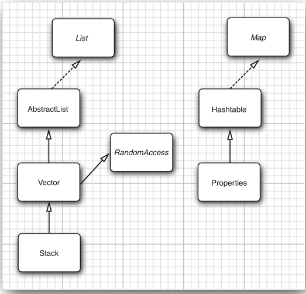

# 遗留的集合
>time: 2018-7-6 16:33:30

#### 集合框架中的遗留类


## 1. Hashtable 类
Hashtable 类与 HashMap 类的作用一样，实际上，它们拥有相同的接口。与 Vector 类的方法一样。Hashtable 的方法也是同步的。如果对同步性或与遗留代码的兼容性没有任何要求，就应该使用 HashMap。如果需要并发访问，则要使用 ConcurrentHashMap。

## 2. 枚举
遗留集合使用 Enumeration 接口对元素序列进行遍历。Enumeration 接口有两个方法，即 hasMoreElement 和 nextElement。这两个方法与 Iterator 接口的 hasNext 方法和 next 方法十分类似。

Hashtable 类的 elements 方法将产生一个用于描述表中各个枚举值的对象：
```java
Enumeration<Employee> e = staff.elements();
while (e.hasMoreElements())
{
    Employee e = e.nextElement();
    // ...
}
```

有时还会遇到遗留的方法，其参数是枚举类型的。静态方法 Collections.enumeration 将产生一个枚举对象，枚举集合中的元素。
```java
List<InputStream> streams = ...;
// the SequenceInputStream constructor expects an enumeration
SequenceInputStream in = new SequenceInputStream(Collections.enumeration(streams));

```

#### `java.util.Enumeration<E> 1.0`
* boolean hasMoreElements()
    >如果还有更多的元素可以查看，则返回 true。
* E nextElement()
    >返回被检测的下一个元素。如果 hasMoreElements() 返回 false，则不需要调用这个方法。

#### `java.util.Hashtable<K, V> 1.0`
* Enumeration<K> keys()
    >返回一个遍历散列表中键的枚举对象。
* Enumeration<V> elements()
    >返回一个遍历散列表中元素的枚举对象。

#### `java.util.Vector<E> 1.0`
* Enumeration<E> elements()
    >返回遍历向量中元素的枚举对象。

## 3. 属性映射
属性映射（property map）是一个类型非常特殊的映射接口。它有下面 3 个特性：
* 键与值都是字符串。
* 表可以保存到一个文件中，也可以从文件中加载。
* 使用一个默认的辅助表

实现属性映射的 Java 平台类称为 Properties。

#### java.util.Properties 1.0
* Properties()
    >创建一个空的属性映射。
* Properties(Properties defaults)
    >创建一个带有一组默认值的空的属性映射。
* String getProperty(String key)
    >获得属性的对应关系；返回与键对应的字符串。如果在映射中不存在，返回默认表中与这个键对应的字符串。
* String getPropetry(String key, String defaultValue)
    >获得在键没有找到时具有的默认值属性；它将返回与键对应的字符串，如果在映射中不存在，就返回默认的字符串。
* void load(InputStream in)
    >从 InputStream 加载属性映射
* void store(OutputStream out, String commentString)
    >把属性映射存储到 OutputStream。

## 4. 栈
从 1.0 版开始，标准类库中就包含了 Stack 类，其中有大家熟悉的 push 方法和 pop 方法。但是，Stack 类扩展为 Vector 类，从理论角度看，Vector 类并不太令人满意，它可以让栈使用不属于栈操作的 insert 和 remove 方法， 即可以在任何地方进行插入或删除操作，而不仅仅
是在栈顶。

#### `java.util.Stack<E> 1.0`
* E push(E item)
    >将 item 压入栈并返回 item。
* E pop()
    >弹出并返回栈顶的 item。如果栈为空，请不要调用这个方法。
* E peek()
    >返回栈顶元素，但不弹出。如果栈为空，请不要调用这个方法。

## 5. 位集

Java 平台的 BitSet 类用于存放一个位序列（它不是数学上的集，称为位向量或位数组更为合适)。如果需要高效地存储位序列（例如，标志）就可以使用位集。由于位集将位包装在字节里，所以，使用位集要比使用 Boolean 对象的 ArrayList 更加高效。

BitSet 类提供了一个便于读取、设置或清除各个位的接口。使用这个接口可以避免屏蔽和其他麻烦的位操作。如果将这些位存储在 int 或 long 变量中就必须进行这些繁琐的操作。

名为 bucketOfBits 的 BitSet：  
`bucketOfBits.get(i)`  
如果第 i 位处于 “开” 状态，就返回 true；否则返回 false。  
`bucketOfBits.set(i)`  
将第 i 位置为 “开” 状态。  
`bucketOfBits.clear(i)`  
将第 i 位置为 “关” 状态。  

#### java.util.BitSet 1.0
* BitSet(int initialCapacityy)
    >创建一个位集。
* int length()
    >返回位集的 “逻辑长度”，即 1 加上位集的最高设置位的索引。
* boolean get(int bit)
    >获得一个位。
* void set(int bit)
    >设置一个位。
* void clear(int bit)
    >清除一个位。
* void add(BitSet set)
    >这个位集与另一个位集进行逻辑 “AND”
* void or(BitSet set)
    >这个位集与另一个位集进行逻辑 “OR”
* void xor(BitSet set)
    >这个位集与另一个位集进行逻辑 “XOR”
* void andNot(BitSet set)
    >清除这个位集中对应另个一位集中设置的所有位。

#### 计算 2 ~ 2 000 000 之间的所有素数（质数）
```java
public static void main(String[] args) {
    int n = 2_000_000;
    long start = System.currentTimeMillis();
    BitSet b = new BitSet(n + 1);
    int count = 0;
    int i;
    for (i = 2; i <= n; i++) {
        b.set(i);
    }
    
    i = 2;
    while ( i * i <= n) {
        if(b.get(i)) {
            count++;
            int k = 2 * i;
            while (k <= n) {
                b.clear(k);
                k += i;
            }
        }
        i++;
    }
    while (i <= n) {
        if (b.get(i)) {
            count++;
        }
        i++;
    }
    long end = System.currentTimeMillis();
    System.out.println(count + " primes");
    System.out.println((end - start) + " milliseconds");
}

// 148933 primes
// 35 milliseconds
```


