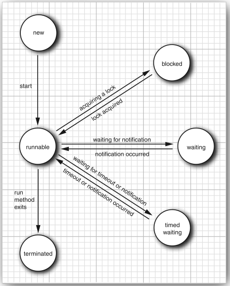
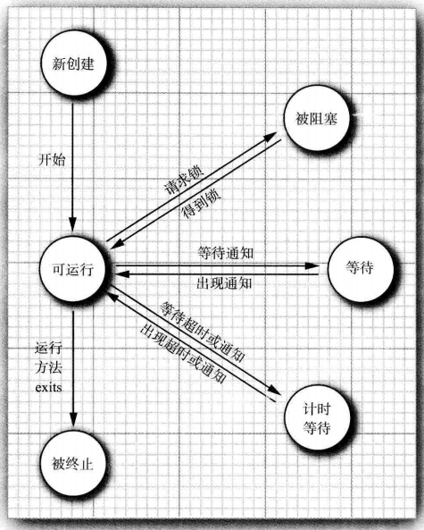

# 线程状态
>time: 2018-7-11 16:33:50

线程可有有如下 6 种状态：
* New（新创建）
* Runnable （可运行）
* Blocked（被阻塞）
* Waiting（等待）
* Timed waiting（计时等待）
* Terminated（被终止）

要确定一个线程的当前状态，可调用 getState 方法。

## 1. 创建新线程
当用 new 操作符创建一个新线程时，如 `new Thread(r)`，该线程还没有开始运行。这意味着它的状态是 new。当一个线程处于新建状态时，程序还没有开始运行线程中的代码。在线程运行之前还有一些基础工作要做。

## 2. 可运行线程
一旦调用了 start 方法，线程处于 runnable 状态。一个可运行的线程可能正在运行也可能没有运行，这取决于操作系统给线程提供运行的时间。（Java 的规范说明没有将它作为一个单独状态。一个正在运行中的线程仍然处于可运行状态。）

一旦一个线程开始运行，它不必始终保持运行。事实上，运行中的线程被中断，目的是为了让其他线程获得运行机会。线程调度的细节依赖于操作系统提供的服务。抢占式调度系统给每一可运行线程一个时间片段来执行任务。当时间片段用完，操作系统剥夺改线程的运行权，并给另外一个线程运行机会。当选择下一个线程时，操作系统考虑线程的优先级。

现在所有的桌面以及服务器操作系统都使用抢占式调度。但是，像手机这样的小型设备可能使用协作式调度。在这样的设备中，一个线程只有在调用 yield 方法、或者被阻塞或等待时，线程才失去控制权。

在具有多个处理器的机器上，每一个处理器运行一个线程，可以有多个线程并行运行。当然，如果线程的数目多于处理器的数目，调度器依然采用时间片机制。

在任何给定的时刻，一个可运行的线程可能正在运行也可能没有运行（这就是为什么将这个状态称为可运行而不是运行）。

## 3. 被阻塞线程和等待线程
当线程处于被阻塞或等待状态时，它暂时不活动。它不运行任何代码且消耗最少的资源。直到线程调度器重新激活它。细节取决于它是怎样达到非活动状态的。

* 当一个线程试图获取一个内部的对象锁（而不是 java.util.concurrent 库中的锁），而该锁被其他线程所持有，则该线程锁进入阻塞状态。当所有其他线程释放该锁，并且线程调度器允许本线程持有它的时候，该线程将变成非阻塞状态。
* 当线程等待另一个线程通知调度器一个条件时，它自己进入等待状态。在调用 Object.wait 方法或 Thread.join 方法，或者是等待 java.util.concurrent 库中的 Lock 或 Condition 时，就会出现这种情况。实际上，被阻塞状态与等待状态是有很大不同的。
* 有几个方法有一个超时参数。调用它们导致线程进人计时等待（timed waiting) 状态。这一状态将一直保持到超时期满或者接收到适当的通知。带有超时参数的方法有 Thread.sleep 和 Object.wait、Thread.join、Lock.tryLock 以及 Condition.await 的计时版。

当一个线程被阻塞或等待时（或终止时)，另一个线程被调度为运行状态。当一个线程被重新激活（例如，因为超时期满或成功地获得了一个锁)，调度器检查它是否具有比当前运行线程更高的优先级。如果是这样，调度器从当前运行线程中挑选一个，剥夺其运行权，选择一个新的线程运行。

## 4. 被终止的线程
线程因如下两个原因之一而被终止：
* 因为 run 方法正常退出而自然死亡。
* 因为一个没有捕获的异常终止了 run 方法而意外死亡。

可以调用线程的 stop 方法杀死一个线程。该方法抛出 ThreadDeath 错误对象，由此杀死线程。但是，stop 方法已过时，不要在自己的代码中调用这个方法。
#### 线程状态 英文

#### 线程状态 中文

#### java.lang.Thread 1.0
* void join()
    >等待终止指定的线程。
* void join(long millis)
    >等待指定的线程死亡或经过指定的毫秒数。
* Thread.State getState() 5.0
    >得到这一线程的状态；NEW、RUNNABLE、BLOCKED、WAITING、TIMED_WAITING 或 TERMINATED 之一。
* void stop()
    >停止该线程。这一方法已过时。
* void suspend()
    >暂停这一线程的执行。这一方法已过时。
* void resume()
    >恢复线程。这一方法仅仅在调用 suspend() 之后调用。这一方法已过时。