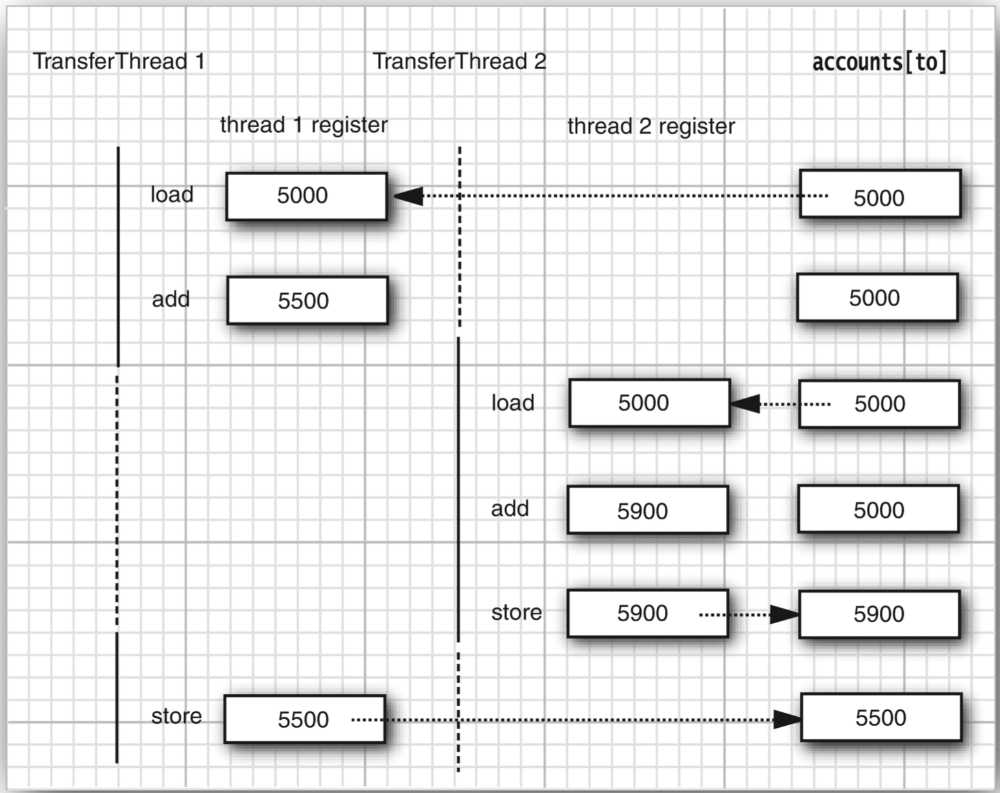

# 线程同步
>time: 2018-07-14 17:53:42

在大多数实际的多线程应用中，两个或两个以上的线程需要共享对同一数据的存取。如果两个线程存取相同的对象，并且每一个线程都调用了一个修改该对象状态的方法，将会发生什么呢？可以想象，线程彼此踩了对方的脚。根据各线程访问数据的次序，可能会产生讹误的对象。这样一个情况通常称为竞争条件（race condition）。

## 1. 竞争条件的一个例子

#### Bank.java
```java
package unsynch;

import java.util.Arrays;

public class Bank {
    private final double[] accounts;
    
    public Bank(int n, double initialBalance) {
        accounts = new double[n];
        Arrays.fill(accounts, initialBalance);
    }
    
    public void transfer(int from, int to, double amount) throws InterruptedException {
        if(accounts[from] < amount) {
            return;
        }
        accounts[from] -= amount;
        accounts[to] += amount;
        String pringMsg = "%24s %10.2f from %2d to %2d Total Balance: %10.2f%n";
        Object[] args = new Object[] {Thread.currentThread(),amount, from, to, getTotalBalance()};
        System.out.printf(pringMsg, args);
    }
    
    public double getTotalBalance() {
        double sum = 0;
        for (double a : accounts) {
            sum += a;
        }
        return sum;
    }
    public int size() {
        return accounts.length;
    }
}
````

#### UnsynchBankTest.java
```java
package unsynch;

public class UnsynchBankTest {
    public static final int NACCOUNTS = 100;
    public static final double INITIAL_BALANCE = 1000;
    public static final double MAX_AMOUNT = 1000;
    public static final int DELAY = 10;
    
    public static void main(String[] args) {
        Bank bank = new Bank(NACCOUNTS, INITIAL_BALANCE);
        for (int i = 0; i < NACCOUNTS; i++) {
            int fromAccount = i;
            Runnable r = () ->{
                try {
                    while (true) {
                        int toAccount = (int)(bank.size() * Math.random());
                        double amount = MAX_AMOUNT * Math.random();
                        bank.transfer(fromAccount, toAccount, amount);
                        Thread.sleep((int)(DELAY * Math.random()));
                    }
                } catch (InterruptedException e) {
                }
            };
            Thread t = new Thread(r);
            t.start();
        }
    }
}
```

为了避免多线程引起的对共享数据的讹误，必须学习如何同步存取。

```bash
 Thread[Thread-2,5,main]     473.48 from  2 to 12 Total Balance:  100000.00
Thread[Thread-99,5,main]     585.19 from 99 to 39 Total Balance:  100000.00
...
Thread[Thread-93,5,main]     294.55 from 93 to 93 Total Balance:  100000.00
Thread[Thread-74,5,main]     793.66 from 74 to 52 Total Balance:  100000.00
Thread[Thread-46,5,main]     105.02 from 46 to 47 Total Balance:   99206.34
Thread[Thread-33,5,main]     591.15 from 33 to 64 Total Balance:  100000.00
Thread[Thread-35,5,main]     654.60 from 35 to 27 Total Balance:  100000.00
Thread[Thread-22,5,main]     195.83 from 22 to 83 Total Balance:  100078.81
Thread[Thread-55,5,main]     208.96 from 55 to 66 Total Balance:  100000.00
Thread[Thread-43,5,main]     448.61 from 43 to 43 Total Balance:  100000.00
Thread[Thread-43,5,main]     915.93 from 43 to 63 Total Balance:  100000.00
...
Thread[Thread-84,5,main]      55.62 from 84 to 46 Total Balance:   99683.26
Thread[Thread-85,5,main]     582.55 from 85 to 34 Total Balance:   99683.26
Thread[Thread-85,5,main]     816.38 from 85 to 29 Total Balance:   99683.26
Thread[Thread-18,5,main]     937.92 from 18 to 18 Total Balance:   99683.26
Thread[Thread-59,5,main]      14.75 from 59 to 30 Total Balance:   99683.26
```

## 2. 竞争条件详解
假定两个线程同时执行  
`accounts[to] += amount`  
问题在于这不是原子操作。该指令可能被处理如下：
1. 将 accounts[to] 加载到寄存器。
2. 增加 amount。
3. 将结果写回 accounts[to]。

假定第 1 个线程执行步骤 1 和 2，然后，它被剥夺了运行权。假定第 2 个线程被唤醒并修改了 accounts 数组中的同一项。然后，第 1 个线程被唤醒并完成其第 3 步。  
这一步擦去了第二个线程所做的更新。于是，总金额不再正确。

***
**注释**： 可以具体看一下执行我们的类中的每一个语句的虚拟机的字节码。运行命令  
`javap -c -v Bank`  
对 Bank.class 文件进行反编译。例如，代码行  
`accounts[to] += amount;`  
被转换为下面的字节码：
```
aload_0
getfield     #2; //Field accounts:[D
iload_2
dup2
daload
dload_3
dadd
dastore
```
这些代码的含义无关紧要。重要的是增值命令是由几条指令组成的，执行它们的线程可以在任何一条指令点上被中断。
***

#### 同时被两个线程访问


## 3. 锁对象
有两种机制防止代码受并发访问的干扰。Java 语言提供了一个 synchronized 关键字达到这一目的，并且 Java SE 5.0 引入了 ReentrantLock 类。synchronized 关键字自动提供了一个锁以及相关的“条件”，对于大多数需要显示锁的情况，这是很便利的。

用 ReentrantLock 保护代码块的基本结构如下：
```java
myLock.lock(); // a ReentrantLock object
try {
    critical section
}finally {
    // make sure the lock is unlocked even if an exception is thrown
    myLock.unlock();
}
```
这一结构确保任何时刻只有一个线程进入临界区。一旦一个线程封锁了锁对象，其他任何线程都无法通过 lock 语句。当其他线程调用 lock 时，它们被阻塞，直到第一个线程释放锁对象。

***
**警告**: 把解锁操作括在 finally 子句之内是至关重要的。如果在临界区的代码出现异常，锁必须被释放。否则，其他线程将永远阻塞。
***

***
**注释**：如果使用锁，就不能使用带资源的 try 语句。首先，解锁方法名不是 close。不过，即使将它重命名，带资源的 try 语句也无法正常工作。它的首部希望声明一个新变量。但是如果使用一个锁，你可能想使用多个线程共享的那个变量（而不是新变量）
***

#### 非同步线程与同步线程的比较


如果每一个对象有自己的 ReentrantLock 对象。如果两个线程视图访问同一个对象，那么锁以串行的方式提供服务。但是，如果两个线程访问不同的对象，每个一个线程得到不同的锁对象，两个线程都不会发生阻塞。本该如此，因为线程在操纵不同的对象实例的时候，线程之间不会相互影响。