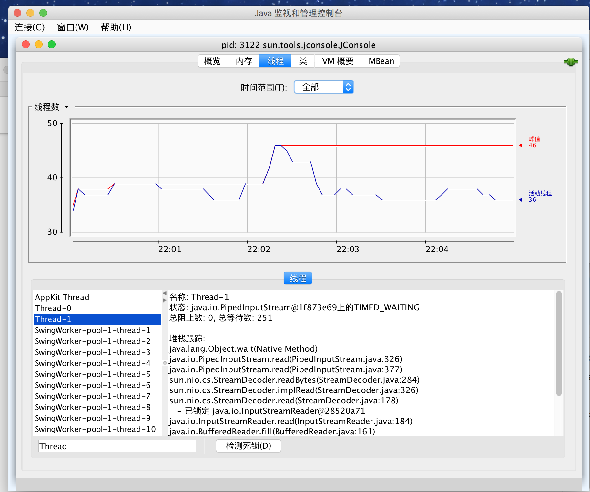

# 线程同步
>time: 2018-07-14 17:53:42

在大多数实际的多线程应用中，两个或两个以上的线程需要共享对同一数据的存取。如果两个线程存取相同的对象，并且每一个线程都调用了一个修改该对象状态的方法，将会发生什么呢？可以想象，线程彼此踩了对方的脚。根据各线程访问数据的次序，可能会产生讹误的对象。这样一个情况通常称为竞争条件（race condition）。

## 1. 竞争条件的一个例子

#### Bank.java
```java
package unsynch;

import java.util.Arrays;

public class Bank {
    private final double[] accounts;

    public Bank(int n, double initialBalance) {
        accounts = new double[n];
        Arrays.fill(accounts, initialBalance);
    }

    public void transfer(int from, int to, double amount) throws InterruptedException {
        if(accounts[from] < amount) {
            return;
        }
        accounts[from] -= amount;
        accounts[to] += amount;
        String pringMsg = "%24s %10.2f from %2d to %2d Total Balance: %10.2f%n";
        Object[] args = new Object[] {Thread.currentThread(),amount, from, to, getTotalBalance()};
        System.out.printf(pringMsg, args);
    }
    
    public double getTotalBalance() {
        double sum = 0;
        for (double a : accounts) {
            sum += a;
        }
        return sum;
    }
    public int size() {
        return accounts.length;
    }
}
````

#### UnsynchBankTest.java

```java
package unsynch;

public class UnsynchBankTest {
    public static final int NACCOUNTS = 100;
    public static final double INITIAL_BALANCE = 1000;
    public static final double MAX_AMOUNT = 1000;
    public static final int DELAY = 10;
    
    public static void main(String[] args) {
        Bank bank = new Bank(NACCOUNTS, INITIAL_BALANCE);
        for (int i = 0; i < NACCOUNTS; i++) {
            int fromAccount = i;
            Runnable r = () ->{
                try {
                    while (true) {
                        int toAccount = (int)(bank.size() * Math.random());
                        double amount = MAX_AMOUNT * Math.random();
                        bank.transfer(fromAccount, toAccount, amount);
                        Thread.sleep((int)(DELAY * Math.random()));
                    }
                } catch (InterruptedException e) {
                }
            };
            Thread t = new Thread(r);
            t.start();
        }
    }
}
```

为了避免多线程引起的对共享数据的讹误，必须学习如何同步存取。

```bash
 Thread[Thread-2,5,main]     473.48 from  2 to 12 Total Balance:  100000.00
Thread[Thread-99,5,main]     585.19 from 99 to 39 Total Balance:  100000.00
...
Thread[Thread-93,5,main]     294.55 from 93 to 93 Total Balance:  100000.00
Thread[Thread-74,5,main]     793.66 from 74 to 52 Total Balance:  100000.00
Thread[Thread-46,5,main]     105.02 from 46 to 47 Total Balance:   99206.34
Thread[Thread-33,5,main]     591.15 from 33 to 64 Total Balance:  100000.00
Thread[Thread-35,5,main]     654.60 from 35 to 27 Total Balance:  100000.00
Thread[Thread-22,5,main]     195.83 from 22 to 83 Total Balance:  100078.81
Thread[Thread-55,5,main]     208.96 from 55 to 66 Total Balance:  100000.00
Thread[Thread-43,5,main]     448.61 from 43 to 43 Total Balance:  100000.00
Thread[Thread-43,5,main]     915.93 from 43 to 63 Total Balance:  100000.00
...
Thread[Thread-84,5,main]      55.62 from 84 to 46 Total Balance:   99683.26
Thread[Thread-85,5,main]     582.55 from 85 to 34 Total Balance:   99683.26
Thread[Thread-85,5,main]     816.38 from 85 to 29 Total Balance:   99683.26
Thread[Thread-18,5,main]     937.92 from 18 to 18 Total Balance:   99683.26
Thread[Thread-59,5,main]      14.75 from 59 to 30 Total Balance:   99683.26
```

## 2. 竞争条件详解
假定两个线程同时执行  
`accounts[to] += amount`  
问题在于这不是原子操作。该指令可能被处理如下：
1. 将 accounts[to] 加载到寄存器。
2. 增加 amount。
3. 将结果写回 accounts[to]。

假定第 1 个线程执行步骤 1 和 2，然后，它被剥夺了运行权。假定第 2 个线程被唤醒并修改了 accounts 数组中的同一项。然后，第 1 个线程被唤醒并完成其第 3 步。  
这一步擦去了第二个线程所做的更新。于是，总金额不再正确。

***
**注释**： 可以具体看一下执行我们的类中的每一个语句的虚拟机的字节码。运行命令  
`javap -c -v Bank`  
对 Bank.class 文件进行反编译。例如，代码行  
`accounts[to] += amount;`  
被转换为下面的字节码：
```
aload_0
getfield     #2; //Field accounts:[D
iload_2
dup2
daload
dload_3
dadd
dastore
```
这些代码的含义无关紧要。重要的是增值命令是由几条指令组成的，执行它们的线程可以在任何一条指令点上被中断。
***

#### 同时被两个线程访问


## 3. 锁对象
有两种机制防止代码受并发访问的干扰。Java 语言提供了一个 synchronized 关键字达到这一目的，并且 Java SE 5.0 引入了 ReentrantLock 类。synchronized 关键字自动提供了一个锁以及相关的“条件”，对于大多数需要显示锁的情况，这是很便利的。

用 ReentrantLock 保护代码块的基本结构如下：
```java
myLock.lock(); // a ReentrantLock object
try {
    critical section
}finally {
    // make sure the lock is unlocked even if an exception is thrown
    myLock.unlock();
}
```
这一结构确保任何时刻只有一个线程进入临界区。一旦一个线程封锁了锁对象，其他任何线程都无法通过 lock 语句。当其他线程调用 lock 时，它们被阻塞，直到第一个线程释放锁对象。

***
**警告**: 把解锁操作括在 finally 子句之内是至关重要的。如果在临界区的代码出现异常，锁必须被释放。否则，其他线程将永远阻塞。
***

***
**注释**：如果使用锁，就不能使用带资源的 try 语句。首先，解锁方法名不是 close。不过，即使将它重命名，带资源的 try 语句也无法正常工作。它的首部希望声明一个新变量。但是如果使用一个锁，你可能想使用多个线程共享的那个变量（而不是新变量）
***

#### 非同步线程与同步线程的比较


如果每一个对象有自己的 ReentrantLock 对象。如果两个线程视图访问同一个对象，那么锁以串行的方式提供服务。但是，如果两个线程访问不同的对象，每个一个线程得到不同的锁对象，两个线程都不会发生阻塞。本该如此，因为线程在操纵不同的对象实例的时候，线程之间不会相互影响。

锁是可重入的，因为线程可以重复地获已经持有的锁。锁保持一个持有计数（hold count）来跟踪对 lock 方法的嵌套调用。线程在每一次调用 lock 都要调用 unlock 来释放锁。由于这一特性，都被一个锁保护的代码可以调用另一个使用相同锁的方法。

例如，transfer 方法调用 getTotalBalance 方法，这也会封锁 bankLock 对象，此时 bankLock 对象的持有计数为 2。当 getTotalBalance 方法退出的时候，持有计数变回 1。当 transfer 方法退出的时候，持有计数变为 0。线程释放锁。

通常，可能想要保护若干个操作来更新或检查共享对象的代码。要确保这些操作完成后，另一个线程才能使用相同对象。

***
**警告**：要留心临界区域的代码，不要因为异常的抛出而跳出临界区。如果临界区代码结束之前抛出了异常，finally 子句将释放锁，但会使对象可能处于一种受损状态。
***

#### java.util.concurrent.Lock 5.0
* void lock()
    >获取这个锁；如果锁同时被另一个线程拥有则放生阻塞。
* void unlock()
    >释放这个锁；

#### java.util.concurrent.locks,ReentrantLock 5.0
* ReentrantLock()
    >构建一个可以被用来保护临界区的可重入锁。
* ReentrantLock(boolean fair)
    >构建一个带有公平策略的锁。一个公平锁偏爱等待时间最长的线程。但是，这一公平的保证将大大降低性能。所以，默认情况先，锁没有被强制为公平的。

***
**警告**：听起来公平锁更合理一些，但是使用公平锁比使用常规锁要慢很多。只有当你确实要了解自己要做什么并且对于你解决的问题有一个特定的理由必须使用公平锁的时候，才可以使用公平锁。即使使用公平锁，也无法确保线程调度器是公平的。如果线程调度器选择忽略一个线程，而该线程为了这个锁已经等待了很长时间，那么就没有机会公平的处理这个锁了。
***

## 4. 条件对象
通常，线程进人临界区，却发现在某一条件满足之后它才能执行。要使用一个条件对象来管理那些已经获得了一个锁但是却不能做有用工作的线程。Java库中条件对象(由于历史的原因，条件对象经常被称为条件变量(conditional variable) )。

一个锁对象可以有一个或多个相关的条件对象。你可以用 newCondition 方法获得一个条件对象。习惯上给每一个条件对象命名为可以反映它所表达的条件的名字。
```java
public class Bank {
private Condition sufficientFunds;
...

public Bank(int n, double initialBalance) {
    ...
    sufficientFunds = bankLock.newCondition();
}
```
如果 transfer 方法发现余额不足，它调用
`sufficientFunds.await()`  
当前线程现在被阻塞了，并放弃了锁。

等待获得锁的线程和调用 await 方法的线程存在本质上的不同。一旦一个线程调用 await 方法，它进人该条件的等待集。当锁可用时，该线程不能马上解除阻塞。相反，它处于阻塞状态，直到另一个线程调用同一条件上的 signalAll 方法时为止。  
调用  
`sufficientFunds.singalAll();`  
这一调用重新激活因为这一条件而等待的所有线程。当这些线程从等待集当中移出时，它们再次成为可运行的，调度器将再次激活它们。同时，它们将试图重新进人该对象。一旦锁成为可用的，它们中的某个将从 await 调用返回，获得该锁并从被阻塞的地方继续执行。

此时，线程应该再次测试该条件。由于无法确保该条件被满足 —— signalAll 方法仅仅是通知正在等待的线程: 此时有可能已经满足条件，值得再次去检测该条件。
***
**注释**：通常，对 await 的调用应该在如下形式的循环体中
```
while(!(ok to proceed))
    condition.await();
```
***

至关重要的是最终需要某个其他线程调用 signalAll 方法。当一个线程调用 await，它没有办法重新激活自身。它寄希望于其他线程。如果没有其他线程来重新激活等待的线程，它就永远不再运行了。这将导致令人不快的死锁（deadlock）现象。如果所有其他线程被阻塞，最后一个活动线程在解除其他线程的阻塞状态之前就调用 await 方法，那么它也被阻塞。没有任何线程可以解除其他线程的阻塞，那么该程序就刮起了。

应该如何调用 signalAll 呢？经验上讲，在对象的状态有利于等待线程的方向改变时调用 signalAll。

signalAll 不会立即激活一个等待线程。它仅仅解除了等待线程的阻塞，以便这些线程可以在当前线程退出同步方法之后，通过竞争实现对对象的访问。

***
**警告**：当一个线程拥有某个条件的锁时，它仅仅可以在该条件上调用 await、signalAll 或 signal 方法

#### Bank.java
```java
package synch;

import java.util.Arrays;
import java.util.concurrent.locks.Condition;
import java.util.concurrent.locks.Lock;
import java.util.concurrent.locks.ReentrantLock;

public class Bank {
    private final double[] accounts;
    private Lock bankLock;
    private Condition sufficientFunds;
    
    public Bank(int n, double initialBalance) {
        accounts = new double[n];
        Arrays.fill(accounts, initialBalance);
        bankLock = new ReentrantLock();
        sufficientFunds = bankLock.newCondition();
    }
    
    public void transfer(int from, int to, double amount) throws InterruptedException {
        bankLock.lock();
        try {
            while(accounts[from] < amount) {
                sufficientFunds.await();
            }
            System.out.print(Thread.currentThread());
            accounts[from] -= amount;
            System.out.printf(" %10.2f from %d to %d", amount, from, to);
            accounts[to] += amount;
            System.out.printf(" Total Balance: %10.2f%n", getTotalBalance());
            sufficientFunds.signalAll();
        }finally {
            bankLock.unlock();
        }
    }
    
    public double getTotalBalance() {
        bankLock.lock();
        
        try {
            double sum = 0;
            for (double a : accounts) {
                sum += a;
            }
            return sum;
        }finally {
            bankLock.unlock();
        }
    }
    public int size() {
        return accounts.length;
    }
}
```
#### Test.java
```java
package synch;

public classTest {
    public static final int NACCOUNTS = 100;
    public static final double INITIAL_BALANCE = 1000;
    public static final double MAX_AMOUNT = 1000;
    public static final int DELAY = 10;
    
    public static void main(String[] args) {
        Bank bank = new Bank(NACCOUNTS, INITIAL_BALANCE);
        for (int i = 0; i < NACCOUNTS; i++) {
            int fromAccount = i;
            Runnable r = () ->{
                try {
                    while (true) {
                        int toAccount = (int)(bank.size() * Math.random());
                        double amount = MAX_AMOUNT * Math.random();
                        bank.transfer(fromAccount, toAccount, amount);
                        Thread.sleep((int)(DELAY * Math.random()));
                    }
                } catch (InterruptedException e) {
                }
            };
            Thread t = new Thread(r);
            t.start();
        }
    }
}
```

#### java.util.concurrent.locks.Lock 5.0
* Condition newCondition();
    >返回一个与该锁相关的条件对象
#### java.util.concurrent.locks.Condition 5.0
* void await()
    >将该线程放到条件的等待集中。
* void signalAll()
    >解除该条件的等待集中所有线程的阻塞状态。
* void signal()
    >从该条件的等待集中随机选择一个线程，解除其阻塞状态。

## 5. synchronized 关键字
锁和条件的关键之处：
* 锁用来保护代码片段，任何时刻只能有一个线程执行被保护的代码。
* 锁可以管理试图进入被保护代码段的线程。
* 锁可以拥有一个或多个相关的条件对象。
* 每个条件对象管理那些已经进入被保护的代码段但还不能运行的线程。

Lock 和 Condition 接口为程序设计人员提供了高度的锁定控制。

从 1.0 版开始，Java 中的每一个对象都有一个内部锁。如果一个方法用 synchronized 关键字声明，那么对象的锁将保护整个方法。这就是说，要调用该方法，线程必须获得内部的对象锁。

换句话说，
```java
public synchronized void method()
{
    // method body
}
```
等价于
```java
public void method() 
{
    this.intrinsiclock.lock();
    try
    {
        // method body
    }
    finally { this.intrinsiclock.unlock(); }
}
```
使用 synchronized 关键字写代码要简洁得多。当然，要理解这一代码，你必须了解每一个对象有一个内部锁，并且该锁有一个内部条件。有锁来管理那些试图进入 synchronized 方法的线程，有条件来管理那些嗲用 wait 的线程。

***
**提示**：Synchronized 方法是相对简单的。但是，初学者常常对条件感到困惑。
***

将静态方法声明为 synchronized 也是合法的。如果调用这种方法，该方法获得相关的类对象的内部锁。例如，如果 Bank 类有一个静态同步的方法，那么当该方法调用时，Bank.class 对象的锁被锁住。因此，没有其他线程可以调用同一个类的这个或任何其他的同步静态方法。

内部锁和条件存在一些局限：
* 不能中断一个正在试图获得锁的线程。
* 试图获得锁时不能设定超时。
* 每个锁仅有单一的条件，可能是不够的。

使用 Lock 和 Condition 对象还是同步方法的一些建议：
* 最好即不使用 Lock/Condition 也不使用 synchronized 关键字。在许多情况下你可以使用 java.util.concurrent 包中的一种机制，它会为你处理所有的加锁。
* 如果 synchronized 关键字适合你的程序，那么请尽量使用它，这样可以减少编写的代码数量，减少出错的几率。
* 如果特别需要 Lock/Condition 结构提供的独有特性时，才使用 Lock/Condition。

#### Bank.java
```java
package synch;

import java.util.Arrays;

public class Bank {
	private final double[] accounts;
	
	public Bank(int n, double initialBalance) {
		accounts = new double[n];
		Arrays.fill(accounts, initialBalance);
	}
	
	public synchronized void transfer(int from, int to, double amount) throws InterruptedException
	{
		while(accounts[from] < amount) {
			wait();
		}
		System.out.printf("%24s", Thread.currentThread());
		accounts[from] -= amount;
		System.out.printf(" %10.2f from %2d to %2d", amount, from, to);
		accounts[to] += amount;
		System.out.printf(" Total Balance: %10.2f%n", getTotalBalance());
		notifyAll();
	}
	
	public synchronized double getTotalBalance() {
		double sum = 0;
		
		for(double a : accounts) {
			sum += a;
		}
		
		return sum;
	}
	
	public int size() {
		return accounts.length;
	}
}
```
#### Test.java
```java
package synch;

public class Test {
	public static final int NACCOUNTS = 100;
    public static final double INITIAL_BALANCE = 1000;
    public static final double MAX_AMOUNT = 1000;
    public static final int DELAY = 10;
    
	public static void main(String[] args) {
        Bank bank = new Bank(NACCOUNTS, INITIAL_BALANCE);
        for (int i = 0; i < NACCOUNTS; i++) {
            int fromAccount = i;
            Runnable r = () ->{
                try {
                    while (true) {
                        int toAccount = (int)(bank.size() * Math.random());
                        double amount = MAX_AMOUNT * Math.random();
                        bank.transfer(fromAccount, toAccount, amount);
                        Thread.sleep((int)(DELAY * Math.random()));
                    }
                } catch (InterruptedException e) {
                }
            };
            Thread t = new Thread(r);
            t.start();
        }
    }
}
```
#### java.lang.Object 1.0
* void notifyAll()
    >解除那些在该对象上调用 wait 方法的线程的阻塞状态。该方法只能在同步方法或同步块内部调用。如果当前线程不是对象锁的持有者，该方法抛出一个 IllegalMonitorStateException 异常。
* void notify()
    >随机选择一个在该对象上调用 wait 方法的线程，解除其阻塞状态。该方法只能在一个同步方法或同步块中调用。如果当前线程不是对象锁的持有者，该方法抛出一个 IllegalMonitorStateException 异常。
* void wait()
    >导致线程进入等待状态直到它被通知。该方法只能在一个同步方法中调用。如果当前线程不是对象锁的持有者，该方法抛出一个 IllegalMonitorStateException 异常。
* void wait(long millis)
* void wait(long millis, int nanos)
    >导致线程进入等待状态直到它被通知或者经过指定的时间。这些方法只能在一个同步方法中调用。如果当前线程不是对象锁的持有者该方法抛出一个 IllegalMonitorStateException 异常。  
    >参数：
    >>millis: 毫秒数  
    >>nanos: 纳秒数，<1 000 000

## 6 同步阻塞
每一个 Java 对象有一个锁。线程可以通过调用同步方法获得锁。还有另一种机制可以获得锁，通过进入一个同步阻塞。

```java
// this is the syntax for a synchronized block
synchronized (obj)
{
	// critical section
}
```
获得 obj 的锁。

有时会发现“特殊的”锁，
```java
private double[] accounts;
private Object lock = new Object();
...
public void transfer(int from, int to, int amount)
{
	synchronized(lock) // an ad-hoc lock
	{
		accounts[from] -= amount;
		accounts[to] += amount;
	}
	System.out.println(...);
} 
```

有时程序员使用一个对象的锁来实现额外的原子操作，实际上称为客户端锁定 （client-side locking）。例如，考虑 Vector 类，一个列表，它的方法是同步的。现在，假定在 `Vector<Double>` 中存储银行余额。这里有一个  transfer 方法的原始实现：
```java
public void transfer(Vector<Double> accounts, int from, int to, int amount) // Error
{
	accounts.set(from, accounts.get(from) - amount);
	accounts.set(to, accounts.get(to) + amount);
	System.out.println(...);
}
```

Vector 类的 get 和 set 方法是同步的，但是，这对于我们并没有什么帮助。在第一次对 get 的调用已经完成之后，一个线程完全可能在 transfer 方法中被剥夺运行权。于是，另一个线程可能在相同的存储位置存入不同的值。但是，我们可以截获这个锁：
```java
public void transfer(Vector<Double> accounts, int from, int to, int amount)
{
	synchronized (accounts) {
		accounts.set(from, accounts.get(from) - amount);
		accounts.set(to, accounts.get(to) + amount);
	}	
	System.out.println(...);
}
```

这个方法可以工作，但是它完全依赖于这样一个事实，Vector 类对自己的所有可能修改方法都使用内部锁。然而，这是真的吗？Vector 类的文档没有给出这样的承诺。不得不仔细研究源代码并希望将来的版本能介绍非同步的可修改方法。客户端锁是非常脆弱的，通常不推荐使用。

## 7 监视器概念
锁和条件是线程同步的强大工具，严格地将，它们不是面向对象的。

监视器（monitor）可以在不需要程序员考虑如何加锁的情况下，就可以保证多线程的安全性。

用 Java 的术语来讲，监视器具有如下特性：
* 监视器是只包含私有域的类。
* 每个监视器类的对象有一个相关的锁。
* 使用该锁对所有的方法进行加锁。换句话说，如果客户端调用 obj.method()，那么 obj 对象的锁是在方法调用开始时自动获得，并且当方法返回时自动释放改锁。因为所有的域是私有的，这样的安排可以确保一个线程在对对象操作时，没有其他线程能访问改域。
* 改锁可以有任意多个相关条件。

监视器的早期版本只有单一的条件，使用一种很优雅的句法。可以简单地调用 `await accounts[from] >= balance` 而不使用任何显式的条件变量。然而，研究表明盲目地重新测试条件是低效的。显式的条件变量解决了这一问题。每一个条件变量管理一个独立的线程集。

Java 设计者以不是很精确的方式采用了监视器概念，Java 中的每一个对象有一个内部的锁和内部的条件。如果一个方法用 synchronized 关键字声明，那么，它表现的就像是一个监视器方法。通过 wait/notifyAll/notify 来访问条件变量。

在下述的 3 个方面 Java 对象不同于监视器，从而使得线程的安全性下降:
* 域不要求必须是 private。
* 方法不要求必须是 synchronized。
* 内部锁对客户是可用的。

## 8 Volatile 域
有时，仅仅为了读写一个或两个实例域就使用同步，显得开销过大了。使用现代的处理器与编译器，出错的可能性很大。

* 多处理器的计算机能够暂时在寄存器或本地内存缓冲区中保存内存的值。结果是，运行在不同处理器上的线程可能在同一个内存位置取到不同的值。
* 编译器可以改变指令执行的顺序以使吞吐量最大化。这种顺序上的变化不会改变代码语义，但是编译器假定内存的值仅仅在代码中有显式的修改指令时才会改变。然而，内存的值可以被另一个线程改变。

如果你使用锁来保护可以被多个线程访问的代码，那么可以不考虑这种问题。编译器要求通过在必要的时候刷新本地缓存来保持锁的效应，并且不能不正当地重新排序指令。

***
**注释**：Brian Goetz 给出了下述 “同步格言”：“如果向一个变量写入值，而这个变量接下来可能会被另一个线程读取，或者，从一个变量读值，而这个变量可能是之前被另一个线程写入的。此时必须使用同步”。
***

volatile 关键字为实例域的同步访问提供了一种免锁机制。如果声明一个域为 volatile，那么编译器和虚拟机就知道该域是可能被另一个线程并发更新的。

例如，假定一个对象有一个布尔标记 done，它的值被一个线程设置却被另一个线程查询，如同我们讨论过的那样，你可以用锁
```java
private boolean done;
private synchronized boolean isDone() { return done; }
private synchronized void setDone() { done = true; }
```
或许使用内部锁不是个好主意。如果另一个线程已经对该对象加锁，isDone 和 setDone 方法可能阻塞。如果注意到这个方面，一个线程可以为这一变量使用独立的 Lock。但是，这也会带来许多麻烦。

在这种情况下，将域声明为 volatile 是合理的：
```java
private volatile boolean done;
private boolean isDone() { return done; }
private void setDone(){ done = true; }
```

***
**警告**：Volatile 变量不能提供原子性。例如，方法  
`public void flipDone() { done = !done; } // not atomic`  
不能确保翻转域中的值。不能保证读取、翻转和写入不被中断。
```

## 9 final 变量

从多个线程安全地访问一个域的情况：
1. 使用锁
1. volatile 修饰符
1. final 修饰符

域被声明为 final 时，多个线程可以安全的访问一个这个域。

`final Map<Sring, Double> accounts = new HashMap();`  
其他线程会在构造函数完成构造之后才能看到这个 accounts 变量。  
如果不使用 final，就不能保证其他线程看到的是 accounts 更新后的值，它们可能只看到了 null，而不是新构造的 HashMap。  
这个映射表的操作不是线程安全的。如果多个线程在读写这个映射表，仍然需要进行同步。

## 10 原子性
假设对共享变量除了赋值之外并不完成其他操作，那么可以将这些共享变量声明为 volatile。

`java.util.concurrent.atomic` 包中有很多类使用了很高效的机器级指令（而不是使用锁）来保证其他操作的原子性。例如，AtomicInteger 类提供了方法 incrementAndGet 和 decrementAndGet，它们分别以原子方式将一个整数自增或自减。例如，可以安全地生成一个数值序列，如下所示：
```java
public static AtomicLong nextNumber = new AtomicLong();
// In some thread...
long id = nextNumber.incrementAndGet();
```
incrementAndGet 方法以原子方式将 AtomicLong 自增，并返回自增后的值。也就是说，获得值、增 1 并设置然后生成新值得操作不会中断。可以保证即使是多个线程并发地访问同一个实例，也会计算并返回正确的值。

有很多方法可以以原子方式设置和增减值，不过，如果希望完成复杂的更新，就必须使用 compareAndSet 方法。例如，假设希望跟踪不同线程观察的最大值。下面的代码是不可行的：
```java
public static AtomincLong larges = new AtomicLong();
// In some thread...
largest.set(Math.max(largest.get(), observed)); // Error--reace condition!
```
这个更新不是原子的。实际上，应当在一个循环中计算新值和使用 compareAndSet：
```java
do {
    oldValue = largest.get();
    newValue = Math.max(oldValue, observed);
} while (!largest.compareAndSet(oldValue, newValue));
```
如果另一个线程也在更新 largest，就可能阻止这个线程更新。这样一来，compareAndSet 会返回 false，而不会设置新值。在这种情况下，循环会再次尝试，读取更新后的值，并尝试修改。最终，它会成功地用新值替换原来的值。这听上去有些麻烦，不过 compareAndSet 方法会映射到一个处理器操作，比使用锁速度更快。

在 Java SE 8 中，不再需要编写这样的循环样板代码。实际上，可以提供一个 lambda 表达式更新变量，它会为你完成更新。
```java
largest.updateAndGet(x -> Math(x, observed));
// 或
largest.accumulateAndGet(observed, Math:max);
```
accumulateAndGet 方法利用一个二元操作符来合并原子值和所提供的参数。  
还有 getAndUpdate 和 getAndAccumulate 方法可以返回原值。

***
**注释**：类 AtomicInteger、AtomicIntegerArray、AtomicIntegerFieldUpdater、AtomicLongArray、AtomicLongFieldUpdate、AtomicReference、AtomicReferenceArray 和 AtomicReferenceFieldUpdate 也提供了这些方法。
***

如果由大量线程要访问相同的原子值，性能会大幅下降，因为乐观更新需要太多次重试。Java SE 8 提供了 LongAdder 和 LongAccumulator 类来解决这个问题。LongAdder 包括多个变量（加数），其总和为当前值。可以有多个线程更新不同的加数，线程个数增加时会自动提供新的加数。通常情况下，只有当所有工作都完成之后才需要总和的值，对于这种情况，这种方法会很高效。性能会有显著的提升。

如果认为可能存在大量竞争，值需要使用 LongAdder 而不是 AtomicLong。方法名稍有区别。调用 increment 让计数器自增，或者调用 add 来增加一个量，或者调用 sum 来获取总和。
```java
final LongAdder adder = new LongAdder();
for(...)
    pool.submit(() -> {
        while(...) {
            // ...
            if (...) adder.increment();
        }
    });
...
long total = adder.sum();
```

***
**注释**：当然，increment 方法不会返回原值。这样做会消除将求和分解到多个加数所带来的性能提升。
***

LongAccumulator 将这种思想推广到任意的累加操作。在构造函数中，可以提供这个操作以及它的零元素。要加入新的值，可以调用 accumulate。调用 get 来获得当前值。下面的代码可以得到与 LongAdder 同样的效果：
```java
LongAccumulator adder = new LongAccumulator(Long::sum, 0);
// In some thread ...
adder.accumulate(value);
```
在内部，这个累加器包含变量 a<sub>1</sub>，a<sub>2</sub>，...，a<sub>n</sub>。每个变量初始化为零元素（这个例子中零元素为 0）。  
调用 accumulate 并提供值 v 时，其中一个变量会以原子方式更新为 a<sub>i</sub> = a<sub>i</sub> op v，这里 op 是中缀形式的累加操作。在我们这个例子中，调动 accumulate 会对某个 i 计算 a<sub>i</sub> = a<sub>i</sub> + v。

get 的结果是 a<sub>i</sub> op a<sub>2</sub> op ... op a<sub>n</sub>。在我们的例子中，这就是累加器的总和： a<sub>1</sub> + a<sub>2</sub> + ... + a<sub>n</sub>。

如果选择一个不同的操作，可以计算最小值或最大值。一般地，这个操作必须满足结合律和交换律。这说明，最终的结果必须独立于所结合的中间值得顺序。

另外 DoubleAdder 和 DoubleAccumulator 也采用同样的方式，只不过处理的是 double 值。

## 11. 死锁
锁和条件不能解决多线程中的所有问题。考虑下面的情况:
```
账户 1：$200
账户 2：$300
线程 1：从账户 1 转移 $300 到账户 2
线程 2：从账户 2 转移 $400 到账户 1
```
线程 1 和线程 2 都被阻塞了。因为账户 1 以及账户 2 中的余额都不足以进行转账，两个线程都无法执行下去。

有可能会因为每一个线程要等待更多的钱款存人而导致所有线程都被阻塞。这样的状态称为死锁（deadlock）。
***
**提示**：当线程挂起时，键入 `CTRL+\`，将得到一个所有线程的列表。每一个线程有一个栈踪迹，告诉你线程被阻塞的位置。运行 jconsole 并参考线程面板。

***

问题的起因在于调用 signal。它仅仅为一个线程解锁，而且，它很可能选择一个不能继续运行的线程。

遗憾的是，Java 编程语言中没有任何东西可以避免或打破死锁现象。必须仔细设计程序，以确保不会出现死锁。

## 12. 线程局部变量
在线程间共享变量的风险。有时可能要避免共享变量，使用 ThreadLocal 辅助类为各个线程提供各自的实例。

例如，SimpleDateFormat 类不是线程安全的。假设有一个静态变量：  
`public static final SimpleDateFormat dateFormat = new SimpleDateFormat("yyyy-MM-dd");`  
如果两个线程都执行以下操作：  
`String dateStamp = dateFormat.format(new Date());`  
结果可能很混乱，因为 dateFormat 使用的内部数据结构可能会被并发的访问所破坏。当然可以使用同步，但开销很大；或者也可以在需要时构造一个局部 SimpleDateFormat 对象，不过这也太浪费了。

要为每一个线程构造一个实例，可以使用以下代码：
```java
public static final ThreadLocal<SimpleDateFormat> dateFormat = 
    ThreadLocal.withInitial(() -> new SimpleDateFormat("yyyy-MM-dd"));
```
要访问具体的格式化方法，可以调用：  
`String dateStamp = dateFormat.get().format(new Date());`  
在一个给定的线程中首次调用 get 时，会调用 initialValue 方法。在此之后，get 方法会返回属于当前线程的那个实例。

在多线程中使用随机数也存在类似的问题。java.util.Random 类是线程安全的。但是如果多个线程需要等待一个共享的随机数生成器，这会很低效。

可以使用 ThreadLocal 辅助类为各个线程提供一个单独的生成器，不过 Java SE 7 还另外提供了一个便利类。只需要做一下调用：  
`int random = ThreadLocalRandom.current().nextInt(upperBound);`  
ThreadLocalRandom.current() 调用会返回特定于当前线程的 Random 类实例。

#### `java.lang.ThreadLocal<T>` 1.2
* T get()
    >得到这个线程的当前值。如果是首次调用 get，会调用 initialize 来得到这个值。
* protected initialized()
    >应覆盖这个方法类提供一个初始值。默认情况下，这个方法返回 null。
* void set(T t)
    >为这个线程设置一个新值。
* void remove()
    >删除对应这个线程的值。
* `static <S> ThreadLocal<S> withInitial(Supper<? extends S> supplier)` 8
    >创建一个线程局部变量，其初始值通过调用给定的 supplier 生成。

#### java.util.concurrent.ThreadLocalRandom 7
* static ThreadLocalRandom current()
    >返回特定于当前线程的 Random 类实例。

## 13. 锁测试与超时
线程在调用 lock 方法来获得另一个线程所持有的锁的时候，很可能发生阻塞。应该更加谨慎地申请锁。tryLock 方法试图申请一个锁，在成功后获得锁返回 true，否则，立即返回 false，而且线程可以立即离开去做其他事情。
```java
if(myLock.tryLock()) {
    // now the thread owns the lock
    try{ ... }
    finally { myLock.unlock(); }
}else {
    // do something else
}
```

可以调用 tryLock 时，使用超时参数：  
`if (myLock.tryLock(100, TimeUnit.MILLISECONDS))...`  
TimeUnit 是一个枚举类型，可以取的值包括 SECONDS、MILLISCONDS、MICROSECONDS 和 NANOSECONDS。

lock 方法不能被中断。如果一个线程等待获得一个锁时被中断，中断线程在获得锁之前一直处于阻塞状态，如果出现死锁，那么，lock 方法就无法终止。

然而，如果调用带有超时参数的 tryLock，那么如果线程在等待期间被中断，将抛出 InterruptedException 异常。这是一个非常有用的特性，因为允许线程打破死锁。

也可以调用 lockInterruptibly 方法。它就相当于一个超时设为无限的 tryLock 方法。

在等待一个条件时，也可以提供一个超时：  
`myCondition.await(100, TimeUnit.MILLISECONDS))`  

如果一个线程被另一个线程通过调用 signalAll 或 signal 激活，或者超时时限已达到，或者线程被中断，那么 await 方法将返回。

如果等待的线程被中断，await 方法将抛出一个 InterruptedException 异常。在你希望出现这种情况时线程继续等待（可能不太合理），可以使用 awaitUninterruptibly 方法代替 await。

#### java.util.concurrent.locks.Lock 5.0
* boolean tryLock()
    >尝试获得锁而没有发生阻塞; 如果成功返回真。这个方法会抢夺可用的锁，即使该锁有公平加锁策略， 即便其他线程已经等待很久也是如此。
* boolean tryLock(long time, TimeUnit unit)
    >尝试获得锁，阻塞时间不会超过给定的值；如果成功返回 true。
* void lockInterruptibly()
    >获得锁，但是会不确定地发生阻塞。如果线程被中断，抛出一个 InterruptedException 异常。

#### java.util.concurrent.locks.Condition 5.0
* boolean await(long time, TimeUnit unit)
    >进人该条件的等待集，直到线程从等待集中移出或等待了指定的时间之后才解除阻塞。如果因为等待时间到了而返回就返回false，否则返回true。
* void awaitUninterruptibly()
    >进人该条件的等待集，直到线程从等待集移出才解除阻塞。如果线程被中断，该方法不会抛出 InterruptedException 异常。


#### 14. 读/写锁
`java.util.concurrent.locks` 包定义了两个锁类，ReentrantLock 类和 ReentrantReadWriteLock 类。如果很多线程从一个数据结构读取数据而很少线程修改其中数据的话，后者是十分有用的。在这种情况下，允许对读者线程共享访问是合适的。当然，写者线程依然必须是互斥访问的。

下面是使用读/写锁的必要步骤：
1. 构造一个 ReentrantReadWriteLock 对象  
    >`private ReentrantReadWriteLock rwl = new ReentrantReadWriteLock();`
2. 抽取读锁和写锁：
    >`private Lock readLock = rwl.readLock();`  
    >`private Lock writeLock = rwl.writeLock();`
3. 对所有的获取方法加锁读
```java
public double getTotalBalance()
{
    readLock.lock();
    try { ... }
    finally { readLock.unlock(); }
}
```
4. 多所有的修改方法加写锁：
```java
public void transfer(...)
{
    writeLock.lock();
    try { ... }
    finally { writeLock.unlock();}
}
```


