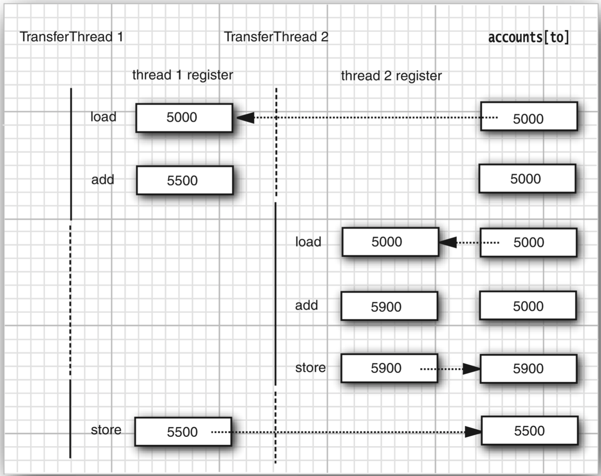
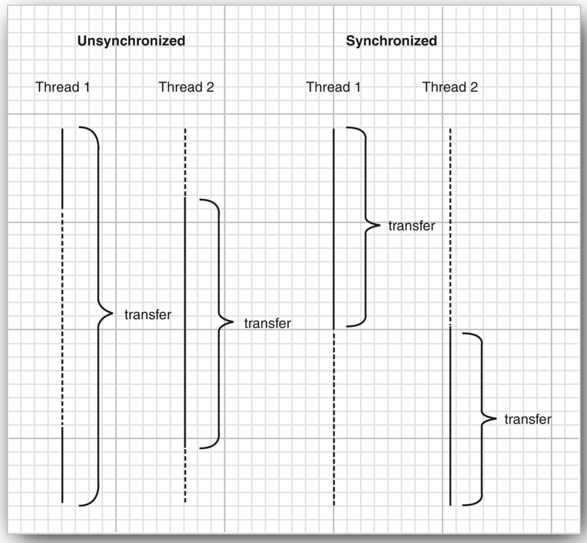

# 线程同步
>time: 2018-07-14 17:53:42

在大多数实际的多线程应用中，两个或两个以上的线程需要共享对同一数据的存取。如果两个线程存取相同的对象，并且每一个线程都调用了一个修改该对象状态的方法，将会发生什么呢？可以想象，线程彼此踩了对方的脚。根据各线程访问数据的次序，可能会产生讹误的对象。这样一个情况通常称为竞争条件（race condition）。

## 1. 竞争条件的一个例子

#### Bank.java
```java
package unsynch;

import java.util.Arrays;

public class Bank {
    private final double[] accounts;
    
    public Bank(int n, double initialBalance) {
        accounts = new double[n];
        Arrays.fill(accounts, initialBalance);
    }
    
    public void transfer(int from, int to, double amount) throws InterruptedException {
        if(accounts[from] < amount) {
            return;
        }
        accounts[from] -= amount;
        accounts[to] += amount;
        String pringMsg = "%24s %10.2f from %2d to %2d Total Balance: %10.2f%n";
        Object[] args = new Object[] {Thread.currentThread(),amount, from, to, getTotalBalance()};
        System.out.printf(pringMsg, args);
    }
    
    public double getTotalBalance() {
        double sum = 0;
        for (double a : accounts) {
            sum += a;
        }
        return sum;
    }
    public int size() {
        return accounts.length;
    }
}
````

#### UnsynchBankTest.java
```java
package unsynch;

public class UnsynchBankTest {
    public static final int NACCOUNTS = 100;
    public static final double INITIAL_BALANCE = 1000;
    public static final double MAX_AMOUNT = 1000;
    public static final int DELAY = 10;
    
    public static void main(String[] args) {
        Bank bank = new Bank(NACCOUNTS, INITIAL_BALANCE);
        for (int i = 0; i < NACCOUNTS; i++) {
            int fromAccount = i;
            Runnable r = () ->{
                try {
                    while (true) {
                        int toAccount = (int)(bank.size() * Math.random());
                        double amount = MAX_AMOUNT * Math.random();
                        bank.transfer(fromAccount, toAccount, amount);
                        Thread.sleep((int)(DELAY * Math.random()));
                    }
                } catch (InterruptedException e) {
                }
            };
            Thread t = new Thread(r);
            t.start();
        }
    }
}
```

为了避免多线程引起的对共享数据的讹误，必须学习如何同步存取。

```bash
 Thread[Thread-2,5,main]     473.48 from  2 to 12 Total Balance:  100000.00
Thread[Thread-99,5,main]     585.19 from 99 to 39 Total Balance:  100000.00
...
Thread[Thread-93,5,main]     294.55 from 93 to 93 Total Balance:  100000.00
Thread[Thread-74,5,main]     793.66 from 74 to 52 Total Balance:  100000.00
Thread[Thread-46,5,main]     105.02 from 46 to 47 Total Balance:   99206.34
Thread[Thread-33,5,main]     591.15 from 33 to 64 Total Balance:  100000.00
Thread[Thread-35,5,main]     654.60 from 35 to 27 Total Balance:  100000.00
Thread[Thread-22,5,main]     195.83 from 22 to 83 Total Balance:  100078.81
Thread[Thread-55,5,main]     208.96 from 55 to 66 Total Balance:  100000.00
Thread[Thread-43,5,main]     448.61 from 43 to 43 Total Balance:  100000.00
Thread[Thread-43,5,main]     915.93 from 43 to 63 Total Balance:  100000.00
...
Thread[Thread-84,5,main]      55.62 from 84 to 46 Total Balance:   99683.26
Thread[Thread-85,5,main]     582.55 from 85 to 34 Total Balance:   99683.26
Thread[Thread-85,5,main]     816.38 from 85 to 29 Total Balance:   99683.26
Thread[Thread-18,5,main]     937.92 from 18 to 18 Total Balance:   99683.26
Thread[Thread-59,5,main]      14.75 from 59 to 30 Total Balance:   99683.26
```

## 2. 竞争条件详解
假定两个线程同时执行  
`accounts[to] += amount`  
问题在于这不是原子操作。该指令可能被处理如下：
1. 将 accounts[to] 加载到寄存器。
2. 增加 amount。
3. 将结果写回 accounts[to]。

假定第 1 个线程执行步骤 1 和 2，然后，它被剥夺了运行权。假定第 2 个线程被唤醒并修改了 accounts 数组中的同一项。然后，第 1 个线程被唤醒并完成其第 3 步。  
这一步擦去了第二个线程所做的更新。于是，总金额不再正确。

***
**注释**： 可以具体看一下执行我们的类中的每一个语句的虚拟机的字节码。运行命令  
`javap -c -v Bank`  
对 Bank.class 文件进行反编译。例如，代码行  
`accounts[to] += amount;`  
被转换为下面的字节码：
```
aload_0
getfield     #2; //Field accounts:[D
iload_2
dup2
daload
dload_3
dadd
dastore
```
这些代码的含义无关紧要。重要的是增值命令是由几条指令组成的，执行它们的线程可以在任何一条指令点上被中断。
***

#### 同时被两个线程访问


## 3. 锁对象
有两种机制防止代码受并发访问的干扰。Java 语言提供了一个 synchronized 关键字达到这一目的，并且 Java SE 5.0 引入了 ReentrantLock 类。synchronized 关键字自动提供了一个锁以及相关的“条件”，对于大多数需要显示锁的情况，这是很便利的。

用 ReentrantLock 保护代码块的基本结构如下：
```java
myLock.lock(); // a ReentrantLock object
try {
    critical section
}finally {
    // make sure the lock is unlocked even if an exception is thrown
    myLock.unlock();
}
```
这一结构确保任何时刻只有一个线程进入临界区。一旦一个线程封锁了锁对象，其他任何线程都无法通过 lock 语句。当其他线程调用 lock 时，它们被阻塞，直到第一个线程释放锁对象。

***
**警告**: 把解锁操作括在 finally 子句之内是至关重要的。如果在临界区的代码出现异常，锁必须被释放。否则，其他线程将永远阻塞。
***

***
**注释**：如果使用锁，就不能使用带资源的 try 语句。首先，解锁方法名不是 close。不过，即使将它重命名，带资源的 try 语句也无法正常工作。它的首部希望声明一个新变量。但是如果使用一个锁，你可能想使用多个线程共享的那个变量（而不是新变量）
***

#### 非同步线程与同步线程的比较


如果每一个对象有自己的 ReentrantLock 对象。如果两个线程视图访问同一个对象，那么锁以串行的方式提供服务。但是，如果两个线程访问不同的对象，每个一个线程得到不同的锁对象，两个线程都不会发生阻塞。本该如此，因为线程在操纵不同的对象实例的时候，线程之间不会相互影响。

锁是可重入的，因为线程可以重复地获已经持有的锁。锁保持一个持有计数（hold count）来跟踪对 lock 方法的嵌套调用。线程在每一次调用 lock 都要调用 unlock 来释放锁。由于这一特性，都被一个锁保护的代码可以调用另一个使用相同锁的方法。

例如，transfer 方法调用 getTotalBalance 方法，这也会封锁 bankLock 对象，此时 bankLock 对象的持有计数为 2。当 getTotalBalance 方法退出的时候，持有计数变回 1。当 transfer 方法退出的时候，持有计数变为 0。线程释放锁。

通常，可能想要保护若干个操作来更新或检查共享对象的代码。要确保这些操作完成后，另一个线程才能使用相同对象。

***
**警告**：要留心临界区域的代码，不要因为异常的抛出而跳出临界区。如果临界区代码结束之前抛出了异常，finally 子句将释放锁，但会使对象可能处于一种受损状态。
***

#### java.util.concurrent.Lock 5.0
* void lock()
    >获取这个锁；如果锁同时被另一个线程拥有则放生阻塞。
* void unlock()
    >释放这个锁；

#### java.util.concurrent.locks,ReentrantLock 5.0
* ReentrantLock()
    >构建一个可以被用来保护临界区的可重入锁。
* ReentrantLock(boolean fair)
    >构建一个带有公平策略的锁。一个公平锁偏爱等待时间最长的线程。但是，这一公平的保证将大大降低性能。所以，默认情况先，锁没有被强制为公平的。

***
**警告**：听起来公平锁更合理一些，但是使用公平锁比使用常规锁要慢很多。只有当你确实要了解自己要做什么并且对于你解决的问题有一个特定的理由必须使用公平锁的时候，才可以使用公平锁。即使使用公平锁，也无法确保线程调度器是公平的。如果线程调度器选择忽略一个线程，而该线程为了这个锁已经等待了很长时间，那么就没有机会公平的处理这个锁了。
***

## 4. 条件对象
通常，线程进人临界区，却发现在某一条件满足之后它才能执行。要使用一个条件对象来管理那些已经获得了一个锁但是却不能做有用工作的线程。Java库中条件对象(由于历史的原因，条件对象经常被称为条件变量(conditional variable) )。

一个锁对象可以有一个或多个相关的条件对象。你可以用 newCondition 方法获得一个条件对象。习惯上给每一个条件对象命名为可以反映它所表达的条件的名字。
```java
public class Bank {
private Condition sufficientFunds;
...

public Bank(int n, double initialBalance) {
    ...
    sufficientFunds = bankLock.newCondition();
}
```
如果 transfer 方法发现余额不足，它调用
`sufficientFunds.await()`  
当前线程现在被阻塞了，并放弃了锁。

等待获得锁的线程和调用 await 方法的线程存在本质上的不同。一旦一个线程调用 await 方法，它进人该条件的等待集。当锁可用时，该线程不能马上解除阻塞。相反，它处于阻塞状态，直到另一个线程调用同一条件上的 signalAll 方法时为止。  
调用  
`sufficientFunds.singalAll();`  
这一调用重新激活因为这一条件而等待的所有线程。当这些线程从等待集当中移出时，它们再次成为可运行的，调度器将再次激活它们。同时，它们将试图重新进人该对象。一旦锁成为可用的，它们中的某个将从 await 调用返回，获得该锁并从被阻塞的地方继续执行。

此时，线程应该再次测试该条件。由于无法确保该条件被满足 —— signalAll 方法仅仅是通知正在等待的线程: 此时有可能已经满足条件，值得再次去检测该条件。
***
**注释**：通常，对 await 的调用应该在如下形式的循环体中
```
while(!(ok to proceed))
    condition.await();
```
***

至关重要的是最终需要某个其他线程调用 signalAll 方法。当一个线程调用 await，它没有办法重新激活自身。它寄希望于其他线程。如果没有其他线程来重新激活等待的线程，它就永远不再运行了。这将导致令人不快的死锁（deadlock）现象。如果所有其他线程被阻塞，最后一个活动线程在解除其他线程的阻塞状态之前就调用 await 方法，那么它也被阻塞。没有任何线程可以解除其他线程的阻塞，那么该程序就刮起了。

应该如何调用 signalAll 呢？经验上讲，在对象的状态有利于等待线程的方向改变时调用 signalAll。

signalAll 不会立即激活一个等待线程。它仅仅解除了等待线程的阻塞，以便这些线程可以在当前线程退出同步方法之后，通过竞争实现对对象的访问。

***
**警告**：当一个线程拥有某个条件的锁时，它仅仅可以在该条件上调用 await、signalAll 或 signal 方法

#### Bank.java
```java
package synch;

import java.util.Arrays;
import java.util.concurrent.locks.Condition;
import java.util.concurrent.locks.Lock;
import java.util.concurrent.locks.ReentrantLock;

public class Bank {
    private final double[] accounts;
    private Lock bankLock;
    private Condition sufficientFunds;
    
    public Bank(int n, double initialBalance) {
        accounts = new double[n];
        Arrays.fill(accounts, initialBalance);
        bankLock = new ReentrantLock();
        sufficientFunds = bankLock.newCondition();
    }
    
    public void transfer(int from, int to, double amount) throws InterruptedException {
        bankLock.lock();
        try {
            while(accounts[from] < amount) {
                sufficientFunds.await();
            }
            System.out.print(Thread.currentThread());
            accounts[from] -= amount;
            System.out.printf(" %10.2f from %d to %d", amount, from, to);
            accounts[to] += amount;
            System.out.printf(" Total Balance: %10.2f%n", getTotalBalance());
            sufficientFunds.signalAll();
        }finally {
            bankLock.unlock();
        }
    }
    
    public double getTotalBalance() {
        bankLock.lock();
        
        try {
            double sum = 0;
            for (double a : accounts) {
                sum += a;
            }
            return sum;
        }finally {
            bankLock.unlock();
        }
    }
    public int size() {
        return accounts.length;
    }
}
```
#### Test.java
```java
package synch;

public classTest {
    public static final int NACCOUNTS = 100;
    public static final double INITIAL_BALANCE = 1000;
    public static final double MAX_AMOUNT = 1000;
    public static final int DELAY = 10;
    
    public static void main(String[] args) {
        Bank bank = new Bank(NACCOUNTS, INITIAL_BALANCE);
        for (int i = 0; i < NACCOUNTS; i++) {
            int fromAccount = i;
            Runnable r = () ->{
                try {
                    while (true) {
                        int toAccount = (int)(bank.size() * Math.random());
                        double amount = MAX_AMOUNT * Math.random();
                        bank.transfer(fromAccount, toAccount, amount);
                        Thread.sleep((int)(DELAY * Math.random()));
                    }
                } catch (InterruptedException e) {
                }
            };
            Thread t = new Thread(r);
            t.start();
        }
    }
}
```

#### java.util.concurrent.locks.Lock 5.0
* Condition newCondition();
    >返回一个与该锁相关的条件对象
#### java.util.concurrent.locks.Condition 5.0
* void await()
    >将该线程放到条件的等待集中。
* void signalAll()
    >解除该条件的等待集中所有线程的阻塞状态。
* void signal()
    >从该条件的等待集中随机选择一个线程，解除其阻塞状态。

## 5. synchronized 关键字
锁和条件的关键之处：
* 锁用来保护代码片段，任何时刻只能有一个线程执行被保护的代码。
* 锁可以管理试图进入被保护代码段的线程。
* 锁可以拥有一个或多个相关的条件对象。
* 每个条件对象管理那些已经进入被保护的代码段但还不能运行的线程。

Lock 和 Condition 接口为程序设计人员提供了高度的锁定控制。

从 1.0 版开始，Java 中的每一个对象都有一个内部锁。如果一个方法用 synchronized 关键字声明，那么对象的锁将保护整个方法。这就是说，要调用该方法，线程必须获得内部的对象锁。

换句话说，
```java
public synchronized void method()
{
    // method body
}
```
等价于
```java
public void method() 
{
    this.intrinsiclock.lock();
    try
    {
        // method body
    }
    finally { this.intrinsiclock.unlock(); }
}
```
使用 synchronized 关键字写代码要简洁得多。当然，要理解这一代码，你必须了解每一个对象有一个内部锁，并且该锁有一个内部条件。有锁来管理那些试图进入 synchronized 方法的线程，有条件来管理那些嗲用 wait 的线程。

***
**提示**：Synchronized 方法是相对简单的。但是，初学者常常对条件感到困惑。
***

将静态方法声明为 synchronized 也是合法的。如果调用这种方法，该方法获得相关的类对象的内部锁。例如，如果 Bank 类有一个静态同步的方法，那么当该方法调用时，Bank.class 对象的锁被锁住。因此，没有其他线程可以调用同一个类的这个或任何其他的同步静态方法。

内部锁和条件存在一些局限：
* 不能中断一个正在试图获得锁的线程。
* 试图获得锁时不能设定超时。
* 每个锁仅有单一的条件，可能是不够的。

使用 Lock 和 Condition 对象还是同步方法的一些建议：
* 最好即不使用 Lock/Condition 也不使用 synchronized 关键字。在许多情况下你可以使用 java.util.concurrent 包中的一种机制，它会为你处理所有的加锁。
* 如果 synchronized 关键字适合你的程序，那么请尽量使用它，这样可以减少编写的代码数量，减少出错的几率。
* 如果特别需要 Lock/Condition 结构提供的独有特性时，才使用 Lock/Condition。

#### Bank.java
```java
package synch;

import java.util.Arrays;

public class Bank {
	private final double[] accounts;
	
	public Bank(int n, double initialBalance) {
		accounts = new double[n];
		Arrays.fill(accounts, initialBalance);
	}
	
	public synchronized void transfer(int from, int to, double amount) throws InterruptedException
	{
		while(accounts[from] < amount) {
			wait();
		}
		System.out.printf("%24s", Thread.currentThread());
		accounts[from] -= amount;
		System.out.printf(" %10.2f from %2d to %2d", amount, from, to);
		accounts[to] += amount;
		System.out.printf(" Total Balance: %10.2f%n", getTotalBalance());
		notifyAll();
	}
	
	public synchronized double getTotalBalance() {
		double sum = 0;
		
		for(double a : accounts) {
			sum += a;
		}
		
		return sum;
	}
	
	public int size() {
		return accounts.length;
	}
}
```
#### Test.java
```java
package synch;

public class Test {
	public static final int NACCOUNTS = 100;
    public static final double INITIAL_BALANCE = 1000;
    public static final double MAX_AMOUNT = 1000;
    public static final int DELAY = 10;
    
	public static void main(String[] args) {
        Bank bank = new Bank(NACCOUNTS, INITIAL_BALANCE);
        for (int i = 0; i < NACCOUNTS; i++) {
            int fromAccount = i;
            Runnable r = () ->{
                try {
                    while (true) {
                        int toAccount = (int)(bank.size() * Math.random());
                        double amount = MAX_AMOUNT * Math.random();
                        bank.transfer(fromAccount, toAccount, amount);
                        Thread.sleep((int)(DELAY * Math.random()));
                    }
                } catch (InterruptedException e) {
                }
            };
            Thread t = new Thread(r);
            t.start();
        }
    }
}
```
#### java.lang.Object 1.0
* void notifyAll()
    >解除那些在该对象上调用 wait 方法的线程的阻塞状态。该方法只能在同步方法或同步块内部调用。如果当前线程不是对象锁的持有者，该方法抛出一个 IllegalMonitorStateException 异常。
* void notify()
    >随机选择一个在该对象上调用 wait 方法的线程，解除其阻塞状态。该方法只能在一个同步方法或同步块中调用。如果当前线程不是对象锁的持有者，该方法抛出一个 IllegalMonitorStateException 异常。
* void wait()
    >导致线程进入等待状态直到它被通知。该方法只能在一个同步方法中调用。如果当前线程不是对象锁的持有者，该方法抛出一个 IllegalMonitorStateException 异常。
* void wait(long millis)
* void wait(long millis, int nanos)
    >导致线程进入等待状态直到它被通知或者经过指定的时间。这些方法只能在一个同步方法中调用。如果当前线程不是对象锁的持有者该方法抛出一个 IllegalMonitorStateException 异常。  
    >参数：
    >>millis: 毫秒数  
    >>nanos: 纳秒数，<1 000 000


