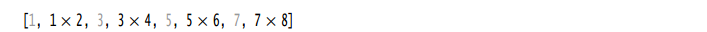
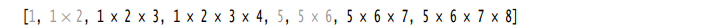

# 线程安全的集合
>time: 2018-08-06 17:42:09

如果多线程要并发地修改一个数据结构，例如散列表，那么很容易会破坏这个数据结构。

可以通过提供锁来保护共享数据结构，但是选择线程安全的实现作为替代可能更容易些。阻塞队列就是线程安全的集合。

## 1. 高效的映射、集和队列

java.util.concurrent 包提供了映射、有序集和队列的高效实现： ConcurrentHashMap、ConcurrentSkipListMap、ConcurrentSkipListSet 和 ConcurrentLinkedQueue。

这些集合使用复杂的算法，通过允许并发地访问数据结构的不同部分来使竞争极小化。

与大多数集合不同，size 方法不必在常量时间内操作。确定这样的集合当前的大小通常需要遍历。

***
**注释**： 有些应用使用庞大的并发散列映射，这些映射太过庞大，以至于无法用 size 方法得到它的大小，因为这个方法只能返回 int。对于一个包含超过 20 亿条目的映射该如何处理？Java SE 8 引入了一个 mappingCount 方法可以把大小作为 long 返回。
***

集合返回弱一致性（weakly consistent）的迭代器。这意味着迭代器不一定能反映出它们被构造之后的所有修改，但是，它们不会将同一个值返回两次，也不会抛出 ConcurrentModificationException 异常。

***
**注释**: 预制形成对照的是，集合如果在迭代器构造之后发生改变，java.util 包中的迭代器将抛出一个 ConcurrentMoidificationException 异常。
***

并发的散列值映射表，可高效的支持大量的读者和一定数量的写者。默认情况下，假定可以有多达 16 个写者线程同时执行。可以有更多的写者线程，但是，如果同一时间多于 16 个，其他线程将暂时被阻塞。可以指定更大数据的构造器，然而，恐怕没有这种必要。

***
**注释**： 散列映射将有相同散列码的所有条目放在同一个“桶”中。有些应用使用的散列函数不当
，以至于所有条目最后都放在很少的桶中，这会严重降低性能。即使是一般意义上还算合理的散列函数，如 String 类的散列函数，也可能存在问题。例如，攻击者可能会制造大量有相同散列值的字符串，让程序速度减慢。在 JavaSE 8 中，并发散列映射将桶组织为树，而不是列表，键类型实现了 Comparable，从而可以保证性能为 0(log(n))。
***

#### java.util.concurrent.ConcurrentLinkedQueue`<E>` 5.0
* ConcurrentLinkedQueue`<E>`()
    >构造一个可以被多线程安全访问的无边界非阻塞的队列。

#### java.util.concurrent.ConcurrentSkipListSet`<E>` 6
* ConcurrentSkipListSet`<E>`()
* ConcurrentSkepListSet`<E>`(Comparator`<? super E>` comp)
    >构造一个可以被多线程安全访问的有序集。第一个构造器要求元素实现 Comparable 接口。

#### java.util.concurrent.ConcurrentHashMap`<K, V>` 5.0
#### java.util.concurrent.ConcurrentSkipListMap`<K, V>` 6
* ConcurrentHashMap`<K, V>`()
* ConcurrentHashMap`<K, V>`(int initialCapacity)
* ConcurrentHashMap`<K, V>`(int initialCapacity, float loadFactor, int concurrencyLevel)
    >构造一个可以被多线程安全访问的散列映射表。  
    >参数：
    >>initialCapacity: 集合的初始容量。默认值为 16。  
    >>loadFactor: 控制调整：如果每一个桶的平均负载超过这个因子，表的大小会被重新调整。默认值为 0.75。
    >>concurrencyLevel: 并发写者线程的估计数目。
* ConcurrentSkipListMap`<K, V>`()
* ConcurrentSkipListSet`<K, V>`(Comparator`<? super K` comp)
    >构造一个可以被多个线程安全访问的有序的影像表。第一个构造器要求键实现 Comparable 接口。

## 2. 映射条目的原子更新
ConcurrentHashMap 原来的版本只是为数不多的方法可以实现原子更新，这使得编程多少有些麻烦。假设我们希望统计观察到某些特性的频度。作为一个简单的例子，假设多个线程会遇到单词，我们想统计它们的频率。  
可以使用 `ConcurrentHashMap<String, Long>` 吗？考虑让计数自增的代码。显然，下面的代码不是线程安全的：
```java
Long oldValue = map.get(word);
Long newValue = oldValue == null ? 1 : oldValue + 1;
map.put(word, newValue); // Error--might not replace oldValue
```
可能会有另一个线程在同时更新同一个计数。

***
**注释**：有些程序员很奇怪为什么原本线程安全的数据结构会允许非线程安全的操作。不过有两种完全不同的情况。如果多个线程修改一个普通的 HashMap，它们会破坏内部结构（一个链表数组）。有些链接可能丢失，或者甚至会构成循环，使得这个数据结构不再可用。对于 ConcurrentHashMap 绝对不会发生这种情况。在上面的例子中，get 和 put 代码不会破坏数据结构。不过，由于操作序列不是原子的，所以结果不可预知。
***

传统的做法是使用 replace 操作，它会以原子方式用一个新值替换原值，前提是之前没有其他线程把原值替换为其他值。必须一直这么做，直到 replace成功：
```java
do {
    oldValue = map.get(word);
    newValue = oldValue == null ? 1 : oldValue + 1;
} while(!map.replace(word, oldValue, newValue));
```

或者，可以使用一个 `ConcurrentHashMap<String, AtomicLong>`，或者在 Java SE 8 中，还可以使用 `ConcurrentHashMap<String, LongAdder>`。更新代码如下：
```java
map.putIfAbsent(word, new LongAdder());
map.get(word).increment();
```
第一个语句确保有一个 LongAdder 可以完成原子自增。由于 putlfAbsent 返回映射的的值（可能是原来的值，或者是新设置的值)，所以可以组合这两个语句：  
`map.putIfAbsent(word, new LongAdder()).increment();`  

Java SE 8 提供了一些可以更方便地完成原子更新的方法。调用 compute 方法时可以提供一个键和一个计算新值的函数。这个函数接收键和相关联的值（如果没有值，则为 null)，它会计算新值。例如，可以如下更新一个整数计数器的映射：
`map.compute(word, (k, v)) -> v == null ? 1 : v + 1);`

***
**注释**： ConcurrentHashMap 中不允许有 null 值。有很多方法都使用 null 值来指示映射中某个给定的键不存在。
***

另外还有 computelfPresent 和 computelfAbsent 方法，它们分别只在已经有原值的情况下计
算新值，或者只有没有原值的情况下计算新值。可以如下更新一个 LongAdder 计数器映射：  
`map.computeIfAbsent(word, k -> new LongAdder()).increment();`  
这与之前看到的 putlfAbsent 调用几乎是一样的，不过 LongAdder 构造器只在确实需要一个新的计数器时才会调用。

首次增加一个键时通常需要做些特殊的处理。利用 merge 方法可以非常方便地做到这一点。这个方法有一个参数表示键不存在时使用的初始值。否则，就会调用你提供的函数来结合原值与初始值。（与 compute 不同，这个函数不处理键。）  
`map.merge(word, 1L, (existingValue, newValue) -> existingValue + newValue);`  
或者，更简单地可以写为：  
`map.merge(word, 1L, Long::sum);`  
再不能比这更简洁了。

***
**注释**： 如果传入 compute 或 merge 的函数返回 null，将从映射中删除现有的条目。
***

***
**警告**： 使用 compute 或 merge 时，要记住你提供的函数不能做太多工作。这个函数运行时，可能会阻塞映射的其他更新。当然，这个函数也不能更新映射的其他部分。

## 3. 对并发散列映射的批操作

Java SE 8 为并发散列映射提供了批操作，即使有其他线程在处理映射，这些操作也能安全地执行。批操作会遍历映射，处理遍历过程中找到的元素。无须冻结当前映射的快照。除非你恰好知道批操作运行时映射不会被修改，否则就要把结果看作是映射状态的一个近似。

#### 有 3 种不同的操作
* 搜索（search) 为每个键或值提供一个函数，直到函数生成一个非 null 的结果。然后搜索终止，返回这个函数的结果。
* 规约（reduce）组合所有键或值，这里要使用所提供的一个累加函数。
* forEach 为所有键或值提供一个函数。

#### 每个操作都有 4 个版本
* operationKeys：处理键。
* operationValues：处理值。
* operation：处理键和值
* operationEntries：处理 Map.Entry 对象。

对于上述各个操作，需要指定一个参数化阈值（parallelism threshold）。如果映射包含的元素多于这个阈值，就会并行完成操作。如果希望批操作在一个线程中运行，可以使用阈值 Long.MAX_VALUE。如果希望用尽可能多的线程运行批操作，可以使用阈值 1。

search 方法有以下版本：
```
U searchKeys(long threshold, BiFunction<? super K, ? extends U> f)
U searchValues(long threshold, BiFunction<? super V, ? extends U> f)
U search(long threshold, BiFunction<? super K, ? super V, ? extends U> f)
U serverEntries(long threashold, BiFunction<Map.Entry<K, V>, ? extends U> f)
```

找出第一个出现次数超过 1000 次的单词。需要搜索键和值：  
`String result = map.search(threshold, (k, v) -> v > 1000? k : null);`  
result 会设置为第一个匹配的单词，如果搜索函数对所有输入都返回 null，则返回 null。forEach 方法有两种形式。第一个只为各个映射条目提供一个消费者函数，例如：
```java
map.forEach(threshold, 
    (k, v) -> System.out.println(k + " -> " + v));
```
第二种形式还有一个转换器函数，这个函数要先提供，其结果会传递到消费者：
```java
map.forEach(threshold,
    (k, v) -> k + " -> " + v, // Transformer
    System.out::println); // Consumer
```
转换器可以用作为一个过滤器。只要转换器返回 null，这个值就会被悄无声息地跳过。
```java
map.forEach(threshold,
    (k, v) -> v > 1000 ? k + " -> " + v: null, // Filter and transformer
    System.out::println); // The nulls are not passed to the consumer
```

reduce 操作用一个累加函数组合其输入。  
`Long sum = map.reduceValues(threshold, Long::sum);`  
与 forEach 类似，也可以提供一个转换器函数。可以如下计算最长的键的长度：
```java
Integer maxLength = map.reduceKeys(thread,
    String:: length, // Transformer
    Integer:: max); // Accumulator
```
转换器可以作为一个过滤器，通过返回 null 来排除不想要的输入。  
统计值 > 1000 条目的数量  
```java
Long count = map.reduceValues(treshold,
    v -> v > 1000 : 1L : null,
    Long::sum);
```

***
**注释**： 如果映射为空，或者所有条目都被过滤掉，reduce 操作会返回 null。如果只有一个元素，则返回其转换结果，不会应用累加器。
***

对于 int、long 和 double 输出还有相应的特殊化操作，分别有后缀 ToInt、ToLong 和 ToDouble。需要把输入转换为一个基本类型的值，并制定一个默认值和累加器函数。映射为空时返回默认值。
```java
long sum = map.reduceValuesToLong(threshold,
    Long::longValue, // Transformer to primitive type
    0, // Default value for empty map
    Long::sum); // Primitive type accumulator
```
***
**警告**： 这些特殊化操作与对象版本的操作有所不同，对于对象版本的操作，只需要考虑一个元素。这里不是返回转换得到的元素，而是将于默认值累加。因此，默认值必须是累加器的零元素。
***

## 4. 并发集视图
假设你想要的是一个大的线程安全的集而不是映射。并没有一个 ConcurrentHashSet 类，而且你肯定不想自己创建这样一个类。当然，可以使用 ConcurrentHashMap (包含 “假” 值)，不过这会得到一个映射而不是集，而且不能应用 Set 接口的操作。

静态 newKeySet 方法会生成一个 `Set<K>`，这实际上是 `ConcurrentHashMap<K, Boolean>` 的一个包装器。（所有映射值都为 Boolean.TRUE，不过因为只是要把它用作一个集，所以并不关心具体的值。）  
`Set<String> words = ConcurrentHashMap.<String>newKeySet();`

当然，如果原来有一个映射，keySet 方法可以生成这个映射的键集。这个集是可变的。如果删除这个集的元素，这个键（以及相应的值）会从映射中删除。不过，不能向键集增加元素，因为没有相应的值可以增加。Java SE 8 为 ConcurrentHashMap 增加了第二个 keySet 方法，包含一个默认值，可以在为集增加元素时使用：
```java
Set<String> words = map.keySet(1L);
words.add("java");
```
如果 "Java” 在 words中不存在，现在它会有一个值 10。存在，不操作。

## 5. 写数组的拷贝
CopyOnWriteArrayList 和 CopyOnWriteArraySet 是线程安全的集合，其中所有的修改线程对底层数组进行复制。如果在集合上进行迭代的线程数超过修改线程数，这样的安排是很有用的。当构建一个迭代器的时候，它包含一个对当前数组的引用。如果数组后来被修改了，迭代器仍然引用旧数组，但是，集合的数组已经被替换了。因而，旧的迭代器拥有一致的（可能过时的）视图，访问它无需任何同步开销。

## 6. 并行数组算法
在 Java SE 8 中，Arrays 类提供了大量并行化操作。静态 Arrays.parallelSort 方法可以对一个基本类型值或对象的数组排序。
```
String contents = new String(Files.readAllBytes(
    Paths.get("alice.txt")), StandardCharsets.UTF_8); // Read file into string
String[] words = contents.split("[\\P{L}]+"); // Split along nonletters
Arrays.parallelSort(words);
```
对对象排序时，可以提供一个 Comparator。  
`Arrays.parallelSort(words, Comparator.comparing(Sting:: length));`  
对于所有方法都可以提供一个范围的边界  
`Arrays.parallelSort(values, values.length / 2, values.length); // Sort the upper half`

***
**注释**： 乍一看，这些方法名中的 parallel 可能有些奇怪，因为用户不用关心排序具体怎样完成。不过，API 设计者希望清楚地指出排序是并行化的。这样一来，用户就会注意避免使用有副作用的比较器。
***

parallelSetAll 方法会用由一个函数计算得到的值填充一个数组。这个函数接收元素索引，
然后计算相应位置上的值。
```java
Arrays.parallel(values, i -> i % 10);
// Fills values with 0 1 2 3 4 5 6 7 8 9 0 1 2 ...
```

显然，并行化对这个操作很有好处。这个操作对于所有基本类型数组和对象数组都有相应的版本。

最后还有一个 parallelPrefix 方法，它会用对应一个给定结合操作的前缀的累加结果替换各个数组元素。这是什么意思？这里给出一个例子。考虑数组 `[1，2, 3, 4, . . .]` 和 x 操作。执行 `Arrays.parallelPrefix(values, (x, y)-> x * y)` 之后，数组将包含：  
`[1, 1x2, 1x2x3, 1x2x3x4, ...]`  
可能很奇怪，不过这个计算确实可以并行化。首先，结合相邻元素，如下所示：  
  
灰值保持不变。显然， 可以在不同的数组区中并行完成这个计算。下一步中，通过将所指示的元素与下面一个或两个位置上的元素相乘来更新这些元素：
  
这同样可以并行完成。log(n)步之后，这个过程结束。如果有足够多的处理器，这会远远胜过直接的线性计算。这个算法在特殊用途硬件上很常用，使用这些硬件的用户很有创造力，会相应地调整算法来解决各种不同的问题。

## 7. 较早的线程安全集合


