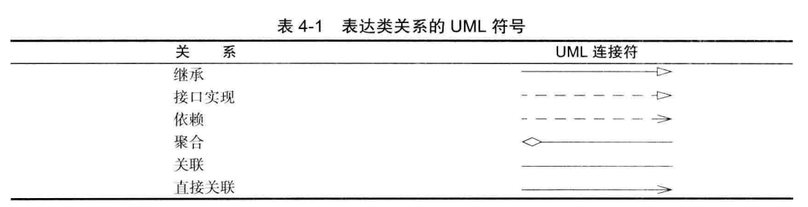

# 面向对象程序设计概述
>key: 2017-11-15 17:38:50  
>keyword: 面向对象程序设计

面向对象程序设计（简称 OOP）是当今主流程序设计反省，它已经取代了 20 世纪 70 年代的 “结构化”过程化程序设计开发技术。Java 是完全面向对象的，必须熟悉 OOP 才能够编写 Java 程序。

面向对象的程序是由对象组成的，每个对象包含对用户公开的特定功能部分和隐藏的实现部分。程序中的很多对象来自标准库，还有一些是自定义的。究竟是自己构造对象，还是从外界购买对象完全取决于开发项目的预算和时间。但是，从根本上说，只要对象能够满足要求，就不必关心其功能的具体实现过程。在 OOP 中，不必关系对象的具体实现，只要能够满足用户的需求即可。

OOP 将数据放在第一位，然后再考虑操作数据的算法。

对于一些规模较小的问题，将其分解为过程的开发方式比较理想，而面向对象更加适用于解决规模较大的问题。

## 1.1 类

类（class）是构造对象的模板或蓝图。由类构造（construct）对象的过程称为创建类的实例（instance）。

封装（encapsulation，有时称为数据隐藏）是与对象有关的一个重要概念。从形式上看，封装不过是将数据和行为组合在一个包中，并对对象的实用者隐藏了数据的实现方式。对象中的数据称为实例域（instance field），操纵数据的过程称为方法（method）。对于每个特定的类实例（对象）都有一组特定的实例域值。这些值的集合就是这个对象的当前状态（state）。无论何时，只要面向对象发送一个消息，它的状态就有可能发生改变。

实现封装的关键在于绝对不能让类中的方法直接地访问其他类的实例域。程序仅通过对象的方法与对象数据进行交互。封装给对象赋予了“黑盒”特征，这是提高重用性和可靠性的关键。这意味着一个类可以全面地改变存储数据的方式，只要仍旧使用同样的方法操作数据，其他对象就不会知道或介意所发生的变化。

OOP 的另一个原则让用户自定义 Java 类变得轻而易举，这就是： 可以通过扩展一个类来建立另外一个新的类。事实上，在 Java 中，所有的类都源自于 Object 类。

在扩展一个已有的类时，这个扩展后的新类具有所扩展的类的全部属性和方法。在新类中，只需要提供适用于这个新类的新方法和数据域就可以了。通过扩展一个类来建立另外一个类的过程成为继承（inheritance）。

## 1.2 对象

要想使用 OOP，一定要清楚对象的三个主要特征：
* 对象的行为（behavior）—— 可以对对象施加哪些操作，或可以对对象施加哪些方法？
* 对象的状态（state）—— 当施加那些方法时，对象如何相应？
* 对象标识（identity）—— 如何辨别具有相同行为与状态的不同对象？

同一个类的所有对象实例，由于支持相同的行为而具有家族式的相似性。对象的行为是用可调用的方法定义的。

每个对象都保存着描述当前特征的信息。这就是对象的状态。对象的状态可能会随着时间而发生改变，但这种改变不是自发的。对象状态的改变必须通过调用方法实现（如果不经过方法调用就可以改变对象状态，只能说明封装性遭到了破坏）。

对象的状态并不能完全描述一个对象。每个对象都一个唯一的身份（identity）。作为一个类的实例，每个对象的标识永远是不同的，状态常常也存在着差异。

对象的这些关键特性在彼此之间相互影响着。例如，对象的状态影响它的行为。

## 1.3 识别类

传统的过程化程序设计，必须从顶部的 main 函数开始编写程序。在面向对象程序设计时没有所谓的“顶部”。对于学习 OOP 的初学者来说常常会感觉无从下手。答案是：**首先从设计类开始，然后再往每个类中添加方法。**

识别类的简单规则是分析问题的过程中寻找名词，而方法对应着动词。

所谓“找名词与动词”原则只是一种经验，在创建类的时候，哪些名词和动词是重要的完全取决于个人的开发经验。

## 1.4 类之间的关系

在类之间，最常见的关系有
* 依赖（“uses-a”）
* 聚合（“has-a”）
* 继承（“is-a”）

1. 依赖（dependence），即 “uses-a” 关系，是一种最明显的、最常见的关系。如果一个类的方法操作了另一个类的对象，我们就说一个类依赖于另个一个类。    
应该的尽可能地将相互依赖的类减少至最少。如果类 A 不知道 B 的存在，它就不关心 B 的任何改变（这意味着 B  的改变不会导致 A 的任何 bug）。用软件工程的术语来说，就是让类之间的耦合最小。
1. 聚合（aggregation），即 “has-a” 关系，是一种具体切易于理解的关系。聚合关系意味着类 A 的对象包含了类 B 的对象。
1. 继承（inheritance），即 “is-a” 关系，是一种用于表示特殊与一般关系的。如果类 A 扩展类 B，类 A 不但包含从类 B 继承的方法，还会拥有一些额外的功能。

