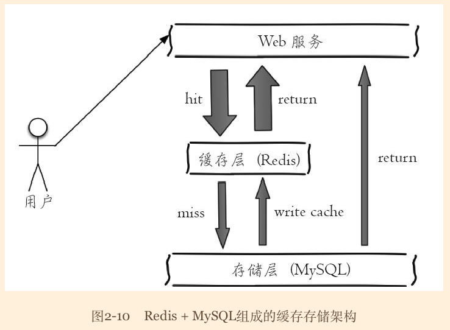
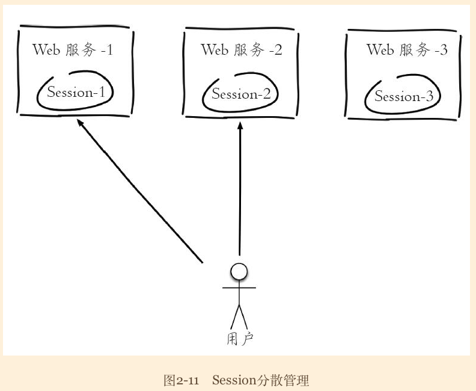
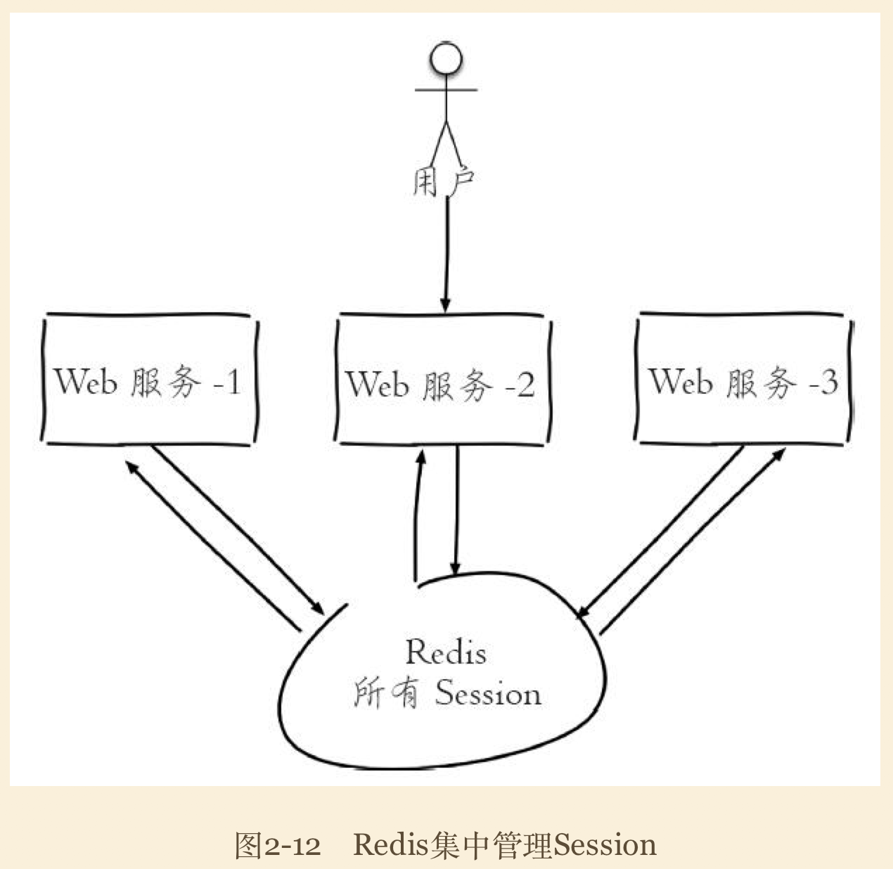

# 字符串
>time: 2018-02-27 14:13:07

字符串类型是 Redis 最基础的数据结构。首先键都是字符串类型，而且其他几种数据结构都是在字符串类型基础上构建的，所以字符串类型能为其他四种数据结构的学习奠定基础。字符串类型的值实际可以是字符串（简单的字符串、复杂的字符串（例如JSON、XML））、数字（整数、浮点数），甚至是二进制（图片、音频、视频），但是值最大不能超过512MB。

#### 字符串类型命令时间复杂度
| 命令 | 时间复杂度 |
|---|---|
| set key value | O(1) |
| get key | O(1) |
| del key [key ...] | O(k)，k 是键的个数 |
| mset key value [key value ...] | O(k)，k 是键的个数 |
| mget key [key ...] | O(k)，k 是键的个数 |
| incr key | O(1) |
| decr key | O(1) |
| incrby key increment | O(1) |
| decrby key increment | O(1) |
| incrbyfloat key increment | O(1) |
| append key value | O(1) |
| strlen key | O(1) |
| setrange key offset value | O(1) |
| getrange key start end |  O(n)，n 是字符串的导航度，由于获取字符串非常快，所以如果字符串不是很长，可以视同为 O(1) |

## 内部编码
字符串类型的内部编码有 3 种：
* int：8 个字节的长整型
* embstr：小于等于 39 个字节的字符串
* raw：大于 39 个字节的字符串

Redis 会根据当前值的类型和长度决定使用哪种内部编码实现。

## 典型使用场景
1. 缓存功能。
    >下图是比较典型的缓存使用场景，其中 Redis 作为缓存层、MySQL 作为存储层，绝大部分请求的数据都是从 Redis 中获取。由于 Redis 具有支持高并发的特性，所以缓存通常能起到加速读写和降低后端压力的作用。

    

    与 MySQL 等关系型数据库不同的是，Redis 没有命令空间，而且也没有对键名有强制要求（除了不能使用一些特殊字符）。但设计合理的键名，有利于防止键冲突和项目的可维护性，比较推荐的方式是使用“`业务名：对象名：id：[属性]`”作为键名（也可以不是分号）。例如 MySQL 的数据库名为 vs，用户表名为 user，那么对应的键可以用"`vs：user：1`"，"`vs：user：1：name`"来表示，如果当前 Redis 只被一个业务使用，甚至可以去掉“vs：”。如果键名比较长，例如“`user：{uid}：friends：messages：{mid}`”，可以在能描述键含义的前提下适当减少键的长度，例如变为“`u：{uid}：fr：m：{mid}`”，从而减少由于键过长的内存浪费。

1. 计数
    >许多应用都会使用 Redis 作为计数的基础工具，它可以实现快速计数、查询缓存的功能，同时数据可以异步落地到其他数据源。

1. 共享 Session
    >如图 2-11 所示，一个分布式 Web 服务将用户的 Session 信息（例如用户登录信息）保存在各自服务器中，这样会造成一个问题，出于负载均衡的考虑，分布式服务会将用户的访问均衡到不同服务器上，用户刷新一次访问可能会发现需要重新登录，这个问题是用户无法容忍的。

    

    为了解决这个问题，可以使用 Redis 将用户的 Session 进行集中管理，如图 2-12 所示，在这种模式下只要保证 Redis 是高可用和扩展性的，每次用户更新或者查询登录信息都直接从 Redis 中集中获取。

    

1. 限速
    >很多应用出于安全的考虑，会在每次进行登录时，让用户输入手机验证码，从而确定是否是用户本人。但是为了短信接口不被频繁访问，会限制用户每分钟获取验证码的频率，例如一分钟不能超过 5 次。

    Redis 实现的基本思路：
    ```
    phoneNum = "138xxxxxxxx";
    key = "shortMsg:limit:" + phoneNum;
    // SET key value EX 60 NX
    isExists = redis.set(key, 1, "EX 60", "NX");
    if(isExists != null || redis.incr(key) <= 5) {
        // 通过
    }else {
        // 限速
    }
    ```