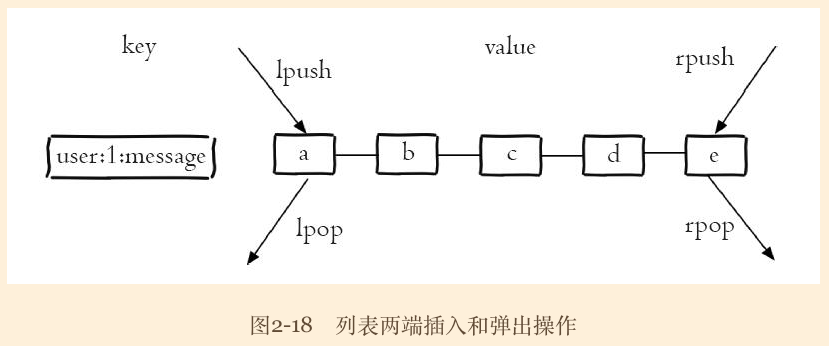
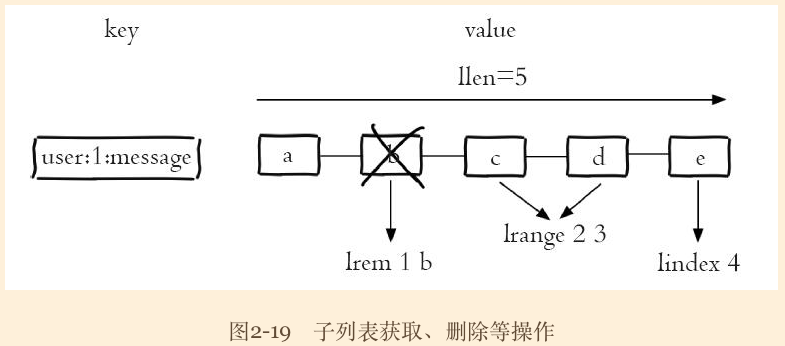
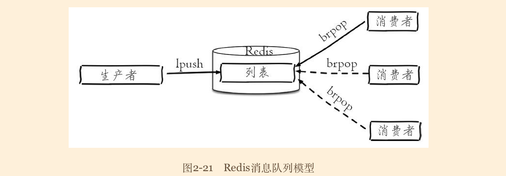

# 列表
>time: 2018-03-01 11:48:41

列表（list）类型是用来存储多个有序的字符串，如图2-18所示，a、b、c、d、e 五个元素从左到右组成了一个有序的列表，列表中的每个字符串称为元素（element），一个列表最多可以存储 232-1 个元素。在Redis中，可以对列表两端插入（push）和弹出（pop），还可以获取指定范围的元素列表、获取指定索引下标的元素等（如图 2-18 和图 2-19 所示）。列表是一种比较灵活的数据结构，它可以充当栈和队列的角色，在实际开发上有很多应用场景。  

#### 列表类型有两个特点：
1. 列表中的元素是有序的
    >这就意味着可以通过索引下标获取某个元素或者某个范围内的元素列表。
1. 列表中的元素可以是重复的

列表的 5 种操作类型：
1. 添加: rpush lpush linsert
1. 查: lrange lindex llen
1. 删除: lpop rpop lrem ltrim
1. 修改: lset
1. 阻塞操作: blpop brpop

### 列表命令时间复杂度

| 操作类型 | 命令 | 时间复杂度 |
|---|---|---|
| 添加 | `rpush key value [value ...]` | O(k),k 是元素个数 |
| 添加 | `lpush key value [value ...]` | O(k),k 是元素个数 |
| 添加 | `linsert key before|after pivot value` | O(n)，n 是 pivot 距离列表头或尾的距离 |
| 查找 | `lrange key start end` | O(s + n)， s 是 start 偏移量，n 是 start 到 end 的范围 |
| 查找 | `lindex key index` | O(n)，n 是索引的偏移量 |
| 查找 | `llen key` | O(1) |
| 删除 | `lpop key` | O(1) |
| 删除 | `rpop key` | O(1) |
| 删除 | `ltem count value` | O(n)，n 是列表长度 |
| 删除 | `ltrim key start end` | O(n)，n 是要裁剪的元素总数 |
| 修改 | `lset key index value` | O(n)，n 是索引的偏移量 |
| 阻塞操作 | `blpop brpop` | O(1) |

## 1. 内部编码

#### 列表类型的内部编码有两种：
1. ziplist（压缩列表）：当列表的元素个数小于 list-max-ziplist-entries 配置（默认512个），同时列表中每个元素的值都小于 list-max-ziplist-value 配置时（默认64字节），Redis 会选用 ziplist 来作为列表的内部实现来减少内存的使用。

1. linkedlist（链表）：当列表类型无法满足 ziplist 的条件时，Redis 会使用 linkedlist 作为列表的内部实现。

1. quicklist，简单地说它是以一个 ziplist 为节点的 linkedlist，它结合了 ziplist 和 linkedlist 两者的优势，为列表类型提供了一种更为优秀的内部编码实现。

## 2. 使用场景
1. 消息队列
    >Redis 的 lpush + brpop  命令组合即可实现阻塞队列，生产者客户端使用 lpush 从列表左侧插入元素，多个消费者客户端使用 brpop 命令阻塞式的“抢”列表尾部的元素，多个客户端保证了消费者的负载均衡和高可用性。
    
1. 文章列表
    >每个用户有属于自己的文章列表，现需要分页展示文章列表。此时可以考虑使用列表，因为列表不但是有序的，同时支持按照索引范围获取元素。
    
    >1. 每篇文章使用哈希结构存储，例如每篇文章有 3 个属性 title、timestamp、content：  
    `hmset acticle: 1 title xx timestamp 1476536196 content xxxx`   
    `...`   
    `hmset acticle: k title yy timestamp 1476512536 content yyyy`   
    `...`
    >1. 向用户文章列表添加文章，`user:{id}: articles` 作为用户文章列表的键：  
    `lpush user:1:acticles article:1 articale:3`  
    `...`

    使用列表类型保存和获取文章列表会存在 2 个问题。
    1. 如果每次分页获取的文章个数较多，需要执行多次 hgetall 操作，此时可以考虑使用 Pipeline 批量获取，或者考虑将文章数据序列化为字符串类型，使用 mget 批量获取。
    1. 分页获取文章列表时，lrange 命令在列表两端的性能较好，但是如果列表较大，获取列表中间范围的元素性能会变差，此时可以考虑将列表二级拆分，或者使用 quicklist 内部编码实现，它结合 ziplist 和 linkedlist 的特点，获取列表中间范围的元素时也可以搞笑完成。

    #### 提示： 实际上列表的使用场景很多，在选择时可以参考以下口诀：
    * `lpush+lpop=Stack（栈）`
    * `lpush+rpop=Queue（队列）`
    * `lpush+ltrim=Capped Collection（有限集合）`
    * `lpush+brpop=Message Queue（消息队列）`