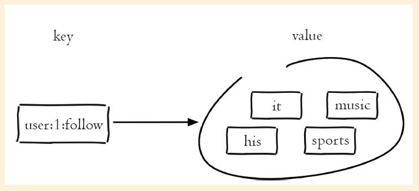

# 集合
>time: 2018-03-08 15:32:41

集合（set）类型也是用来保存多个的字符串元素，但和列表类型不一样的是，集合中不允许有重复元素，并且集合中的元素是无序的，不能通过索引下标获取元素。如图2-22所示，集合 `user：1：follow` 包含着 "it"、"music"、"his"、"sports" 四个元素，一个集合最多可以存储 232-1个元素。Redis除了支持集合内的增删改查，同时还支持多个集合取交集、并集、差集，合理地使用好集合类型，能在实际开发中解决很多实际问题。

