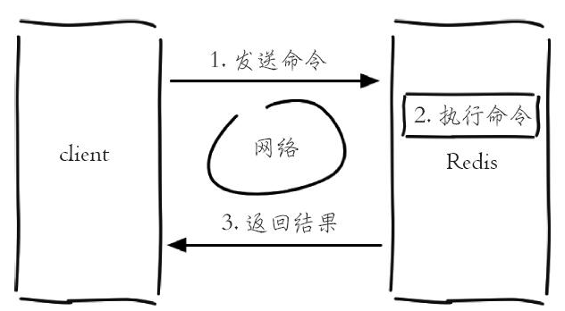

# 单线程架构
>time: 2018-02-27 13:41:48

Redis 使用了单线程架构和 I/O 多路复用模型来实现功性能的内存数据库服务。

Redis 客户端与服务端的模型可以简化成下图每次客户端调用都经历了发送命令、执行命令、返回结果三个过程。

其中第 2 步是重点要讨论的，因为 Redis 是单线程来处理命令的，所以一条命令从客户端达到服务端不会立刻被执行，所有命令都会进入一个队列中，然后逐个被执行。所以 3 个客户端命令的执行顺序是不确定的，但是可以确定不会有两条命令被同时执行，所以两条 incr 命令无论怎么执行最终结果都是 2，不会产生并发问题，这就是 Redis 单线程的基本模型。但是像发送命令、返回结果、命令排队肯定不像描述的这么简单，Redis使用了 I/O 多路复用技术来解决 I/O 的问题。

#### 为什么 Redis 使用单线程模型会达到每秒万级别的处理能力呢？可以将其归结为三点：

1. 纯内存访问，Redis 将所有数据放在内存中，内存的响应时长大约为 100 纳秒，这是 Redis 达到每秒万级别访问的重要基础。

1. 非阻塞 I/O，Redis 使用 epoll 作为 I/O 多路复用技术的实现，再加上 Redis 自身的事件处理模型将 epoll 中的连接、读写、关闭都转换为事件，不在网络 I/O 上浪费过多的时间，

1. 单线程避免了线程切换和竞态产生的消耗。

#### 单线程能带来几个好处：
1. 单线程可以简化数据结构和算法的实现。如果对高级编程语言熟悉的读者应该了解并发数据结构实现不但困难而且开发测试比较麻烦。

1. 单线程避免了线程切换和竞态产生的消耗，对于服务端开发来说，锁和线程切换通常是性能杀手。

单线程会有一个问题：对于每个命令的执行时间是有要求的。如果某个命令执行过长，会造成其他命令的阻塞，对于 Redis 这种高性能的服务来说是致命的，所以 Redis 是面向快速执行场景的数据库。