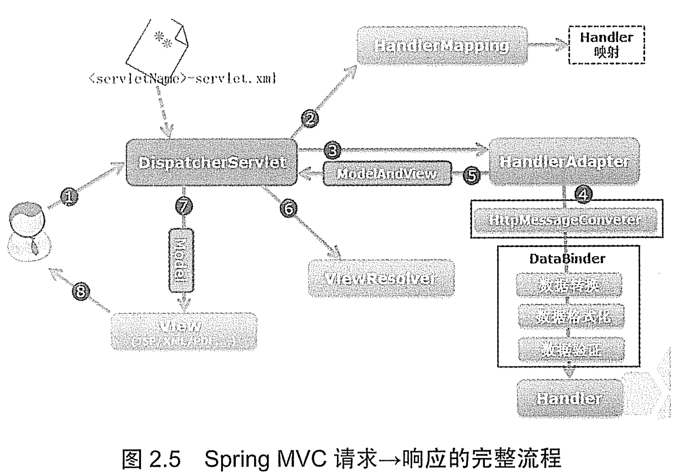

# Spring MVC 应用的开发步骤

1. 在 web.xml 文件中定义前端控制器 DispatcherServlet 来拦截用户请求。
    >由于 Web 应用是基于请求/响应架构的应用，所以不管哪个 MVC Web 框架，都需要在 web.xml中配置该框架的核心 Servlet 或 Filter，这样才可以让该框架介入 Web 应用中。
1. 如果需要以 POST 方式提交请求，则定义包含表单数据的 JSP 页面。如果仅仅只是以 GET 方式发送请求，则无须经过这一步。
1. 定义处理用户请求的 Handle 类，可以实现 Controller 接口或使用 @Controller 注解。
    >这一步也是所有 MVC 框架中必不可少的，因为这个 DispatcherServlet 就是 MVC 中的 C，也就是前端控制器，该控制器负责接受请求，并将请求分发给对应的 Handle，即实现 Controller 接口的 Java 类，而该 Java 类负责调用后台业务逻辑代码来处理请求。
1. 配置 Handle。
1. 编写视图资源
    >当 Handle 处理用户请求结束后，通常会返回一个 ModleAndView 对象，该对象中应该包含返回的视图名或视图名和模型，这个视图名就代表需要显示的物理视图资源。如果 Handle 需要把一些数据传给视图资源，则可以通过模型对象。

## Spring MVC 执行的流程

Spring MVC 建议把所有的视图页面存放在 WEB-INF 文件夹下，这样可以保护视图页面，避免直接向视图页面发送请求。

Spring MVC 请求 --> 响应的完整工作流程如下：

1. 用户向服务器发送请求，请求被 String 的前端控制器 DispatcherServlet 截获。

1. DispatcherServlet 对请求 URL（统一资源定位符）进行解析，得到 URI（请求资源标志符）。然后根据该 URI，调用 HandlerMapping 获得该 Handler 配置的所有相关的对象，包括 Handler 对象以及 Handler 对象对应的拦截器，这些对象会被封装到一个 HandlerExceptionChain 对象当中返回。

1. DispatcherServlet 根据获得的 Handler，选择一个合适的 HandlerAdapter。HandlerAdapter 的设计符合面向对象中的单一职责原则，代码架构清晰，便于维护，最重要的是，代码可复用性高。HandlerAdapter 会被用于处理多种 Handler，调用 Handler 实际处理请求的方法。

1. 提取请求中的模型数据，开始执行 Handler（Controller）。在填充 Handler 的入参过程中，根据配置，Spring 将帮助你做一些额外的工作。
    >**消息转换**。将请求消息进行数据转换（如 Json、xml 等数据）转换成一个对象，将对象转换为指定的响应信息。  
    >**数据转换**。对请求消息进行数据转换，如 String 转换成 Integer、Double 等。  
    >**数据格式化**。对请求消息进行数据格式化，如将字符串转换成格式化数字或格式化日期等。  
    >**数据验证**。验证数据的有效性（长度、格式等），验证结果存储到 BindingResult 或 Error 中。

1. Handle 执行完成后，向 DispatcherServlet 返回一个 ModelAndView 对象，ModelAndView 对象中应该包含视图名和模型。

1. 根据返回的 ModelAndView 对象，选择一个合适的 ViewResolver（视图解析器）返回给 DispatcherServlet。

1. ViewResolver 结合 Model 和 View 来渲染视图。

1. 将视图渲染结果返回给客户端。
