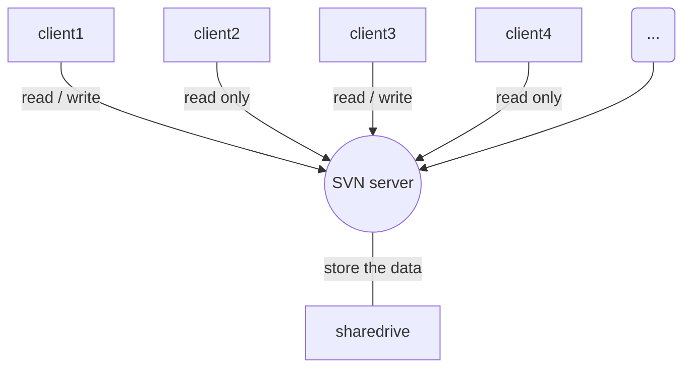

# 框图

## 图表方向
>graph TD 从上之下
* TB - top bottom
* BT - bottom top
* RL - right left
* LR - left right
* TD - same as TB

```mermaid
graph TD
    client1-->|read / write|SVN((SVN server))
    client2-->|read only|SVN
    client3-->|read / write|SVN
    client4-->|read only|SVN
    client5(...)-->SVN
    SVN---|store the data|sharedrive
```
