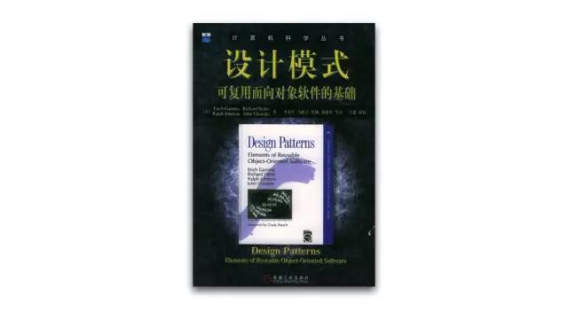

# 书籍
>time: 2018-03-06 09:31:16

## 哥德尔、埃舍尔、巴赫

作者简介：道格拉斯·理查·郝夫斯台特，中文名侯世达，美国学者、作家。他的主要研究领域包括意识、类比、艺术创造、文学翻译以及数学和物理学探索。 因其著作《哥德尔、埃舍尔、巴赫》获得普立兹奖（非小说类别）和美国国家经典奖（科学类别）。

推荐理由：这是一部天书。在数学，绘画，音乐和故事中畅游，却在探讨哲学中最深刻的问题：意识和灵魂如何产生，**从哲学角度探讨人工智能和人类智能。**当你看完书后，也许你具体记不得太多细节，但是不经意间你会发现它已经深深地影响了你的世界观。

## 算法导论

作者简介：托马斯·科尔曼，达特茅斯学院计算机科学系教授、系主任；查尔斯·雷瑟尔森，麻省理工学院计算机科学与电气工程系教授，他目前主持 MIT 超级计算技术研究组，并是 MIT 计算机科学和人工智能实验室计算理论研究组的成员；罗纳德·李维斯特，现任麻省理工学院电子工程和计算机科学系安德鲁与厄纳·维特尔比（Andrew and Erna Viterbi）教授。他是 MIT 计算机科学和人工智能实验室的成员，并领导着其中的信息安全和隐私中心。他现在担任国家密码学会的负责人；克利福德·斯坦，哥伦比亚大学计算机科学系和工业工程与运筹学系教授，他还是工业工程与运筹学系的系主任。

推荐理由：这本书深入浅出，全面地介绍了计算机算法。对每一个算法的分析既易于理解又十分有趣，并保持了数学严谨性。本书的设计目标全面，适用于多种用途。涵盖的内容有：算法在计算中的作用，概率分析和随机算法的介绍。书中专门讨论了线性规划，介绍了动态规划的两个应用，随机化和线性规划技术的近似算法等，还有有关递归求解、快速排序中用到的划分方法与期望线性时间顺序统计算法，以及对贪心算法元素的讨论。此书还介绍了对强连通子图算法正确性的证明，对哈密顿回路和子集求和问题的 NP 完全性的证明等内容。

## 代码大全

作者简介：史蒂夫·迈克康奈尔，被公认为软件开发社区中的首要作者和发言人之一。他是 Construx Software 公司的首席软件工程师。他所编著的图书包括曾被《软件开发》杂志授予优异产品震撼大奖的《代码大全》和《快速软件开发》，以及《软件项目生存指南》和《专业软件开发》等等。

推荐理由：这是一本完整的软件构建手册，涵盖了软件构建过程中的所有细节。它从软件质量和编程思想等方面论述了软件构建的各个问题，并详细论述了紧跟潮流的新技术、高屋建瓴的观点、通用的概念，还含有丰富而典型的程序示例。这本书中所论述的技术不仅填补了初级与高级编程技术之间的空白，而且也为程序员们提供了一个有关编程技巧的信息来源。这本书对经验丰富的程序员、技术带头人、自学的程序员及几乎不懂太多编程技巧的学生们都是大有裨益的。

## 设计模式

作者简介：四位作者均是国际公认的面向对象软件领域的专家。

艾瑞克·伽玛，在苏黎世大学获得计算机科学博士学位，曾供职于瑞士联邦银行、Taligent、OTI 公司。现在是 Eclipse 项目的主要技术负责人之一；理查德·海尔姆，在墨尔本大学获得计算机科学博士学位，曾在 IBMT.J.Watson 担任研究员。现在 IBM 咨询集团供职；拉尔夫·约翰森，在康内尔大学获得计算机科学博士学位，目前是伊利诺伊大学教授，在模式，重构等领域均有很高造诣；约翰·威力西德斯，在斯坦福大学获得计算机科学博士学位，目前是 IBMT.J.Watson 研究中心的研究员。

推荐理由：这本书是引导读者走出软件设计迷宫的指路明灯，凝聚了软件开发界几十年设计经验的结晶。四位面向对象领域专家精心选取了具价值的设计实践，加以分类整理和命名，并用简洁而易于重用的形式表达出来。本书已经成为面向对象技术人员的圣经和词典，书中定义的 23 个模式逐渐成为开发界技术交流所必备的基础知识和语汇。