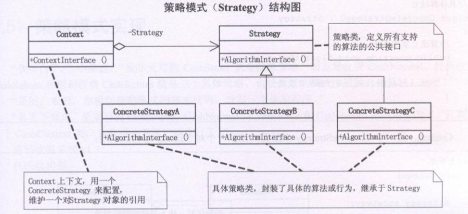

# 策略模式（Strategy）

策略模式（Strategy）： 它定义了算法家族，分别封装起来，让它们之间可以相互替换，此模式让算法的变化，不会影响到使用算法的客户[DP]。

面向对象的编程，并不是类越多越好，类的划分是为了封装，但分类的基础是抽象，具有相同属性和功能的对象的抽象结合才是类。

策略模式是一种定义了一系列算法的方法，从概念上来看，这些算法完成的都是相同的工作，只是实现不同，它可以以相同的方式调用的所有的算法，减少了各种算法类与使用算法类之间的耦合[DPE];

策略模式的 Strategy 类层次为 Context 定义了一系列的可供重用的算法或行为。继承有助于析取出这些算法中的公共功能[DP]。

策略模式的优点是简化了单元测试，因为每个算法都有自己的类，可以通过自己的接口单独测试[DPE]。

当不同的行为堆砌在一个类中时，就很难避免使用条件语句来选择合适的行为。将这些行为封装在一个个对立的 Strategy 类中，可以在使用这些行为的类中消除条件语句[DP]。

策略模式就是用来封装算法，但在实践中，我们发现可以用它来封装几乎任何类型的规则，只要在分析过程中听到需要在不同时间应用不同的业务规则，就可以考虑使用策略模式处理这种变化的可能性[DPE]。

在基本的策略模式中，选择所用具体实现的指责由客户端对象承担，并转给策略模式的 Context 对象[DPE]。

任何需求的变更都是需要成本的。但是成本的高低还是有差异的，高手和菜鸟的区别就是高手可以花同样的代价获得最大的收益或者说同样的事花最小的待见。面对同样的需求，当然是改动越小越好。