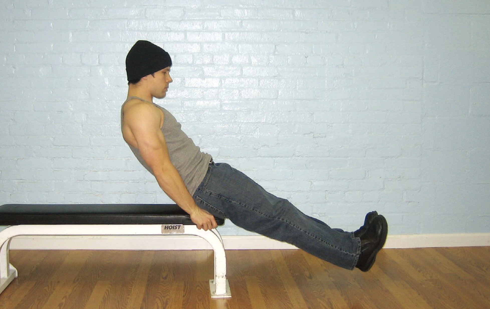
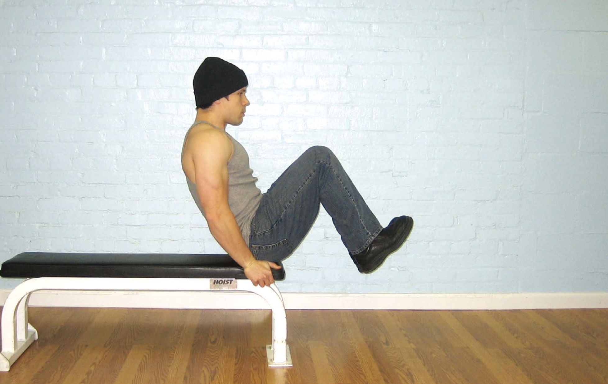

# 第一式 坐姿屈膝

## 动作

坐在椅子或床的边缘，身体略微向后倾斜，双手抓住边沿，两腿伸直，双脚并拢，脚跟距离地面几厘米。这是该动作的起始姿势（图61）。平缓地抬起膝盖，直到膝盖距胸部约15～25厘米。在此过程中呼气，动作完成时呼气结束，腹肌保持收缩状态。这是该动作的结束姿势（图62）。暂停1秒钟，进行反向运动并回到起始姿势。伸展膝盖的同时吸气。双脚应该始终沿着一条直线移动，而且始终保持悬空，直到一组动作完成方可接触地面。腹部要始终收缩，动作要慢，要抵制快速完成动作的冲动。如果需要，可以在两次动作之间喘几口气（所有中段练习都一样）。

图61　身体略微向后倾斜，双手抓住边沿，两腿伸直，双脚并拢，脚跟距离地面几厘米。

图62　动作完成时呼气结束，腹肌保持收缩状态。

## 解析

对初学者来说，坐姿屈膝是理想的腹部练习动作，因为该动作可以培养良好的脊柱姿势，锻炼腹部肌肉，增强髋部屈肌。对大多数人来说，这个动作也相对容易，因此给他们提供了发展完美技巧的绝佳机会，为以后的中段练习做好准备。切记，动作要平缓，呼吸节奏要正确，腹部始终要保持收紧状态。

## 训练目标

* 初级标准：1组，10次
* 中级标准：2组，各25次
* 升级标准：3组，各40次

## 稳扎稳打

坐姿屈膝动作的起始姿势（两腿伸展）与结束姿势（两膝靠近胸部）难度相当。想要降低坐姿屈膝的难度，就要在这两个难点之间适当缩小动作幅度。随着训练者的腰部越来越强，再逐渐加大动作幅度，直至动作完美无缺。
