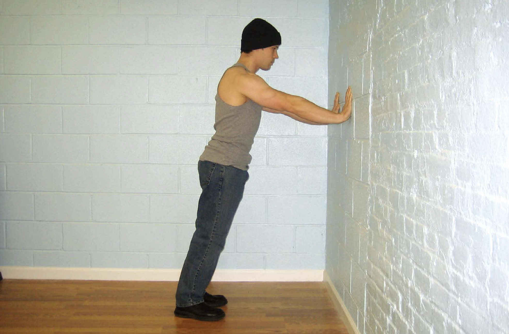
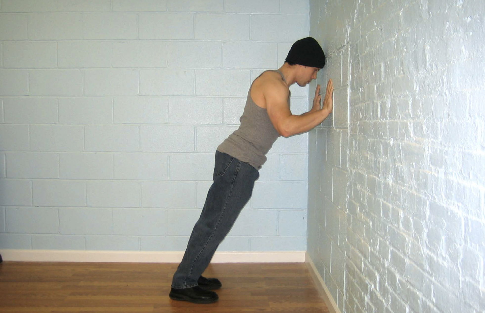

# 第一式　墙壁俯卧撑

## 动作

面对墙壁站立，双脚并拢，双臂伸直，与肩同宽，双手平放在墙上，手掌与胸等高。这是该动作的起始姿势（图1）。弯曲肘部，直到前额轻触墙面。这是该动作的结束姿势（图2）。然后将自己推回到起始姿势，如此重复。

（图1）双脚并拢，双臂伸直，与肩同宽，双手平放在墙上。

（图2）弯曲肘部，直到前额轻触墙面。

## 解析

俯卧撑动作共有十式，墙壁俯卧撑只是第一式。既然是第一式，也就最容易的，毫无疑问普通人都能做。墙壁俯卧撑也是第一个有治疗效果的练习。刚受伤、做过手术或身体正处于恢复期的人若想加快恢复速度、尽快拥有强健的体魄，可以选择这个动作。肘、腕、肩（尤其是柔弱的肩袖）极易出现慢性或急性损伤，这项练习能够轻柔地刺激这些部位，并改善血液循环。不熟悉徒手体操的初学者应该以较轻柔的动作开始训练，然后逐步提高自己的运动技巧，循序渐进地增强自己的运动能力。我建议就从这个练习动作开始。

## 训练目标

初级标准：1组，10次
中级标准：2组，各25次
升级标准：3组，各50次

## 稳扎稳打

只要身体没有残疾、没有严重的伤病或疾病，一般人应该都能完成这个动作。如果你刚好处于伤病或手术的恢复期，那么这个动作就是很好的“测试”，能让你了解自己的身体在恢复期的弱点。