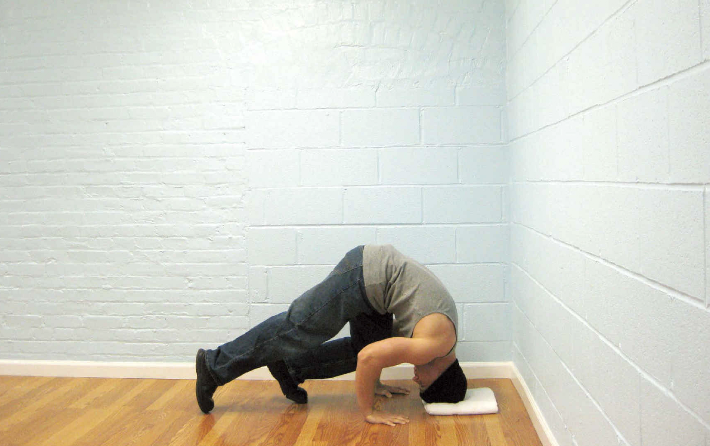
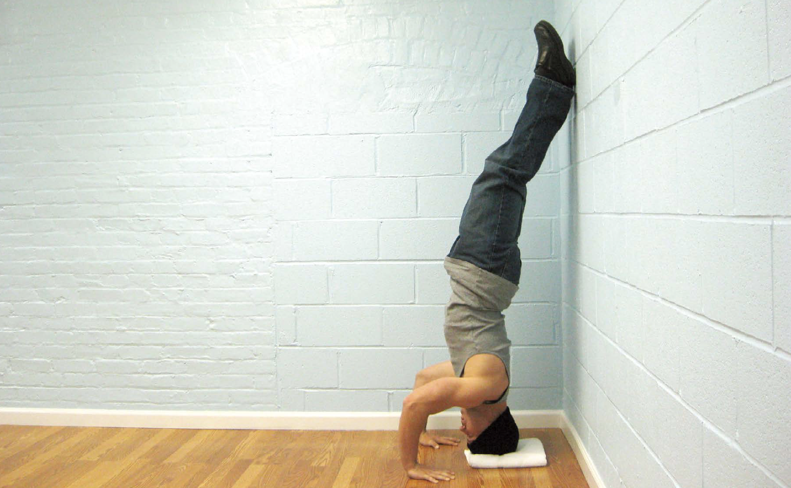

# 第一式 靠墙顶立

## 动作

找一堵墙，在墙根处放置一个枕头（坐垫或叠好的毛巾也可）。双手和双膝着地，将头顶在枕头上，头部距离墙壁约15～25厘米。双手稳稳地放在头部两侧，大约与肩同宽。抬起一条腿的膝盖，让其靠近同侧的肘部，同时伸直另一条腿，使膝盖离地（图107）。然后，让靠近肘部的腿使劲蹬地，同时将另一条腿向上踢，从而让两条腿同时靠向墙壁。一旦双脚靠在墙壁上，就慢慢伸直双腿，把身体摆正（图108）。嘴巴保持闭合，用鼻子平缓呼吸。坚持所需时间后，弯曲双腿，并有控制地放下它们。

图107　抬起一条腿的膝盖，让其靠近同侧的肘部，同时伸直另一条腿，使膝盖离地。

图108　一旦双脚靠在墙壁上，就慢慢伸直双腿，把身体摆正。

## 解析

任何想做倒立撑的人，首先都必须掌握倒立姿势。靠墙顶立是完美的入门技巧，只需稍加练习，我们的血管、内脏器官以及头部就会适应这种突然的颠倒。在这个动作中，整个身体都在头部上方，这对身体的平衡能力是一个考验。肩部要维持身体的平衡，因此也会得到一定的锻炼。

## 训练目标
* 初级标准：30秒
* 中级标准：1分钟
* 升级标准：2分钟

## 稳扎稳打

在做靠墙顶立时，大多数人都能坚持几秒钟，主要问题是如何做成倒立姿势。难就难在找到上墙所需的推和蹬的正确力道。如果你觉得这有点儿困难，可以先请朋友帮忙，直到最终可以独立完成。
