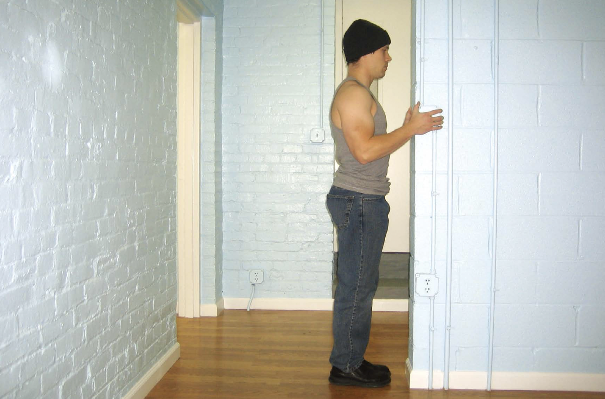
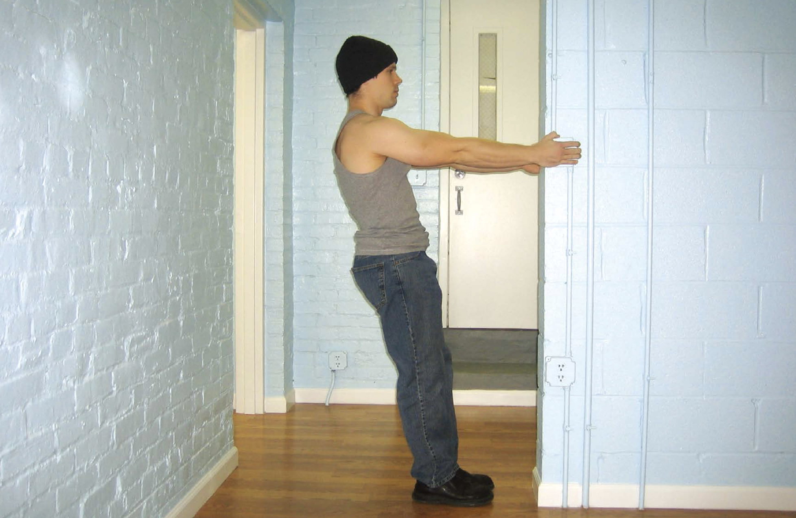

# 第一式 垂直引体

## 动作

找一个可抓握且很稳固的竖直物体，门框和高一点的栏杆都是上好之选。靠近物体站立，脚尖与之保持约8～15厘米的距离。以舒服的姿势抓住该物体，理想情况是双手与肩同宽，但不必要——只要双手对称即可。这是该动作的起始姿势（图41）。由于你距离物体很近，所以手臂会弯曲。身体慢慢向后倾，在此过程中伸展手臂，直到手臂几乎伸直、身体后倾与地面成一定角度为止。这是该动作的结束姿势（图42）。此时，你的上背部应该有拉伸感，手臂可能也会有同感。暂停一会，再并拢肩胛骨并弯曲手臂，把身体拉回到起始姿势。暂停，然后再重复该动作。

图41　靠近物体站立，脚尖与之保持约8～15厘米的距离。

图42　此时，你的上背部应该有拉伸感，手臂可能也会有同感。

## 解析

垂直引体是动作非常轻微的引体向上动作。对那些背部和手臂力量正处于恢复阶段的训练者来说，这是非常理想的练习。此外，这个动作对肩部、肱二头肌或肘部受过伤的训练者而言更适合，因为它可以增加血液流动，并让他们的身体找回“拉力”的感觉。对初学者来说，这也是上好的练习。由于该动作强度较小，可以使初尝拉力训练的人，在进入难度更大的动作之前真切地感受肩部和上背部肌肉的“发力”。

## 训练目标
初级标准：1组，10次
中级标准：2组，各20次
升级标准：3组，各40次

## 稳扎稳打

垂直引体几乎是人人都能做的简易练习。如果你正处在伤病康复阶段，觉得该动作对某些身体部位（也许是缝针部位）而言太过剧烈，那就减小动作幅度，绷紧肩部，别让手臂伸得太直。
