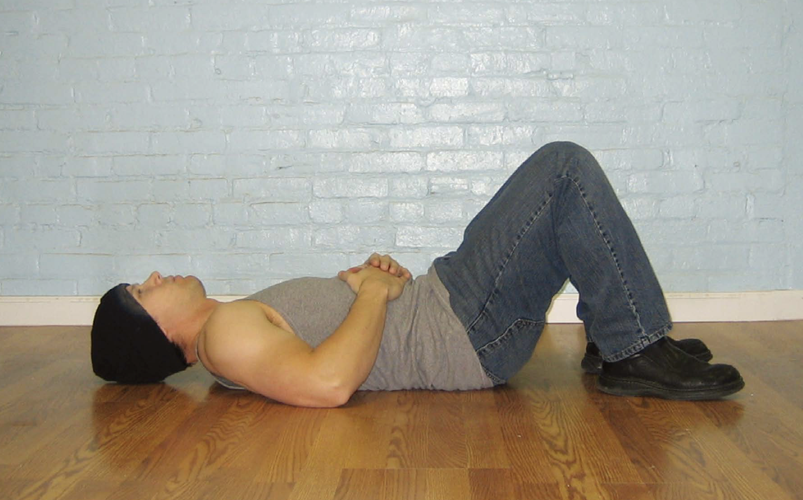
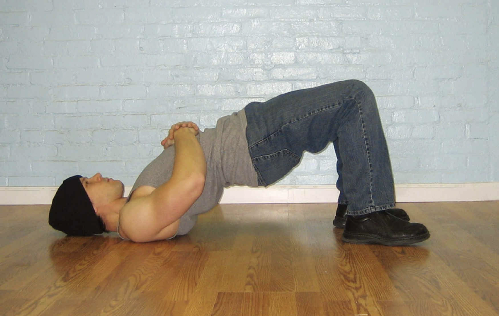

# 第一式短桥

## 动作

躺在地上，双手叠放在腹部。膝盖弯曲，将双脚拉向臀部，直到胫骨与地面接近垂直，此时脚跟距离臀部约15～20厘米，脚掌平放在地上。双脚与肩同宽或略窄，依个人舒适度而定。这是起始姿势（图83）。然后双脚用力下压，身体向上拱起，使髋部和背部离开地面，直到仅以双肩和双脚支撑整个身体。此时，大腿和躯干应成一条直线，髋部不要下沉。这是结束姿势（图84）。暂停一会，然后做反向动作，缓缓地放低身体，直到回到起始姿势，如此重复。身体撑起时呼气，身体放低时吸气。

图83　双脚与肩同宽或略窄，依个人舒适度而定。

图84　大腿和躯干应成一条直线，髋部不要下沉。

## 解析

用下肢来推动整个身体，这是开始脊柱训练最温和的方式。因为在日常生活中，我们通常都是通过腿部带动脊柱活动的，比如散步、弯腰等。在短桥的最高处保持躯干伸直的动作，会刺激脊椎和髋部的肌肉，同时几乎不会给脊椎骨造成任何压力。所以，对椎间盘有伤的人来说，这是极好的治疗动作。

## 训练目标
* 初级标准：1组，10次
* 中级标准：2组，各25次
* 升级标准：3组，各50次

## 稳扎稳打

大多数人做短桥时都不会感觉太吃力。如果你正处于背伤恢复阶段，动作对你而言稍有困难，那你可以在髋部下方放上枕头或坐垫，以缩小动作幅度。
