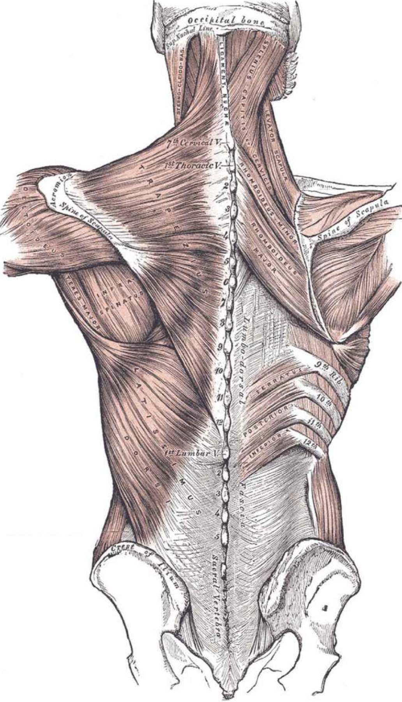

# 训练脊柱

人体最重要的器官不是肌肉，也不是心脏和肺部，而是脑部。脑部控制着所有的器官，就像它实际控制着人体中的所有结构与活动一样。在很大程度上，我们的心理认同都与脑部功能息息相关，甚至可以说我们除了脑就什么都不是了。脑部死亡，你也就没了。

人体第二重要的器官是脊髓，因为脊髓联系着脑部与其他身体部分。脊髓是异常复杂的纤细神经管道，从低位脑干向下在后背延伸。如果脊髓受损，不管脑部多强大、多健康，都无法与其他身体部分联系了，因此将变得毫无用处。大家都记得超人克里斯托夫·里夫（ChristopherReeve）瘫痪的悲剧吧？20世纪90年代中期，他不慎从马上跌落，由于有头盔保护，他的脑部没有受伤，但由于脊髓严重受损，他再无法控制他的身体。

脊髓极其脆弱，如果不加保护很容易受伤。它即使受一点点伤，也会对身体功能酿成灾难性的后果。不过还好，由于对我们的健康和生存至关重要，所以脊髓通过进化过程得到了很好的保护。它包在柔韧且呈铰链式连接的、厚厚的装甲里，这种装甲由坚韧的软骨连接着诸多密实的单个骨头组成，这些单个骨头就是脊椎骨，这些软骨就是椎间盘。整个脊椎又进一步由韧带与控制脊椎运动的深层复杂肌肉组成的网络保护。共有30多对基本的脊椎肌肉，由于篇幅所限，此处并不详细罗列，也不具体描述它们各自的功能。感兴趣的训练者可以拜读亨利·格雷（HenryGray）的《格雷解剖学》（Gray'sAnatomy）。所有这些肌肉都不是各自为战，而是被塑造成了两根厚实的、强有力的、蛇一样的管子，附在脊柱两侧，这些肌肉群叫做竖脊肌。

这两根肌肉柱是防止脊柱受伤的第一道防线，就像厚实的紧身衣，能够保护脊柱免受来自外界的危险，比如尖物或钝物的伤害。这些肌肉也能够控制脊柱的运动，确保脊椎骨遵循一定的运动幅度，从而保护脊髓，并规定脊柱的所有活动。若没有竖脊肌，人根本不能走路、站立、转体、移动躯干，甚至无法扭头。

竖脊肌对人体至关重要。但是竖脊肌与其保护对象脊髓相比显得微不足道。神经冲动通过脊髓从上向下传递，所以受伤部位越靠上，后果越严重。

此图出自经典教材《格雷解剖学》，背部肌肉的复杂程度一目了然。桥可以锻炼所有这些肌肉及其肌腱。

* 脊柱下部（腰椎）受伤，双腿将失去知觉，伤者将大小便失禁和性无能。
* 脊柱中部（胸椎）受伤，伤者无法控制躯干的肌肉。
* 脊柱上部三分之一（颈椎）受伤，会使手臂、肩部和颈部瘫痪。如果伤势严重，那么为肺部提供动力的膈肌也会瘫痪。

除以上这些症状以外，脊柱受伤还有可能引发其他可怕的副作用，包括肌肉萎缩、骨质疏松症、神经性头痛，以及基本生理功能（如血压、体温和心率）的失控。更糟糕的是，脊髓神经组织复杂得不可思议，一旦受损其自我修复能力微乎其微。克里斯托夫·里夫从马背上跌落摔碎了第一颈椎和第二颈椎，结果其脖子以下的身体功能全都不复存在。经过数月的治疗，他才能在脱离呼吸器的情况下进行短暂的呼吸。

脊髓的安全依赖脊柱的整体性，而脊柱的整体性又主要依赖于支撑脊柱的韧带与肌肉的健康。保护脊髓并使之保持健康的最好方式就是维持强壮的竖脊肌。

可能除呼吸、健康饮食和规律睡眠之外，投入时间训练以保护脊柱是你能做的对健康最重要的事情。就是这样。
