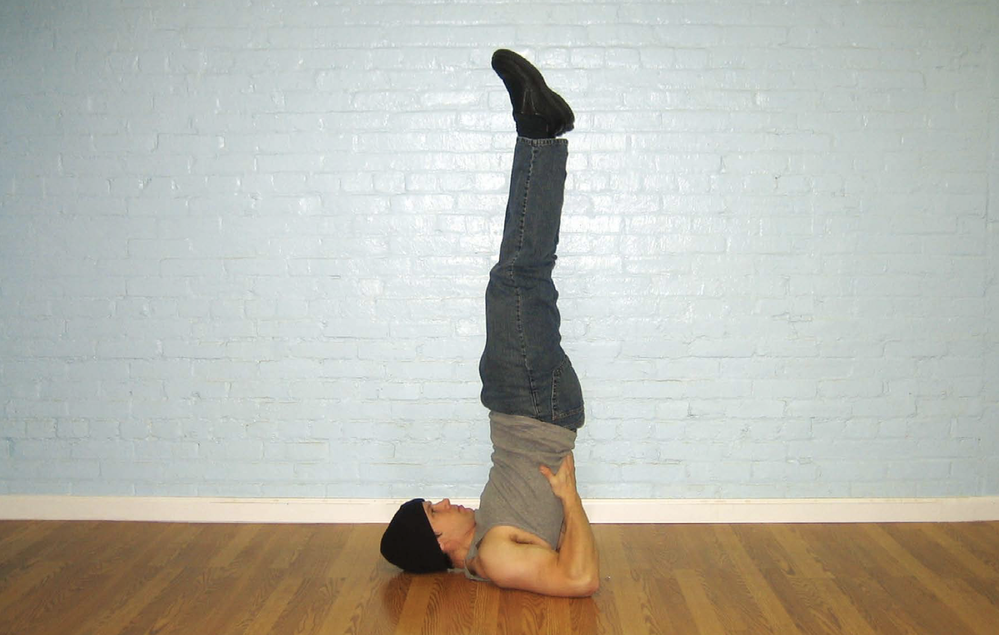
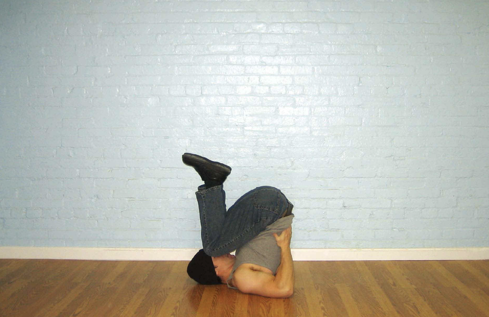

# 第一式肩倒立深蹲

## 动作

平躺，双膝弯曲，双手下压。双脚蹬离地面，直到举到空中。在将双腿举起的过程中，顺势把双手撑在下背部，注意上臂要紧贴地面。你现在摆出的姿势是肩倒立——靠双肩、上背部以及上臂支撑身体。要记住，始终用这几个部位支撑身体，不要让颈部受到压力。身体要锁定伸直，髋部不要弯曲。这是该动作的起始姿势（图21）。上半身要尽可能伸直，弯曲髋部与膝关节，直到膝盖轻触前额，这是该动作的结束姿势（图22）。然后伸直双腿，直到身体回到起始姿势，如此重复。

图21 把双手撑在下背部，注意上臂要紧贴地面。

图22  上半身要尽可能伸直，弯曲髋部与膝关节，直到膝盖轻触前额。

## 解析

对任何开始练习深蹲的人来说，肩倒立深蹲都是完美的起点。由于做该动作时身体处于倒立姿势，所以膝盖和下背部无需承受身体的重量，这就使得该动作成为一个理想的恢复性训练动作——可以帮助那些背部和膝盖有伤的健身者，或是刚做完手术正处于恢复期的健身者重新开始腿部训练。从力量角度来说，做肩倒立其实对健身者上身的要求更高。但是这一动作能让紧绷的关节放松，增加关节的活动幅度，从而能让初学者为练就完美的深蹲打下基础。

## 训练目标

* 初级标准：1组，10次
* 中级标准：2组，各25次
* 升级标准：3组，各50次

## 稳扎稳打

第一次尝试该动作时，不是人人都能做到膝盖轻触前额。你可以在每次锻炼时试着加大动作幅度，这样你的关节很快就会得到放松。另外，有啤酒肚的人几乎无法完成这个动作，因为他的大肚子会碍事。对这类人来说，坚持空腹练习会好一些——直到他们减掉肚子上的赘肉。