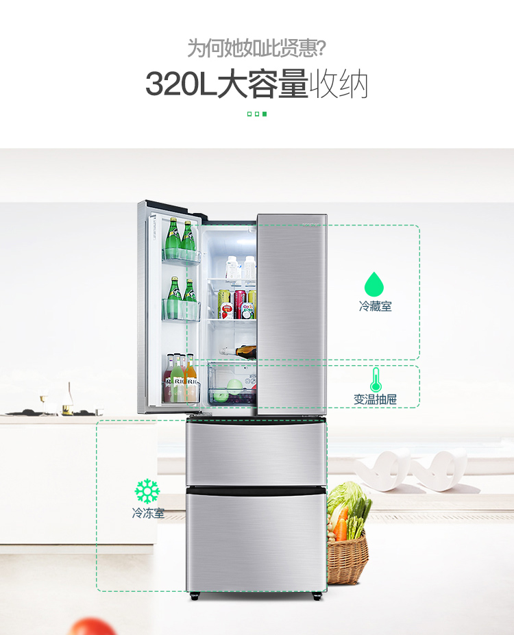

# 容声 (Ronshen) BCD-320WD11MY 320升 多门冰箱 风冷无霜电冰箱 电脑控温 实用变温抽屉 家用节能(卡其银)

|  -   | - |  - |
| --- | --- | --- |
| 主体 | 品牌 | 容声 |
|  | 型号 | BCD-320WD11MY |
|  | 颜色 | 银色 |
|  | 类别 | 多门 |
|  | 开门方式 | 上对门，下抽屉 |
|  | 显示方式 | LED显示 |
|  | 气候类型 |  亚温带型（SN）-温带型（N）-亚热带型（ST）|
| 功能 | 制冷方式 风冷 |
|  | 控制方式 | 电脑式 |
|  | 制冷类型 | 压缩机制冷 |
|  | 除霜模式 | 智能除霜 |
|  | 定频/变频 | 定频 |
|  | 总容积(升) | 320 |
|  | 冷冻室(升) | 114 |
|  | 变温室(升) | 27 |
|  | 冷藏室(升) | 179 |
|  | 冷冻能力(kg/24h) | 12 |
|  | 制冷循环 | 三循环 |
|  | 能效等级 | 2 级 |
|  | 耗电量(KWh/24h) | 0.88 |
|  | 运转音dB(A) | 38 |
|  | 制冷剂 | R600a |
| 规格 | 电压/频率 | 220V/50HZ |
|  | 产品尺寸（深x宽x高）mm | 680x625x1809 |
|  | 包装尺寸（深x宽x高）mm | 749x684x1910 |
|  | 产品重量（kg）| 74 |
|  | 包装清单 | 电冰箱*1、使用说明书*1、|

  
  
  
  
  
  
  
  
  
  
  
  
  
  
  
  
  
  
  
  
  
  
  