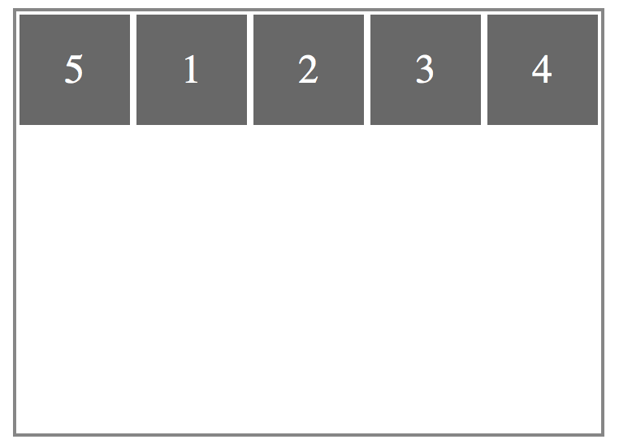
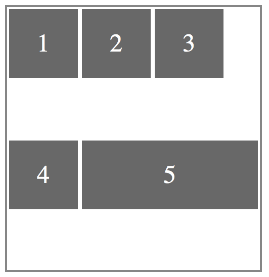
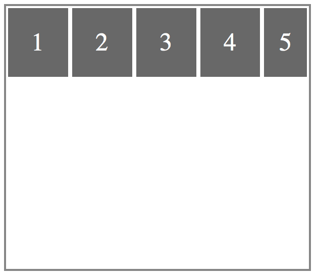
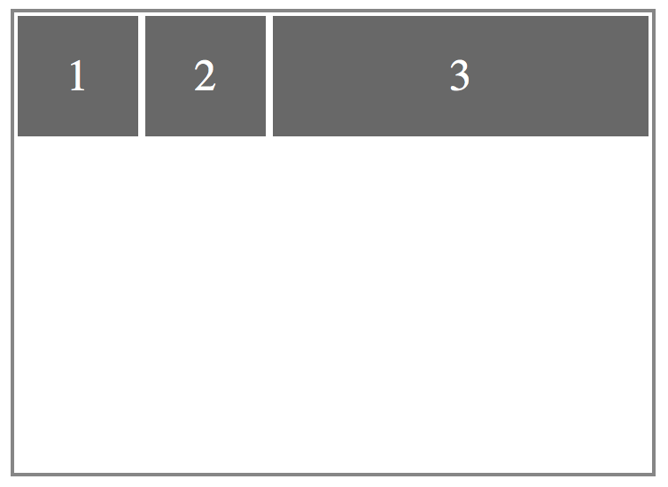
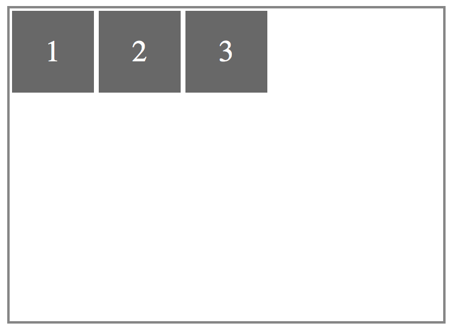
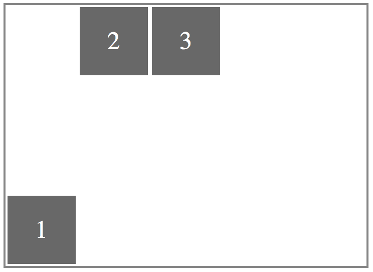
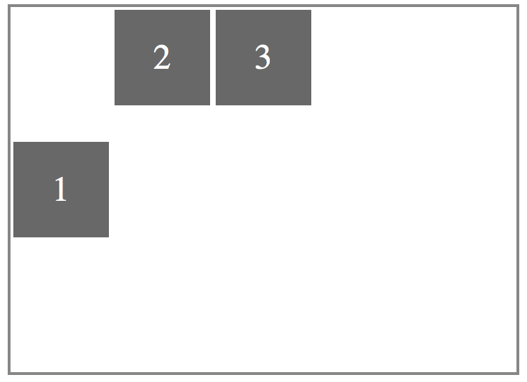
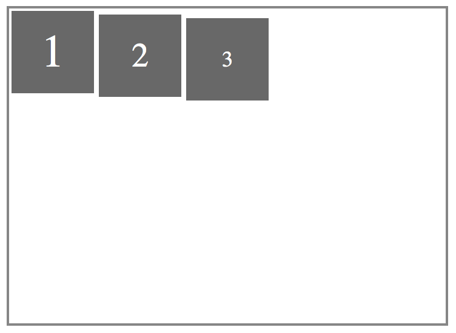
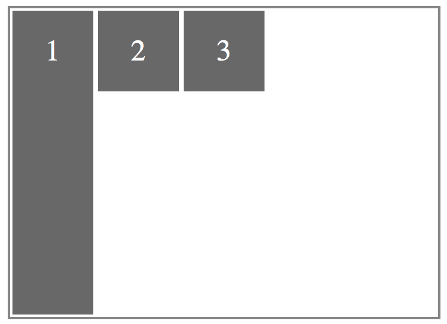

# 伸缩项目
>time: 2018-04-10 17:04:38  

伸缩项目支持的属性有：
* order
* flex-grow
* flex-shrink
* flex-basis
* flex
* align-self
## 1. order
用于定义项目的排列顺序。数值越小，排列要靠前，默认值为 0，其语法为：  
`order: integer`

HTML 代码
```html
<span class="flex-container">
    <span class="flex-item item1">1</span>
    <span class="flex-item item2">2</span>
    <span class="flex-item item3">3</span>
    <span class="flex-item item4">4</span>
    <span class="flex-item item5">5</span>
</span>
```

```css
.flex-container {
    display: flex;
    flex-direction: row;
    flex-wrap: wrap;
    width: 360px;
    height: 260px;
}
.flex-item {
    width: 68px;
    height: 68px;
}
.item5 {
    order: -1;
}
```

[示例](./demo/flex-item_order.html)



## 2. flex-grow
该属性定义伸缩项目的放大比例，默认值为 0，即如果存在剩余空间，也不放大。如果所有伸缩项目的 flex-grow 设置为 1，那么每个伸缩项目将设置为一个大小相等的剩余空间。如果你将其中一个伸缩项目的 flex-grow 值设置为 2，那么这个伸缩项目所占的剩余空间是其他伸缩项目所占剩余空间的两倍。  
`flex-grow: number /* 其默认值为 0 */`

```html
<span class="flex-container">
    <span class="flex-item item1">1</span>
    <span class="flex-item item2">2</span>
    <span class="flex-item item3">3</span>
    <span class="flex-item item4">4</span>
    <span class="flex-item item5">5</span>
</span>
```

```css
.flex-container {
    display: flex;
    flex-direction: row;
    flex-wrap: wrap;
    width: 250px;
    height: 260px;
}
.flex-item {
    width: 68px;
    height: 68px;
}
.item5 {
    flex-grow: 1;
}
```

[示例](./demo/flex-item_flex-grow.html)



## 3. flex-shrink
该属性用来定义伸缩项目的收缩能力。  
`flex-shrink: number /* 其默认值为 1 */`

```html
<span class="flex-container">
    <span class="flex-item item1">1</span>
    <span class="flex-item item2">2</span>
    <span class="flex-item item3">3</span>
    <span class="flex-item item4">4</span>
    <span class="flex-item item5">5</span>
</span>
```

```css
.flex-container {
    display: flex;
    flex-direction: row;
    flex-wrap: nowrap;
    width: 360px;
    height: 260px;
}
.flex-item {
    width: 68px;
    height: 68px;
}
.item5 {
    order: -1;
}
```

[示例](./demo/flex-item_flex-shrink.html)



## 4. flex-basis
该属性用来设置伸缩项目的基准值，剩余的空间按比率进行伸缩，其默认值为 auto。  
`flex-basis: length | auto`

```html
<span class="flex-container">
    <span class="flex-item item1">1</span>
    <span class="flex-item item2">2</span>
    <span class="flex-item item3">3</span>
    <span class="flex-item item4">4</span>
    <span class="flex-item item5">5</span>
</span>
```

```css
.flex-container {
    display: flex;
    flex-direction: row;
    flex-wrap: wrap;
    width: 250px;
    height: 260px;
}
.flex-item {
    width: 68px;
    height: 68px;
}
.item5 {
    flex-grow: 1;
}
```

[示例](./demo/flex-item_flex-basis.html)


## 5. flex
该属性是 flex-grow、flex-shrink 和 flex-basis 这 3 个属性的缩写。  
`flex: none | flex-grow flex-shrink flex-basis`  
其中第二个参数和第三个参数（flex-shrink 和 flex-basis）是可选参数。默认值为 0 1 auto。

该属性有两个快捷值：`auto`（即 `1 1 auto`）和 `none`（即 `0 0 auto`）。

```html
<span class="flex-container">
    <span class="flex-item item1">1</span>
    <span class="flex-item item2">2</span>
    <span class="flex-item item3">3</span>
</span>
```

```css
.flex-container {
    display: flex;
    flex-direction: row;
    width: 360px;
    height: 260px;
}
.flex-item {
    width: 68px;
    height: 68px;
}
.item3 {
    flex: 1;
}
```

[示例](./demo/flex-item_flex.html)



## 6. align-selt
该属性用来设置单独的伸缩项目在交叉轴上的对齐方式，会覆盖默认的对齐方式。  
`align-self: auto | flex-start | flex-end | center | baseline | stretch`

```html
<span class="flex-container">
    <span class="flex-item" id="item1">1</span>
    <span class="flex-item" id="item2">2</span>
    <span class="flex-item" id="item3">3</span>
</span>
```

### 6.1 auto
伸缩项目按照自身设置的宽高显示，如果没有设置，则按 stretch 来计算其值。
```css
.flex-container {
    display: flex;
    flex-direction: row;
    flex-wrap: wrap;
    width: 360px;
    height: 260px;
}
.flex-item {
    width: 68px;
    height: 68px;
}
#item3 {
    align-self: auto;
}
```

[示例](./demo/flex-item_align-self_auto.html)



### 6.2 flex-start
伸缩项目向交叉轴的开始位置靠齐。
```css
.flex-container {
    display: flex;
    flex-direction: row;
    flex-wrap: wrap;
    width: 360px;
    height: 260px;
}
.flex-item {
    width: 68px;
    height: 68px;
}
#item3 {
    align-self: flex-start;
}
```

[示例](./demo/flex-item_align-self_flex-start.html)


### 6.3 flex-end
伸缩项目向交叉轴的结束为止靠齐。

```css
.flex-container {
    display: flex;
    flex-direction: row;
    flex-wrap: wrap;
    width: 360px;
    height: 260px;
}
.flex-item {
    width: 68px;
    height: 68px;
}
#item1 {
    align-self: flex-end;
}
```

[示例](./demo/flex-item_align-self_flex-end.html)



### 6.4 center
伸缩项目向交叉轴的中心位置靠齐。

```css
.flex-container {
    display: flex;
    flex-direction: row;
    flex-wrap: wrap;
    width: 360px;
    height: 260px;
}
.flex-item {
    width: 68px;
    height: 68px;
}
#item1 {
    align-self: center;
}
```

[示例](./demo/flex-item_align-self_center.html)



### 6.5 baseline
伸缩项目按基线对齐

```css
.flex-container {
    display: flex;
    flex-direction: row;
    flex-wrap: wrap;
    width: 360px;
    height: 260px;
}
.flex-item {
    width: 68px;
    height: 68px;
}
#item1 {
    align-self: baseline;
    font-size: 38px;
}

#item2 {
    align-self: baseline;
    font-size: 28px;
}

#item3 {
    align-self: baseline;
    font-size: 18px;
}
```

[示例](./demo/flex-item_align-self_baseline.html)



每个伸缩项目都是沿交叉轴方向，按照前一个伸缩项目的基线作为对齐点的。

### 6.6 stretch
伸缩项目在交叉轴方向沾满s很所容器。


```css
.flex-container {
    display: flex;
    flex-direction: row;
    flex-wrap: wrap;
    width: 360px;
    height: 260px;
}
.flex-item {
    width: 68px;
}
#item1 {
    align-self: stretch;
}

#item2 {
    align-self: stretch;
    height: 68px;
}

#item3 {
    align-self: stretch;
    height: 68px;
}
```

[示例](./demo/flex-item_align-self_stretch.html)

