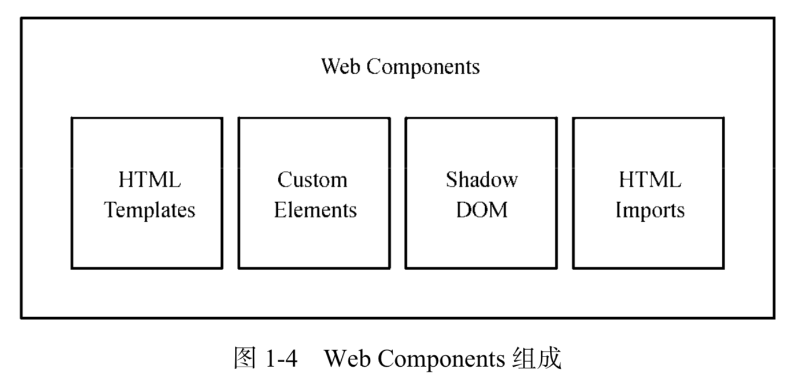
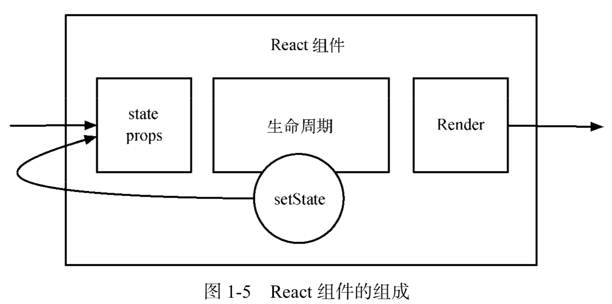

# React 组件的构建
>time: 2018-01-09 17:56:01

## 1. Web Components
Web Components 的 4 个组成部分： HTML Templates 定义了之前模板的概念，Custom Elements 定义了组件的展现形式，Shadow DOM 定义了组件的作用域范围、可以囊括样式， HTML Imports 提出了新的引入方式。



## 2. Reac Components

Web Components 通过自定义元素的方式实现组件化，而 React 的本质就是关心元素的构成，React 组件即为组件元素。组件元素被描述成纯粹的 JSON 对象，意味着可以使用方法或是类来构建。 React 组件基本上由 3 个部分组成——属性（props）、状态（state）以及生命周期方法。这里我们从一张图来简单概括 React。



React 组件可以接收参数，也可能有自身状态。一旦接收到的参数或自身状态有所改变，React 组件就会执行相应的生命周期方法，最后渲染。整个过程完全符合传统组件所定义的组件职责。

## 3. React 与 Web Components

从 React 组件上看，它与 Web Components 传达的理念是一致的，但两者的实现方式不同：
* React 自定义元素是库自己构建的，与 Web Components 规范并不通用
* React 渲染过程包含了模板的概念 ——JSX
* React 组件的实现均在方法与类中，因此可以做到相互隔离，但不包括样式
* React 引用方式遵循 ES6 module 标准

React 还是在纯 JavaScript 上下了工夫，将 HTML 结构彻底引入到 JavaScript 中。尽管这种做法褒贬不一，但也有效解决了组件所要解决的问题之一。

## 4. React 组件的构建方法

React 组件基本上由组件的构建方式、组件内的属性状态与生命周期方法组成。

官方在 React 组件构建上提供了 3 种不同的方法： React.createClass、 ES6 classes 和无状态函数（stateless function）。

* React.createClass
用 React.createClass 构建组件是 React 最传统、也是兼容性最好的方法。

```javascript
const Button = React.createClass({
    getDefaultProps() {
        return {
            color: 'blue',
            text: 'Confirm',
        };
    },
    render() {
            const { color, text } = this.props;
        return (
            <button className={`btn btn-${color}`}>
                <em>{text}</em>
            </button>
        );
    }
});
```

* ES6 classes
ES6 classes 的写法是通过 ES6 标准的类语法的方式来构建方法：
```javascript
import React, { Component } from 'react';
class Button extends Component {
    constructor(props) {
        super(props);
    }
    static defaultProps = {
        color: 'blue',
        text: 'Confirm',
    };
    render() {
        const { color, text } = this.props;
        return (
            <button className={'btn btn-${color}'}>
                <em>{text}</em>
            </button>
        );
    }
}
```

* 无状态函数
使用无状态函数构建的组件称为无状态组件，这种构建方式是 0.14 版本之后新增的，且官方颇为推崇。示例代码如下：

```javascript
function Button({ color = 'blue', text = 'Confirm' }) {
    return (
        <button className={'btn btn-${color}'}>
            <em>{text}</em>
        </button>
    );
}
```

无状态组件只传入 props 和 context 两个参数；也就是说，它不存在 state，也没有生命周期方法，组件本身即上面两种 React 组件构建方法中的 render 方法。不过，像 propTypes 和 defaultProps 还是可以通过向方法设置静态属性来实现的。

在适合的情况下，我们都应该且必须使用无状态组件。无状态组件不像上述两种方法在调用时会创建新实例，它创建时始终保持了一个实例，避免了不必要的检查和内存分配，做到了内部优化。